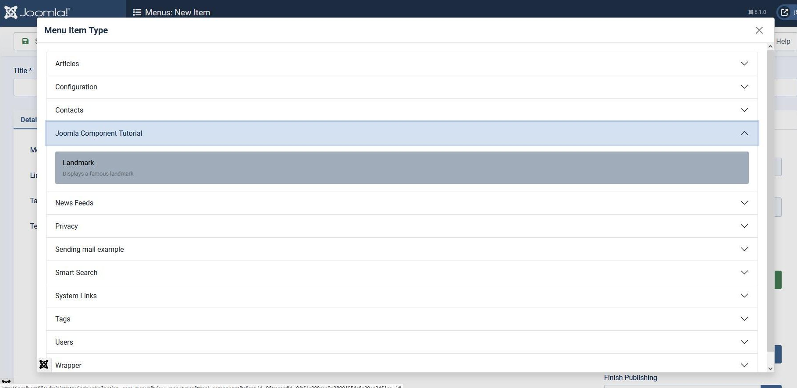

## Introduction

In the first step, in order to show the site Landmark page we had to enter a complicated URL.

In this step we create a menuitem, so that when it's clicked the Landmark page is shown.

The code is available at [com_example step 2](https://github.com/joomla/manual-examples/tree/main/component-tutorial/step02_menuitem).

## Learning Points

Creating a menuitem

Displaying language constants for debug purposes

## Enabling a Menuitem

We want to be able to go into the Administrator back-end Menus functionality,
select a menu then press the New button to create a menuitem to point to our Landmark webpage.

Inside the Menus New Item form, the field Menu Item Type has a Select button. 
When this is pressed then a list of components appears,
and we want com_example to appear here, so that a menuitem pointing to our Landmark can be created,
as shown in the screenshot below.



To do this we set a file within the same directory as the associated tmpl file:

```xml title="components/com_example/src/tmpl/landmark/default.xml"
<?xml version="1.0" encoding="utf-8"?>
<metadata>
    <layout title="COM_EXAMPLE_LANDMARK_MENUITEM_TITLE">
        <message>COM_EXAMPLE_LANDMARK_MENUITEM_DESCRIPTION</message>
    </layout>
</metadata>
```

The XML file contains 2 language strings which we need to define.
The com_menus component displays the data for several components 
in the modal window which appears when Select is pressed,
so this means that the language strings need to be defined in the .sys.ini file.

Also although the file is on the "site" side, the functionality it provides is on the "administrator" side,
so language strings need to be defined in the administrator .sys.ini file. This now contains:

```php title="administrator/components/com_example/language/en-GB/com_example.sys.ini"
COM_EXAMPLE_TITLE="Joomla Component Tutorial"
COM_EXAMPLE_DESCRIPTION="Builds an example application for managing famous landmarks"
; Menu items
COM_EXAMPLE_LANDMARK_MENUITEM_TITLE="Landmark"
COM_EXAMPLE_LANDMARK_MENUITEM_DESCRIPTION="Displays a famous landmark"
```

## Upgrading com_example

Before installing the new version it's best to increase the version number in the XML file
(even though Joomla doesn't enforce this):

```xml title="com_example/example.xml"
<version>0.2.0</version>
```

After installing the new version, create a menuitem pointing to the "Eiffel Tower" page:

- in the administrator back-end select a menu

- in the form which appears press the +New button

- give the new menuitem a Title, then in the Menu Item Type field press the Select button

- Select the Joomla Component Tutorial, then Landmark

- Press the Save & Close button

Navigate to your Joomla site, and on the menu you selected you should see your new menuitem.
Click on this, and it should display the Eiffel Tower message.

## Exploring your installation

Joomla provides a feature which helps with debugging language strings.

In the administrator back-end navigate once again to the new menuitem form.

In another browser tab, in the administrator back-end navigate to Global Configuration / System Tab,
and then set "Debug Language" to Yes, and leave "Language Display" at Constant.
Press the Save button.

Return to the other browser tab, and within the new menuitem form press the Select button.

You should now see the language constants displayed rather than their translations.
This will include COM_EXAMPLE_TITLE (because com_menus has got this from the #__extensions record).

When you've finished, return to the other browser tab, return "Debug Language" to No, and press Save.
