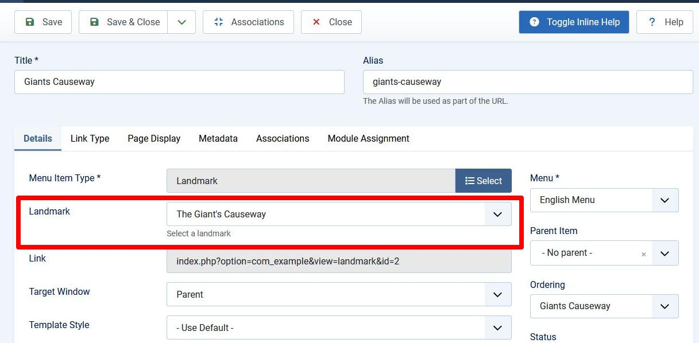

## Introduction

In this step we add another landmark - the Giant's Causeway in Northern Ireland.

This involves making 2 significant changes:

- when defining the menuitem we need to provide a choice of which landmark to choose

- when displaying the site page we need to work out which landmark to display,
and to do this we'll introduce a Model.

The code is available at [com_example step 3](https://github.com/joomla/manual-examples/tree/main/component-tutorial/step03_2_landmarks).

## Learning Points

Creating a request part for a menuitem

Introduction to Joomla standard form fields

Including a Model

Joomla Factory, Application and Input classes

Error handling

## Request part for Menuitem

The default.xml file, which defines the menuitem, needs to change to:

```xml title="components/com_example/tmpl/landmark/default.xml"
<?xml version="1.0" encoding="utf-8"?>
<metadata>
    <layout title="COM_EXAMPLE_LANDMARK_MENUITEM_TITLE">
        <message>COM_EXAMPLE_LANDMARK_MENUITEM_DESCRIPTION</message>
    </layout>
  <!-- highlight-start -->
    <fields name="request">
        <fieldset name="request">
            <field
                name="id"
                type="list"
                label="COM_EXAMPLE_LANDMARK_FIELD_SELECT_TITLE"
                description="COM_EXAMPLE_LANDMARK_FIELD_SELECT_DESC"
                >
                    <option value="1">The Eiffel Tower</option>
                    <option value="2">The Giant's Causeway</option>
            </field>
        </fieldset>
    </fields>
  <!-- highlight-end -->
</metadata>
```

We've introduced 2 new language strings which must be defined in the administrator .ini file:

```php title="administrator/components/com_example/language/en-GB/com_example.ini"
COM_EXAMPLE_LANDMARK_FIELD_SELECT_TITLE="Landmark"
COM_EXAMPLE_LANDMARK_FIELD_SELECT_DESC="Select a landmark"
```

The effect of these changes is shown below. 
(You can reinstall com_example with just the changes above if you want to see the effect at this stage).



The section of the default.xml file within `<fields>` is responsible for creating the part outlined in red:
The "name" attribute for both `<fields>` and `<fieldset>` has to be set to "request".

The `<field>` tag encloses the definition of a Joomla form field,
which maps to the HTML input element and associated label.
The field description is shown when the Toggle Inline Help button is pressed. 

Joomla has a rich set of [standard form fields](../../../general-concepts/forms-fields/standard-fields/index.md),
which greatly simplify the task of building HTML forms. 
The code above uses a [list](../../../general-concepts/forms-fields/standard-fields/list.md) form field,
which creates an HTML `<select>` element for selecting the landmark.

When the menuitem is Saved, then the Link field is filled in. 
This will be set to:

- `index.php?option=com_example&view=landmark&id=1` if the Eiffel Tower is selected

- `index.php?option=com_example&view=landmark&id=2` if the Giant's Causeway is selected

Joomla gets:

- view=landmark from the path of the default.xml file (in tmpl/landmark/)

- id=1 from the "name" attribute in the `<field>` tag, and "value" attribute within the `<option>`.

This indicates the HTTP parameters which will be passed 
in the HTTP GET request which will be generated when the menuitem is selected,
and our code will examine these parameters in order to determine what to display. 

## Site DisplayController

We're going to need a Model instance, and this will be instigated by the Controller.
The code in the display method should now be:

```php title="components/com_example/src/Controller/DisplayController.php"
    public function display($cachable = false, $urlparams = array())
    {
        $view = $this->getView('landmark', 'html');
      <!-- highlight-start -->
        $model = $this->getModel('landmark');
        $view->setModel($model, true);
      <!-- highlight-end -->
        $view->display();
    }
```

The call to `$this->getModel('landmark')` will result in a LandmarkModel instance being created
(actually by the MVC Factory object, similarly to how to LandmarkView instance is created).

The View has setter and getter functions for the Model, 
and the 2nd parameter in `$view->setModel($model, true)` 
means that it will be set as the default Model.

## Site View

The display function of the View class changes to:

```php title="components/com_example/src/View/Landmark/HtmlView.php"
    function display($tpl = null)
    {
      <!-- highlight-next-line -->
        $this->data = $this->getModel()->getItem();
        parent::display($tpl);
    }
```

The View code calls its `getModel()` method to return the default Model,
and then calls `getItem()` to return the data.

## Site Model

Our new code file is 

```php title="components/com_example/src/Model/LandmarkModel.php"
<?php
namespace My\Component\Example\Site\Model;
 
\defined('_JEXEC') or die;

use Joomla\CMS\MVC\Model\ItemModel;
use Joomla\CMS\Factory;

class LandmarkModel extends ItemModel
{
    function getItem($pk = null)
    {
        $app = Factory::getApplication();
        $input = $app->getInput();
        $id = $input->get('id', 0, 'INT');
        switch ($id) {
            case 1:
                return "The Eiffel Tower";
            case 2:
                return "The Giant's Causeway";
            default:
                throw new \UnexpectedValueException("id out of range");
        }
    }
}
```

### ItemModel

```php
use Joomla\CMS\MVC\Model\ItemModel;

class LandmarkModel extends ItemModel
```

ItemModel is used as a base model to inherit from if your Model is just returning a single item.

### Application instance

```php
use Joomla\CMS\Factory;

$app = Factory::getApplication();
```

The Factory class has a static method which enables us to get the Application instance.

The Application instance is the central object controlling the overall flow of control in Joomla,
and there are separate variants for the Joomla site, administrator, API, etc.
By means of the [SiteApplication APIs](cms-api://classes/Joomla-CMS-Application-SiteApplication.html),
we can gain access to many other key Joomla objects.

### Input

The method `$app->getInput()` returns the Input object,
which is what is used within Joomla to access the HTTP parameters. 

```php
$id = $input->get('id', 0, 'INT');
```

As described in the [Input](../../../general-concepts/input.md) documentation, this code

- gets the value of the 'id' HTTP parameter (which should be 1 or 2, based on what was selected in the menuitem)

- sets a default value of 0, which is what will be returned if the 'id' HTTP parameter is not present

- passes the HTTP parameter through an INT filter, so that an integer is always returned.

You should always use Input to access the HTTP parameters,
and ensure that you use an appropriate filter.

### Error Handling

If the id value is out of range, then the code throws an exception:

```php
throw new \UnexpectedValueException("id out of range");
```

This is the standard Joomla way of handling this sort of error.
You can use a language string instead of the hard-coded text,
but generally Joomla code doesn't; it would tend to over-complicate the language .ini files. 

After you install this version, you can demonstrate this exception 
by clicking on the menuitem you created in the previous step. 
Because it didn't include an id parameter, `$id` gets set to the default 0,
and the exception is thrown.

You can also navigate to the administrator Global Configuration / System tab,
and set Debug System to Yes or No.
With Debug System set to Yes, you'll find that the thrown exception causes a stack trace to appear.

Behind the scenes, the Joomla core code is catching this exception,
and then generating an error page using the template at templates/cassiopeia/error.php.

## Installation

Install the new version after updating the version number in the manifest file:

```xml title="com_example/example.xml"
<version>0.3.0</version>
```

You can then explore the functionality of configuring the menuitems with the administrator back-end,
and seeing them appear on the site pages.

## Challenge

Can you add another landmark to provide a third choice for the menuitem? 
You obviously have to be able to click on the menuitem to display it as well.

## Footnote

If you have examined the [SiteApplication APIs](cms-api://classes/Joomla-CMS-Application-SiteApplication.html),
and been surprised not to find the method `getInput` there, the reason is described in 
[Libraries Classes](../../../general-concepts/namespaces/joomla-namespace-prefixes.md#library-classes).
The SiteApplication class (within the CMS side, in libraries/src/Application/SiteApplication.php)
inherits (eventually) from AbstractWebApplication (within the Framework side, in libraries/vendor/joomla/application/src/AbstractWebApplication.php),
so methods which are defined in the latter will not be visible within the APIs of SiteApplication,
and this includes getInput.