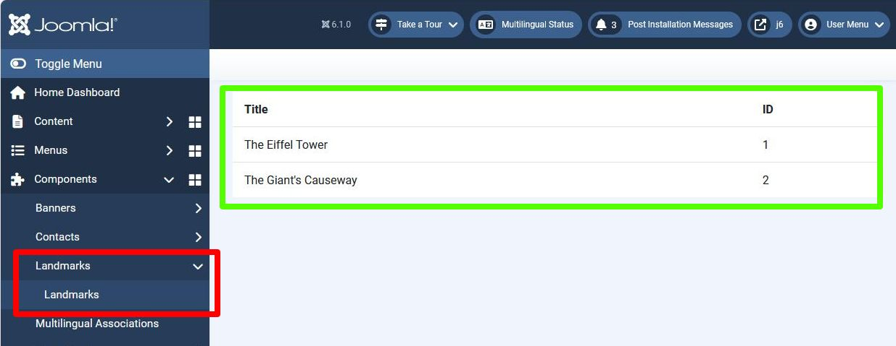

## Introduction

We now begin the development which allows administators to manage the landmarks.
In this step we provide a list of landmarks to the administrator. 

The code is available at [com_example step 5](https://github.com/joomla/manual-examples/tree/main/component-tutorial/step05_admin_list).

## Learning Points

Defining the administrator menu

List Model

## Approach



In this step we develop the 2 items highlighted in the screenshot above:

- in the red rectangle, we'll add our menuitems into the Administrator / Components menu

- in the green rectangle, we'll output the landmarks in an HTML table.

## Defining the administrator menu

The administrator menu is defined in the manifest XML file, so we add a couple of items to the `<administration>` section:

```php title="com_example/example.xml"
    <administration>
        <files folder="administrator/components/com_example">
            <folder>services</folder>
            <folder>sql</folder>
            <folder>src</folder>
            <folder>tmpl</folder>
        </files>
        <languages folder="administrator/components/com_example/language">
            <language tag="en-GB">en-GB/com_example.ini</language>
            <language tag="en-GB">en-GB/com_example.sys.ini</language>
        </languages>
      <--! highlight-start -->
        <menu link="option=com_example">COM_EXAMPLE_MENU</menu>
        <submenu>
            <menu link="option=com_example&amp;view=landmarks">COM_EXAMPLE_MENU</menu>
        </submenu>
      <--! highlight-end -->
    </administration>
```

Here both menu items are given the same text: COM_EXAMPLE_MENU, but you can obviously make them different if you wish.

As these are shown on a page with display from multiple comments, the language string must go into the .sys.ini file:

```php title="administrator/components/com_example/language/en-GB/com_example.sys.ini"
COM_EXAMPLE_TITLE="Joomla Component Tutorial"
COM_EXAMPLE_DESCRIPTION="Builds an example application for managing famous landmarks"
; Menu items
COM_EXAMPLE_LANDMARK_MENUITEM_TITLE="Landmark"
COM_EXAMPLE_LANDMARK_MENUITEM_DESCRIPTION="Displays a famous landmark"
// highlight-start
; Admin menu
COM_EXAMPLE_MENU="Landmarks"
// highlight-end
```

## Displaying the HTML Table

As in the display of a landmark on a site page, we use an MVC approach, 
so we define a Controller, View, Model and tmpl file.

Note that the URL which we have to handle is defined in the `<submenu>` element above, 
namely with the HTTP GET parameters option=com_example and view=landmarks.

How we handle this in the administrator code is similar to how the site front-end handled it. 
We write the following files:

- DisplayController - with a display() method

- a "Landmarks" Model - which returns the landmarks found in the database

- a "Landmarks" View - with a display() method

- a "landmarks" tmpl file, which outputs the HTML

### Controller

As we're displaying data in response to an HTTP GET request, the Dispatcher will call the display method of a DisplayController.
Note that the code includes the Administrator namespace.

```php title="administrator/components/com_example/src/Controller/DisplayController.php"
<?php

namespace My\Component\Example\Administrator\Controller;

\defined('_JEXEC') or die;

use Joomla\CMS\MVC\Controller\BaseController;

class DisplayController extends BaseController {

    public function display($cachable = false, $urlparams = array()) {
        return parent::display($cachable, $urlparams);
    }
}
```

Here the code just calls the `parent::display` which is the display method in BaseController.
The code there (including subsidiary functions) is similar to how we coded the site DisplayController:

```php title="libraries/src/MVC/Controller/BaseController.php"
...
$viewName = $this->input->get('view', $this->default_view);  // will return "landmarks"
...
$view = $this->getView($viewName, ...)  // will return Landmarks\HtmlView class
...
$model = $this->getModel($viewName,...)  // will return LandmarksModel class
$view->setModel($model, true);    // allows us to use $view->getModel() to get this Model
...
$view->display()
```

### View

```php title="administrator/components/com_example/src/View/Landmarks/HtmlView.php"
?php

namespace My\Component\Example\Administrator\View\Landmarks;

\defined('_JEXEC') or die;

use Joomla\CMS\MVC\View\HtmlView as BaseHtmlView;

class HtmlView extends BaseHtmlView {

    function display($tpl = null) {

        $model = $this->getModel();
        $this->items = $model->getItems();

        parent::display($tpl);
    }
}
```

### Model

When returning a list of items then the base model to use is ListModel in libraries/src/MVC/Model/Listmodel.php.
ListModel has a method called getItems which makes a call getListQuery back into our Model class,
in order to obtain a query to apply to the database to select the required records.

The way to write a Joomla database query is described in [Select Data from the Database](../../../general-concepts/database/select-data.md).

```php title="administrator/components/com_example/src/Model/LandmarksModel.php"
<?php

namespace My\Component\Example\Administrator\Model;

\defined('_JEXEC') or die;

use Joomla\CMS\MVC\Model\ListModel;

class LandmarksModel extends ListModel
{
    protected function getListQuery()
    {
        $db = $this->getDatabase();
        $query = $db->getQuery(true);

        $query->select('id, title')
            ->from($db->quoteName('#__example_landmarks'));

        return $query;
    }
}
```

### landmarks tmpl file

This file just outputs an HTML table with the data from the database.

```php title="administrator/components/com_example/tmpl/landmarks/default.php"
<?php

\defined('_JEXEC') or die;

use Joomla\CMS\Language\Text;

?>
<table class="table">
    <thead>
        <tr>
            <th>
                <?php echo Text::_('JGLOBAL_TITLE'); ?>
            </th>
            <th>
                <?php echo Text::_('JGRID_HEADING_ID'); ?>
            </th>
        </tr>
    </thead>
    <tbody><?php foreach ($this->items as $i => $item) :?>
                <tr>
                    <td>
                        <?php echo $item->title; ?>
                    </td>
                    <td>
                        <?php echo $item->id; ?>
                    </td>
                </tr>
            <?php endforeach; ?>
    </tbody>
</table>
```

Because this file is in a new folder we need to include this folder in the manifest XML file:

```xml title="com_example/example.xml"
    <administration>
        <files folder="administrator/components/com_example">
            <folder>services</folder>
            <folder>sql</folder>
            <folder>src</folder>
          <!-- highlight-next-line -->
            <folder>tmpl</folder>
        </files>
    ...
```

## Installation

Do the usual update of the version number in the manifest XML file and install the updated component.

In the administrator back-end click on Components in the left hand panel, and then on the Landmarks submenuitem.

You should see the database records displayed as shown in the screenshot above.

## Challenge

In the administrator DisplayController we didn't write any custom code, 
and instead relied on the BaseController display method to set up the View and Model.
Does the same work for the site DisplayController?

Try removing completely the display() method from the site DisplayController, and then reinstall the component.
How does this affect the front-end functionality? Can you explain it satisfactorily?
