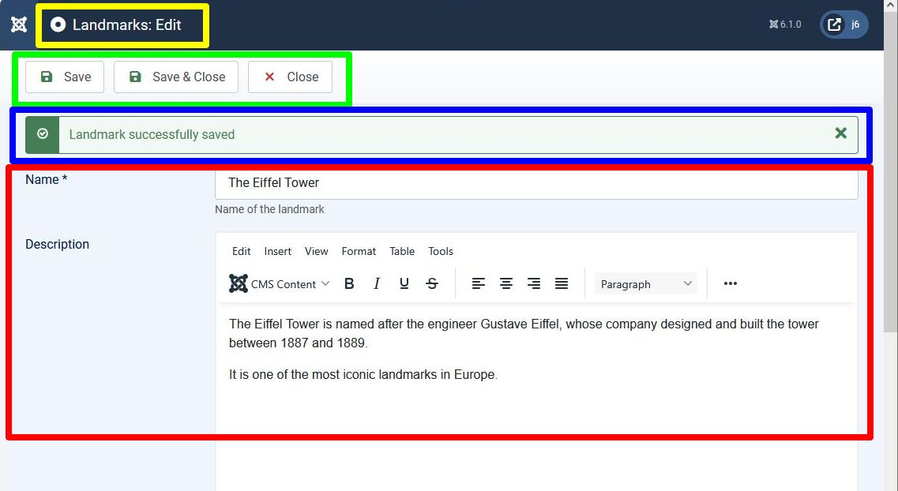

## Introduction

In this step we enable the administrator to edit a landmark record, and
add a description to the landmark database record to provide an entity to edit.

Unfortunately this step is very long, and there's a lot of new code written.
In the next step we'll see how to use Joomla library code to remove a lot of this code.
But it's written in this way so that you can better understand what's happening.

The code is available at [com_example step 7](https://github.com/joomla/manual-examples/tree/main/component-tutorial/step07_admin_edit).

## Learning Points

Joomla MVC Post-Request-Get pattern

Joomla Forms, including the form session token, and storing user state

Filtering data, both on input and output

ToolbarHelper

Updating records using Table

System Messages

## Functionality

In the front-end instead of displaying just the landmark title, we'll now display the landmark title and description.

In the back-end we'll change the list of landmarks so that the title is a link
which will take the administrator to a form where the title and description can be viewed and changed.

## Approach

### Database

Firstly we add a "description" field to the landmark database record, 
which means changing the sql files to apply the database changes.

### Front-end

To output both the title and description on the front-end we need changes to the front-end Model, View and tmpl file 
to handle a structure (with the title and description) rather than passing the title string.

### Back-end

In the landmarks tmpl file we change the landmark title to be a link which will take us to a form where the record can be edited.

We need to code the edit form, allowing the administrator to change the fields and submit the changes.

We need to code a new Controller, View and Model to handle the editing of records.

## Database

We create a SQL update file which will add a "description" column to our landmarks database table.

```sql title="com_example/administrator/components/com_example/sql/updates/mysql/0.7.0.sql"
ALTER TABLE `#__example_landmarks` 
ADD COLUMN `description` TEXT NOT NULL;
```

This means that when we install the update of com_example 
the database table will be altered to add the "description" column.

We name this file "0.7.0" to match the version of the com_example extension,
as recommended in SQL [schema numbering](../../install-update/installation/manifest.md#sql-schema-numbering).

However, it may be the case that this 0.7.0 version is the first version that an administrator installs.
So we need to change our install file to include the "description" column as well:

```sql title="com_example/administrator/components/com_example/sql/install.mysql.sql"
CREATE TABLE IF NOT EXISTS `#__example_landmarks` (
    `id`        INT(11)     NOT NULL AUTO_INCREMENT,
    `title`     VARCHAR(40) NOT NULL,
    `description` TEXT      NOT NULL,
    PRIMARY KEY (`id`)
);

INSERT INTO `#__example_landmarks` (`title`, `description`) VALUES
('The Eiffel Tower', ''),
('The Giant\'s Causeway', '');
```

## Front-end

We change the model code to return the PHP class which has properties set to the fields of the landmark record:

```php title="components/com_example/src/Model/LandmarkModel.php"
    function getItem($pk = null)
    {
        $app = Factory::getApplication();
        $input = $app->getInput();
        $id = $input->get('id', 0, 'INT');

        $table = $this->getTable('Landmark', 'Administrator');
        $result = $table->load($id);
        if ($result) {
      // highlight-next-line
            return $table;
        } else {
            throw new \UnexpectedValueException("id out of range");
        }
    }
```

and we need to handle this in the View:

```php title="components/com_example/src/View/Landmark/HtmlView.php"
    function display($tpl = null)
    {
        $this->data = $this->getModel()->getItem();
        parent::display($tpl);

        $document = $this->getDocument();
      // highlight-next-line
        $document->setTitle($this->data->title);
    }
```

and in the tmpl file:

```php title="components/com_example/tmpl/landmark/default.php"
<?php
\defined('_JEXEC') or die;

?>
// highlight-start
<h4><?php echo $this->escape($this->data->title);?></h4>
<p><?php echo $this->data->description;?></p>
// highlight-end
```

Here we've escaped the title but not the description. 
The `escape` function replaces `<` with `&lt;` and `>` with `&gt;` 
which means that they appear as angle brackets in the client browser, but aren't treated as HTML tags by it.

However, the description field includes text formatting based on HTML,
and if you used `escape` on it then it would display the HTML `<h2>` etc tags in the text,
rather than performing the formatting.
So you shouldn't use `escape` on an editor field like this.

Although the title is escaped, the fact that the code is in a tmpl file
means that administrators who want to allow titles to include HTML formatting
can always define a template override without the `escape`.

## Back-end

To understand how to provide the editing functionality
you should read through the [Joomla Model View Controller Pattern](../mvc/index.md).
We're going to be mirroring the [Edit Article](../mvc/post-redirect-get.md#example-2-edit-article) sequence diagram,
and we split the description of the source code changes to match the actions in that sequence (shown in the green circles).

### Action 1

In the tmpl file displaying a list of landmarks, we change the Landmark Title field to be a link to a form where that record can be edited.

In the sequence diagram, when you click on an article 
it generates an HTTP GET with task=article.edit and id=(id of the article to edit).

So in our case, the URL has the HTTP parameters:

- option=com_example indicating that it's belonging to our component

- task=landmark.edit indicating that it's associated with editing a single landmark

- id=(record id) indicating the record to be edited

To form the URL we use the `Route` class, and the `<th>` element outputting `<?php echo $this->escape($item->title); ?>`
now becomes an `<a href=...>` element using the URL generated by `Route`:

```php title="administrator/components/com_example/tmpl/landmarks/default.php"
// highlight-next-line
use Joomla\CMS\Router\Route;
...
<th scope="row">
  // highlight-start
    <?php 
        $url = Route::_('index.php?option=com_example&task=landmark.edit&id=' . $item->id);
        $linkText = $this->escape($item->title); 
        echo "<a href='{$url}'>{$linkText}</a>";
    ?>
  // highlight-end
</th>
```

### Action 3

Here we handle the HTTP GET request with the above parameters, in particular, with task=landmark.edit.

As described in the [HTTP Request task Parameter](../mvc/mvc-overview.md#the-http-request-task-parameter),
this will cause the Dispatcher to instantiate (via the MVCFactory) a LandmarkController class, 
and to call the edit() method of it.

In later tutorial steps we will implement functionality (such as checkout) within this edit function,
but for this step we simply perform a redirect to a URL which displays the edit landmark form:

```php title="administrator/components/com_example/src/Controller/LandmarkController.php"
<?php

namespace My\Component\Example\Administrator\Controller;

\defined('_JEXEC') or die;

use Joomla\CMS\MVC\Controller\BaseController;
use Joomla\CMS\Router\Route;

class LandmarkController extends BaseController {

    public function edit() 
    {
        $id = $this->input->get('id', 0, "INT");
        $this->setRedirect(Route::_("index.php?option=com_example&view=landmark&layout=edit&id={$id}", false));
        return true;
    }
}
```

Note the `false` second parameter to `Route::_()`, so that `&` doesn't get converted to `&amp;`, as we're not outputting HTML here.

### Action 4

Here we handle the HTTP GET request with the parameters set in action 3, namely

- option=com_example which will route the request to our component,

- view=landmark which means we should have a View\Landmark\HtmlView class, and we'll use a matching LandmarkModel,
and a matching directory for the tmpl file,

- layout=edit which defines the name of the tmpl file, namely tmpl/landmark/edit.php,

- id=(record id) indicating the record to be edited. 

As there is no task parameter, the Dispatcher will cause the DisplayController to be instantiated,
and its display() method called. 

In the tutorial [step 6 Admin List](./step06-admin-list.md) we found that for a URL with view=landmarks,
we could use the BaseController.php code to instantiate the View\Landmarks\HtmlView and LandmarksModel classes,
and this same base code works for us here too and we don't need to change anything.
We just have to define the View and Model with the correct classes, and the BaseController code will find them ok.

The files we're going to need here are:

- the View class, in administrator/components/com_example/src/View/Landmark/HtmlView.php

- its associated tmpl file, in administrator/components/com_example/tmpl/landmark/edit.php

- the Model class, in administrator/components/com_example/src/Model/LandmarkModel.php

- the form definition, in administrator/components/com_example/forms/landmark.xml

Here we're going to display the webpage for editing a landmark:

.

The individual sections of the page will arise from:

- yellow rectangle: ToolBarHelper::title() in the View

- green rectangle: ToolbarHelper::apply() etc in the View

- blue rectangle: system message output in the LandmarkController (in Action 5)

- red rectangle: from the form defined in the landmark.xml file

At this point you should read [How Forms Work](../../../general-concepts/forms/how-forms-work.md).
In this section (Action 4) we're going to be dealing with steps 1 to 3 on that page.
In the next section (Action 5) we'll handle steps 4 and 5 on that page.

#### View

```php title="administrator/components/com_example/src/View/Landmark/HtmlView.php"
<?php

namespace My\Component\Example\Administrator\View\Landmark;

\defined('_JEXEC') or die;

use Joomla\CMS\MVC\View\HtmlView as BaseHtmlView;
use Joomla\CMS\Language\Text;
use Joomla\CMS\Toolbar\ToolbarHelper;
use Joomla\CMS\Factory;

class HtmlView extends BaseHtmlView {

    function display($tpl = null) {

        $model = $this->getModel();
        $this->form = $model->getForm();
        $this->item = $model->getItem();

        $this->addToolBar();
        
        parent::display($tpl);
    }
    
    protected function addToolBar() {

        // Hide Joomla Administrator Main menu
        Factory::getApplication()->getInput()->set('hidemainmenu', true);

        ToolBarHelper::title(Text::_('COM_EXAMPLE_LANDMARK_EDIT'));
        ToolbarHelper::apply('landmark.apply', 'JTOOLBAR_APPLY');   // Save button
        ToolbarHelper::save('landmark.save', 'JTOOLBAR_SAVE');      // Save & Close button
        ToolbarHelper::cancel('landmark.cancel', 'JTOOLBAR_CLOSE'); // Cancel button
    }
}
```

The ToolbarHelper apply, save and cancel calls create the Save, Save & Close and Cancel buttons.
When one of these buttons is pressed then the form will be submitted,
and the data of the form fields will be sent as parameters of an HTTP POST request sent to the server.
The first parameter of these ToolbarHelper function calls is what the `task` parameter will be set to in this POST request.

#### Model and Form

This is the part of the Model file which handles generation of the Form.
(We'll add more methods in Action 5 below).

```php title="administrator/components/com_example/src/Model/LandmarkModel.php"
<?php
namespace My\Component\Example\Administrator\Model;
 
\defined('_JEXEC') or die;

use Joomla\CMS\MVC\Model\ItemModel;
use Joomla\CMS\Factory;
use Joomla\CMS\Form\FormFactoryAwareInterface;
use Joomla\CMS\Form\FormFactoryAwareTrait;
use Joomla\CMS\MVC\Model\FormModelInterface;
use Joomla\CMS\MVC\Model\FormBehaviorTrait;

class LandmarkModel extends ItemModel implements FormFactoryAwareInterface, FormModelInterface
{
    use FormFactoryAwareTrait;  // getter/setter for FormFactory, which instantiates the Form object
    use FormBehaviorTrait;      // contains the functions for loadForm etc
    
    function getForm($data = array(), $loadData = true)
    {
        $form = $this->loadForm(
            'com_example.landmark', // a name you assign to the form - include com_example to make it unique
            'landmark',             // the xml filename - Joomla will find it in forms/landmark.xml
            array(
                'control' => 'jform',       // the name of the parameter in the HTTP POST
                'load_data' => $loadData    // whether to prefill data or not
            )
        );

        if (empty($form))
        {
            return false;
        }

        return $form;
    }
    
    protected function loadFormData()  // the callback function which is called if $loadData was true
    {
        // Check the session for previously entered form data.
        $data = Factory::getApplication()->getUserState('com_example.edit.landmark.data', array());

        if (empty($data))
        {
            $data = $this->getItem();
        }

        return $data;
    }
    
    function getItem($pk = null) // gets the landmark record from the database, based on the HTTP id parameter
    {
        $app = Factory::getApplication();
        $input = $app->getInput();
        $id = $input->get('id', 0, 'INT');

        $table = $this->getTable('Landmark', 'Administrator');
        $result = $table->load($id);
        if ($result) {
            return $table;
        } else {
            throw new \UnexpectedValueException("id out of range");
        }
    }
}
```

The call to `loadForm` (located in the FormBehaviorTrait.php file) results in 

- the Form object being instantiated, and,

- the form definition xml file (below) being read in
(step 1 in [How Forms Work](../../../general-concepts/forms/how-forms-work.md)).

```xml title="administrator/components/com_example/forms/landmark.xml"
<?xml version="1.0" encoding="utf-8"?>
<form> 
        <field
                name="id"
                type="text"
                label="JGLOBAL_FIELD_ID_LABEL"
                class="readonly"
                default="0"
                readonly="true"
                />
        <field
                name="title"
                type="text"
                label="COM_EXAMPLE_LANDMARK_TITLE_LABEL"
                description="COM_EXAMPLE_LANDMARK_TITLE_DESC"
                required="true"
                default=""
                />
        <field  name="description" 
                type="editor"
                label="COM_EXAMPLE_LANDMARK_DESCRIPTION_LABEL" 
                description="COM_EXAMPLE_LANDMARK_DESCRIPTION_DESC"
                filter="\Joomla\CMS\Component\ComponentHelper::filterText" 
                buttons="true" 
                />
</form>
```

These fields are all types of Joomla [Standard Form Fields](../../../general-concepts/forms-fields/standard-fields/index.md).
Some attributes are specific to the type of the form field,
while common ones are described in [Standard Form Field Attributes](../../../general-concepts/forms-fields/standard-form-field-attributes.md).

The Form object makes a callback into `loadFormData` to get the prefill data for the form fields,
and it then binds this data to the form
(step 2 in [How Forms Work](../../../general-concepts/forms/how-forms-work.md)).

#### tmpl file

```php title="administrator/components/com_example/tmpl/landmark/edit.php"
<?php
defined('_JEXEC') or die;

use Joomla\CMS\Router\Route;
use Joomla\CMS\HTML\HTMLHelper;
?>

<form action="<?php echo Route::_('index.php?option=com_example&layout=edit&id=' . (int) $this->item->id); ?>"
    method="post" name="adminForm" id="adminForm">

    <?php echo $this->form->renderField('title');  ?>

    <?php echo $this->form->renderField('description');  ?>

    <?php echo $this->form->renderField('id');  ?>

    <input type="hidden" name="task" value="" />
    <?php echo HTMLHelper::_('form.token'); ?>
</form>
```

The form fields are output using `renderField`,
(step 3 in [How Forms Work](../../../general-concepts/forms/how-forms-work.md)).

The `<form action= ...>` attribute (which specifies the URL for the HTTP POST) 
has the same URL as was set in the Redirect in Action 3 above.

The form name should be set to "adminForm".

Note that the tmpl file doesn't need to output the Toolbar buttons,
as this is handled by the Administrator Toolbar module.
The JavaScript behind the buttons sets the task parameter to the parameter that was set in the View ToolbarHelper calls
(ie 'landmark.apply' etc), but the tmpl file does need to output the task hidden input element:

```php
    <input type="hidden" name="task" value="" />
```

The line `HTMLHelper::_('form.token')` creates a token to reduce the risk of CSRF attacks,
as described in [Security Token](../../../general-concepts/forms/mvc-etc.md#security-token)

#### Additional Language Strings

The toolbar title, and the labels and descriptions in the form XML file need to be defined:

```php title="administrator/components/com_example/language/en-GB/com_example.ini"
COM_EXAMPLE_LANDMARK_FIELD_SELECT_TITLE="Landmark"
COM_EXAMPLE_LANDMARK_FIELD_SELECT_DESC="Select a landmark"
; Admin landmarks view
COM_EXAMPLE_LANDMARKS_CAPTION="Table of Landmarks"
// highlight-start
; Admin landmark edit form
COM_EXAMPLE_LANDMARK_EDIT="Landmarks: Edit"
COM_EXAMPLE_LANDMARK_TITLE_LABEL="Name"
COM_EXAMPLE_LANDMARK_TITLE_DESC="Name of the landmark"
COM_EXAMPLE_LANDMARK_DESCRIPTION_LABEL="Description"
COM_EXAMPLE_LANDMARK_DESCRIPTION_DESC="A summary description of the landmark"
COM_EXAMPLE_SAVE_SUCCESS="Landmark successfully saved"
// highlight-end
```

### Setting and Getting the UserState

Imagine a user filling in an HTML form, submitting the data to the server,
and then the server rejecting the submission because the data is invalid.

In this case, the form is re-presented, and it's more user-friendly to prefill the fields
with the data which was previously entered, rather than force the user to enter the data from scratch.

To manage this, Joomla provides the [Application methods](cms-api://classes/Joomla-CMS-Application-CMSApplication.html#method_setUserState)

- setUserState($context, $data)

- getUserState($context)

which is managed via the Session. 

The component calls setUserState to store the user's data after a form is submitted.

If the form is re-presented before successful submission of the data then the fields are prefilled with this data.

When the form data is submitted and passes validation,
or if the user cancels the operation, then the store is cleared.

The `$context` should include the component name at the start (to avoid collisions with other extensions),
and we set it to 'com_example.edit.landmark.data' here.

### Action 5

Here we handle the HTTP POST request with the submitted form data,
which are steps 4 and 5 in the [How Forms Work](../../../general-concepts/forms/how-forms-work.md) section.

As mentioned above, the task parameter will be set to the parameter passed in the ToolbarHelper calls in the View,
so it can be 'landmark.apply', 'landmark.save' or 'landmark.cancel'.
So the request will be routed to apply(), save() and cancel() functions of the LandmarkController class,
and these are the functions we need to add to the LandmarkController.php file.

#### Cancel

Here's the cancel function: 

```php title="administrator/components/com_example/src/Controller/LandmarkController.php"
    public function cancel() 
    {
        $this->checkToken();

        $this->app->setUserState('com_example.edit.landmark.data', null);

        $this->setRedirect(Route::_("index.php?option=com_example&view=landmarks", false));

        return true;
    }
```

After checking the token and clearing the user state the code sets up a redirect to the list of landmarks page.

#### Save (Save & Close button)

Here's the save() function - the comments in the code explain what is happening.
You will also need to add at the top:

```php
use Joomla\CMS\Language\Text;
```

```php title="administrator/components/com_example/src/Controller/LandmarkController.php"
    public function save($key = null, $urlVar = null)
    {
        $this->checkToken();

        $model   = $this->getModel();
        $table   = $model->getTable();
        
        // get the submitted data which was sent in the HTTP POST 
        // It's in an array called jform - because of 'control' => 'jform' in the previous loadForm call
        $data    = $this->input->post->get('jform', [], 'array');
        
        // The above line doesn't perform any filtering of the input data
        // so you MUST filter the data subsequently (eg using the cast to int below).
        // Even though the id field in the form is readonly and can't be changed there,
        // hackers can easily manufacture (eg using curl) an HTTP POST with id set to anything.
        $id = (int)$data['id'];
        
        // the filtering and validation is based on information in the form
        // so to do that we need to load the form again
        $form = $model->getForm();
        
        // perform filtering on the data to remove risky HTML tags, inappropriate data, etc
        // This will result in a $form->filter($data) call in the Model
        $data = $model->filter($form, $data);
        
        // perform validation on the data
        // This will result in a $form->validate($data) call in the Model
        $result = $model->validate($form, $data);
        if (!$result) {
            $this->app->setUserState('com_example.edit.landmark.data', $data);

            $this->setMessage(Text::sprintf('JLIB_APPLICATION_ERROR_SAVE_FAILED', $model->getError()), 'error');
            
            // Redirect back to the edit screen.
            $this->setRedirect(Route::_("index.php?option=com_example&view=landmark&layout=edit&id={$id}", false));

            return false;
        }

        // Attempt to save the data.
        if (!$model->save($data)) {
            $this->app->setUserState('com_example.edit.landmark.data', $data);

            $this->setMessage(Text::sprintf('JLIB_APPLICATION_ERROR_SAVE_FAILED', $model->getError()), 'error');

            $this->setRedirect(Route::_("index.php?option=com_example&view=landmark&layout=edit&id={$id}", false));

            return false;
        }

        // clear the session data
        $this->app->setUserState('com_example.edit.landmark.data', null);
        
        // This sets a message within the system message area on the administrator page
        $this->setMessage(Text::_('COM_EXAMPLE_SAVE_SUCCESS'));

        // Redirect back to the list of landmarks
        $this->setRedirect(Route::_("index.php?option=com_example&view=landmarks", false));

        return true;
    }
```

Here are the associated functions which need to be added to the LandmarkModel:

```php title="administrator/components/com_example/src/Model/LandmarkModel.php"
    function filter($form, $data)
    {
        return $form->filter($data);
    }
    
    function validate($form, $data)
    {
        $result = $form->validate($data);
        
        // Check for errors
        // Joomla has been moving from custom errors attached to objects to the use of PHP Exceptions,
        // so in this transitional phase you have to check for both
        if ($result instanceof \Exception) {
            $this->setError($result->getMessage());
            return false;
        }

        if ($result === false) {
            // Get the validation messages from the form.
            foreach ($form->getErrors() as $message) {
                $this->setError($message);
            }
            return false;
        }
        
        return true;
    }
        
    function save($data)
    {
        $table = $this->getTable();
        $result = $table->load($data['id']);
        if (!$result) {
            throw new \UnexpectedValueException("id out of range");
        }
        
        if (!$table->bind($data)) {
            $this->setError($table->getError());
            return false;
        }
        
        if (!$table->store()) {
            $this->setError($table->getError());
            return false;
        }
        
        return true;
    }
```

The filter operation is based on what is set on the 'filter=xxx' attribute 
of the field in the form xml definition.

For the description field we have: filter="\Joomla\CMS\Component\ComponentHelper::filterText",
and this results in the filtering being performed according to the Global Configuration / Text Filters tab.

The title field doesn't have any filter attribute, but text fields have a default filtering applied.

At the moment we haven't set any validation to be performed,
so the `$form->validate` call will not cause an error.

The data is saved using the Table functionality. 
For an explanation of these lines please see [Basic Table Functionality](../../../general-concepts/table/basic-table.md).

To make the Table::bind work, the array element keys must match the names of the columns in the database.
As these keys are the 'name' attributes of the fields in the form definition XML file,

**the name attributes in the form xml file should match the names of the columns in the database**.

#### Apply (Save Button)

Apply is handled in a similar way to Save, 
except that the redirect is back to the same form rather than to the list of landmarks page.

```php title="administrator/components/com_example/src/Controller/LandmarkController.php"
public function apply($key = null, $urlVar = null)
    {
        $this->checkToken();

        $model = $this->getModel();
        $table = $model->getTable();
        $data = $this->input->post->get('jform', [], 'array');
        $id = (int)$data['id'];
 
        $form = $model->getForm();
        
        // perform filtering on the data
        $data = $model->filter($form, $data);
        $this->app->setUserState('com_example.edit.landmark.data', $data);
        
        // perform validation on the data
        $result = $model->validate($form, $data);
        if (!$result) {

            $this->setMessage(Text::sprintf('JLIB_APPLICATION_ERROR_SAVE_FAILED', $model->getError()), 'error');
            
            // Redirect back to the edit screen.
            $this->setRedirect(Route::_("index.php?option=com_example&view=landmark&layout=edit&id={$id}", false));

            return false;
        }

        // Attempt to save the data.
        if (!$model->save($data)) {

            $this->setMessage(Text::sprintf('JLIB_APPLICATION_ERROR_SAVE_FAILED', $model->getError()), 'error');

            $this->setRedirect(Route::_("index.php?option=com_example&view=landmark&layout=edit&id={$id}", false));

            return false;
        }
        
        $this->app->setUserState('com_example.edit.landmark.data', null);
        
        $this->setMessage(Text::_('COM_EXAMPLE_SAVE_SUCCESS'));

        $this->setRedirect(Route::_("index.php?option=com_example&view=landmark&layout=edit&id={$id}", false));

        return true;
    }
```

## Installation

In the manifest file, update the list of administrator folders to include the forms folder,
(as well as updating the version number).

```xml title="com_example/example.xml"
  <!-- highlight-next-line -->
    <version>0.7.0</version>
...
    <administration>
        <files folder="administrator/components/com_example">
          <!-- highlight-next-line -->
            <folder>forms</folder>
            <folder>services</folder>
            <folder>sql</folder>
            <folder>src</folder>
            <folder>tmpl</folder>
        </files>
```

After installation you should display the list of landmarks page, and click on a landmark to edit it.

You can create a save error by specifying a title which is longer than 40 characters.

## Exploring your installation

### HTTP Requests

Switch on your browser devtools to view the HTTP requests and responses,
and try to match them with the code we've written. 

(You may also see Ajax calls to trigger the running of Joomla Scheduled Tasks).

Also look at the parameters in the HTTP POST after you press Save or Save & Close. 
You should see the parameters set in the jform array, 
with the array key being the name attribute of that field in the form XML file. 

### User State

In Global Configuration / System set Debug System to Yes.
This should cause a Joomla logo to appear at the bottom left of the screen.
Click on it to display the debug output.

After you have used the landmark edit screen, 
click on the Session tab of the debug output, then on the value to the right of registry. 
If you scroll down you should see what is stored against com_example.edit.landmark.data.

## Footnotes

### Instantiating the Form Object

In Joomla the Form object is instantiated by using the FormFactory::createForm method,
and the FormFactory is obtained from the Dependency Injection Container. 
So how does it all work?

At the start of the LandmarkModel we have this code:

```php title="administrator/components/com_example/src/Model/LandmarkModel.php"
<?php

use Joomla\CMS\Form\FormFactoryAwareInterface;
use Joomla\CMS\Form\FormFactoryAwareTrait;
use Joomla\CMS\MVC\Model\FormBehaviorTrait;

class LandmarkModel extends ItemModel implements FormFactoryAwareInterface, FormModelInterface
{
    use FormFactoryAwareTrait;  // getter/setter for FormFactory, which instantiates the Form object
    use FormBehaviorTrait;      // contains the functions for loadForm etc
```

The FormFactoryAwareTrait includes the 2 functions 

- setFormFactory - which gets passed the FormFactory instance, and stores it locally

- getFormFactory - which returns the locally-stored FormFactory.

The FormFactoryAwareInterface requires the class to implement the setFormFactory method.

When the MVCFactory creates the Model, it checks to see if the Model implements FormFactoryAwareInterface,
and if so then it gets the FormFactory from the DIC and injects it into the Model using setFormFactory.

Then when the Model calls loadForm (in FormBehaviorTrait), it calls

- getFormFactory to get the FormFactory instance, and,

- $formFactory->createForm to create the Form instance.

This is a pattern which is used in several places in Joomla to inject a dependency into a class:

- the trait contains the getter/setter

- the interface specifies that the setter function must be implemented

- a class (eg a Model) implements the interface, and uses the trait

- the Factory which creates the (Model) class checks if it implements the interface,
and if so then it uses the setter function to inject the dependency into it.