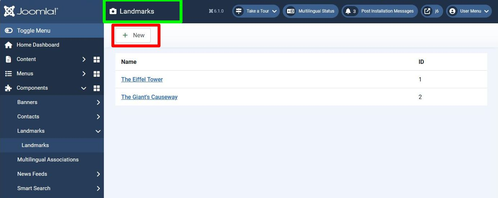

## Introduction

In this step we provide the capability to add a new landmark record. 

The code is available at [com_example step 9](https://github.com/joomla/manual-examples/tree/main/component-tutorial/step09_add_record).

## Learning Points

Administrator adding records

Introduction to Joomla Icons

## Approach

The approach for adding a record follows the [Post-Request-Get Pattern Edit Article](../mvc/post-redirect-get.md#example-2-edit-article),
and we will make use of the methods available in the FormController and AdminModel classes. 

## Action 1

This refers to Action 1 within the [Post-Request-Get Pattern Edit Article](../mvc/post-redirect-get.md#example-2-edit-article) example,
which in our case displays the list of landmarks.
However, here we're not editing a landmark record, but wanting to create a new landmark record,
so rather than selecting a landmark to edit, we provide a New button to press 


We've also added a title and a camera icon (in the green rectangle);
this title also gets mapped into the browser title (which will be shown in the browser tab).

Both the title and New button are implemented as Toolbar buttons; here is the updated View file:

```php title="administrator/components/com_example/src/View/Landmarks/HtmlView.php"
<?php

namespace My\Component\Example\Administrator\View\Landmarks;

\defined('_JEXEC') or die;

use Joomla\CMS\MVC\View\HtmlView as BaseHtmlView;
// highlight-start
use Joomla\CMS\Language\Text;
use Joomla\CMS\Toolbar\ToolbarHelper;
// highlight-end

class HtmlView extends BaseHtmlView {

    function display($tpl = null) 
    {
        $model = $this->getModel();
        $this->items = $model->getItems();
        
        // highlight-next-line
        $this->addToolBar();

        parent::display($tpl);
    }
    
  // highlight-start
    private function addToolBar() 
    {
        ToolBarHelper::title(Text::_('COM_EXAMPLE_LANDMARKS_VIEW_TITLE'), 'camera');
        ToolbarHelper::addNew('landmark.add', 'JTOOLBAR_NEW');   // New button
    }
  // highlight-end
}
```

and the new language string COM_EXAMPLE_LANDMARKS_VIEW_TITLE must be defined:

```php title="administrator/components/com_example/language/en-GB/com_example.ini"
COM_EXAMPLE_LANDMARK_FIELD_SELECT_TITLE="Landmark"
COM_EXAMPLE_LANDMARK_FIELD_SELECT_DESC="Select a landmark"
; Admin landmarks view
// highlight-next-line
COM_EXAMPLE_LANDMARKS_VIEW_TITLE="Landmarks"
COM_EXAMPLE_LANDMARKS_CAPTION="Table of Landmarks"
COM_EXAMPLE_LANDMARK_TITLE_LABEL="Name"
; Admin landmark edit form
COM_EXAMPLE_LANDMARK_EDIT="Landmarks: Edit"
COM_EXAMPLE_LANDMARK_TITLE_DESC="Name of the landmark"
COM_EXAMPLE_LANDMARK_DESCRIPTION_LABEL="Description"
COM_EXAMPLE_LANDMARK_DESCRIPTION_DESC="A summary description of the landmark"
COM_EXAMPLE_SAVE_SUCCESS="Landmark successfully saved"
```

The way that Joomla buttons work is that when a user presses one then
the associated JavaScript sets the `task` parameter to the value passed in the ToolbarHelper function call
(in this case 'landmark.add') and then submits the form. 

So in our tmpl file we need to enclose the table in a `<form>` and supply a `task` input element.

```php title="administrator/components/com_example/tmpl/landmarks/default.php"
...
?>
// highlight-next-line
<form action="<?php echo Route::_('index.php?option=com_example&view=landmarks'); ?>" method="post" name="adminForm" id="adminForm">

    <table class="table">
    ...
    </table>
// highlight-start
    <input type="hidden" name="task" value="" />

</form>
// highlight-end
```

(We don't need a form.token [Security Token](../../../general-concepts/forms/mvc-etc.md#security-token) here
because we're not submitting data to implement any changes, just redirecting to display another form).

When the New button is pressed it generates an HTTP POST to index.php?option=com_example&view=landmarks
(the value of the form `action` attribute) with task=landmark.add as the POST parameter.

## Action 3

The task=landmark.add will cause the HTTP request to be routed to LandmarkController::add().
We don't need to provide any code, as LandmarkController extends FormController,
and FormController::add() provides what we need - a redirect to index.php?option=com_example&view=landmark&layout=edit,
with the user state data set to null.

## Action 4

Here we handle the URL from Action 3: index.php?option=com_example&view=landmark&layout=edit.

The is the same URL as for the case of editing a landmark, except that there is no `id` parameter.
So the code displays the edit form, with the id value set to its default of 0 (in administrator/components/com_example/forms/landmark.xml).

The classes and methods which this Action 4 will use are:

- DisplayController::display() - as there is no `task` parameter in the HTTP request

- the View class display(), in administrator/components/com_example/src/View/Landmark/HtmlView.php (based on view=landmark in the URL)

- its associated tmpl file, in administrator/components/com_example/tmpl/landmark/edit.php (based on layout=edit in the URL)

- the Model class getForm(), loadFormData() and getItem() methods, in administrator/components/com_example/src/Model/LandmarkModel.php 
(default Model class for the URL which has view=landmark)

We actually have no additional code to write here. For example, in AdminModel we have:

```php title="libraries/src/MVC/Model/AdminModel.php"
public function getItem($pk = null)
{
    $pk    = (!empty($pk)) ? $pk : (int) $this->getState($this->getName() . '.id');
    $table = $this->getTable();

    if ($pk > 0) {
        // Attempt to load the row.
        $return = $table->load($pk);
        ...
```

Because we don't have an `id` parameter in the HTTP request parameters, the getState() call will return `null`,
and the cast to int will convert this into a 0. So in this case it will not attempt to load a row from the table,
and what will be displayed in the form will just be blank fields. 

## Action 5

Here we handle the HTTP POST request with the submitted form data.
As for the edit case, these will be routed to LandmarkController based on the `task` parameter:

- cancel() method if the user pressed the Cancel button (task = 'landmark.cancel')

- save() method if the user pressed the Save button (task = 'landmark.apply') or Save & Close button (task = 'landmark.save')

By looking at the AdminModel::save() method you can see that the code loads an existing record only `if ($pk > 0)`.

The data is written to the database using the `$table->store()` method, 
and by looking at libraries/src/Table/Table.php::store() you can see how 
the code decides whether to perform an update or an insert at the database level.

Here again we have no additional code to write.

## Installation

In the manifest file, update the version number:

```xml title="com_example/example.xml"
  <!-- highlight-next-line -->
    <version>0.9.0</version>
...
```

and then install the updated component.

## Exploring your installation

### HTTP Requests

Switch on your browser devtools to view the HTTP requests and responses,
to see how the HTTP parameters differ from the case of editing a record.

### User State

Use the debug output to view the user state (session tab, registry value).
You can still use a landmark name (title column) longer than 40 characters to force an error,
and thus view the form data which failed to save. 

## Challenge

In the view file the camera icon was added into the form title using the code:

```
ToolBarHelper::title(Text::_('COM_EXAMPLE_LANDMARKS_VIEW_TITLE'), 'camera');
```

Using icons within Joomla is described in [Icons](../../../general-concepts/icons.md),
and the icons available are depicted in [Icons in standard templates](https://guide.joomla.org/user-manual/templates/standard-icons).

Try changing the icon from a camera to one of the other Joomla / fontawesome icons.