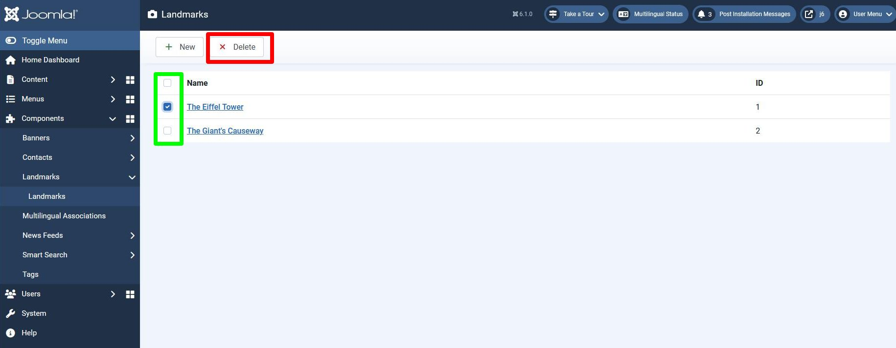

## Introduction

In this step we provide the capability to delete landmark records. 
Using the Landmarks list view the administrator will be able to select a number of records,
and then press the Delete button to delete them from the database.

The code is available at [com_example step 10](https://github.com/joomla/manual-examples/tree/main/component-tutorial/step10_delete_records).

:::note
  The Joomla com_content component doesn't use this approach, but rather deletes records by a 2-stage process:

- the administrator selects records and then marks them as Trashed -
this is implemented as a state change and the records can be recovered if required

- the administrator then can view these Trashed records and can select those to be permanently deleted.

This approach will be covered in a future tutorial step, after publishing state has been covered.
:::

## Learning Points

Administrator deleting records

HTML Registry functions

## Approach

On the administrator list of landmarks form we add:

1. a checkbox against each landmark record, to allow that record to be selected -
these will be added by changing the landmarks tmpl file.

2. a Delete button which the administrator can press to delete the selected records -
this will be added by adding a toolbar button in the landmarks View class.



The delete process follows the [Post-Request-Get Pattern Publish Articles](../mvc/post-redirect-get.md#example-1-publish-articles).

Pressing the Delete button submits the form as an HTTP POST request, 
and the deleting of database records is handled in the MVC triad which handles the POST.
The user is then redirected back to the list of landmarks record. 

## Action 1

This refers to Action 1 within the [Post-Request-Get Pattern Publish Articles](../mvc/post-redirect-get.md#example-1-publish-articles) example,
which in our case displays the list of landmarks.

In the View class we need an extra line within the `addToolBar` function to display the Delete button:

```php title="administrator/components/com_example/src/View/Landmarks/HtmlView.php"
    private function addToolBar() 
    {
        ToolBarHelper::title(Text::_('COM_EXAMPLE_LANDMARKS_VIEW_TITLE'), 'camera');
        ToolbarHelper::addNew('landmark.add', 'JTOOLBAR_NEW');   // New button
      // highlight-next-line
        ToolbarHelper::deleteList('', 'landmarks.delete', 'JTOOLBAR_DELETE');   // Delete button
    }
```

When the Delete button is pressed, the HTTP POST will have the `task` parameter set to 'landmarks.delete'.

The updated landmarks tmpl file is:

```php title="administrator/components/com_example/tmpl/landmarks/default.php"
<?php

\defined('_JEXEC') or die;

// highlight-next-line
use Joomla\CMS\HTML\HTMLHelper;
use Joomla\CMS\Language\Text;
use Joomla\CMS\Router\Route;

?>
<form action="<?php echo Route::_('index.php?option=com_example&view=landmarks'); ?>" method="post" name="adminForm" id="adminForm">

    <table class="table">
        <caption class="visually-hidden">
            <?php echo Text::_('COM_EXAMPLE_LANDMARKS_CAPTION'); ?>
        </caption>
        <thead>
            <tr>
              // highlight-start
                <td class="w-1 text-center">
                    <?php echo HTMLHelper::_('grid.checkall'); ?>
                </td>
              // highlight-end
                <th scope="col">
                    <?php echo Text::_('COM_EXAMPLE_LANDMARK_TITLE_LABEL'); ?>
                </th>
                <th scope="col">
                    <?php echo Text::_('JGRID_HEADING_ID'); ?>
                </th>
            </tr>
        </thead>
        <tbody><?php foreach ($this->items as $i => $item) :?>
                    <tr>
                      // highlight-start
                        <td class="text-center">
                            <?php echo HTMLHelper::_('grid.id', $i, $item->id, false, 'cid', 'cb', $item->title); ?>
                        </td>
                      // highlight-end
                        <th scope="row">
                            <?php 
                                $url = Route::_('index.php?option=com_example&task=landmark.edit&id=' . $item->id);
                                $linkText = $this->escape($item->title); 
                                echo "<a href='{$url}'>{$linkText}</a>";
                            ?>
                        </th>
                        <td>
                            <?php echo (int) $item->id; ?>
                        </td>
                    </tr>
                <?php endforeach; ?>
        </tbody>
    </table>
    <input type="hidden" name="task" value="" />
  // highlight-start
    <input type="hidden" name="boxchecked" value="0" />
    <?php echo HTMLHelper::_('form.token'); ?>
  // highlight-end
</form>
```

The changes are explained in detail below.

### Column Header

The table has an additional column consisting of checkboxes,
and the header for this new column within the `<thead>` element 
is a `<td>` element rather than a `<th>` element. 
This is for accessibility reasons, for users using a screen reader, 
because the column does not contain attribute information of the record being displayed.

The 'w-1' CSS class is used to specify a width of 1% of the whole. 

### HTMLHelper functions

There are 2 HTMLHelper functions used in the code:

- `HTMLHelper::_('grid.checkall')` - for displaying the box in the table head which selects / deselects all the records

- `HTMLHelper::_('grid.id', $i, $item->id, false, 'cid', 'cb', $item->title)` - for displaying a checkbox for an individual record

These are reusable functions for outputting snippets of HTML, 
as described in [HTML Registry](../../../general-concepts/html-registry.md).

In this case we're using the `checkall` and `id` functions of the Joomla\CMS\HTML\Helpers\Grid class,
as described in [Grid utility class API](cms-api://classes/Joomla-CMS-HTML-Helpers-Grid.html).

Some of the parameters of the grid `id` function are used as follows:

- the `id` attribute of the HTML checkbox element is formed from the 'cb' string 
concatenated with the table row number (from `$i`), 
so that the HTML element ids are 'cb0', 'cb1', 'cb2', etc.

- the `name` attribute is set to `'cid[]'` and the `value` attribute is set to `$item->id`
(ie the value of the id column in the database record).
This has the result that in the HTTP POST the values of the checkboxes are sent to the server
as an array with name 'cid' and array entries being the database ids of the records selected.

- `false` means that the record is not checked out. 
If set to `true` then the form will not allow this record to be selected
(a checkbox won't be displayed),
as selecting this record and performing an action upon it would cause a collision with the user who has checked out this record for editing.

- `$item->title` is used to describe the function of the checkbox to a user using a screen reader;
it will output something like "Select The Eiffel Tower"; this HTML element is visually-hidden from normal users.

### boxchecked input element

This element is used by the Joomla JavaScript to track how many checkboxes have been selected.
Its initial value is zero, and when zero the code sets the Delete button to inactive.
As checkboxes are checked / cleared the code maintains the number checked in the boxchecked element,
and sets the Delete button active if the total is greater than zero.

The name "boxchecked" is hard-coded into the Joomla JavaScript code, so you must set name="boxchecked" within this input element.

### form.token input element

Here the result of the HTTP POST will be to affect the data in the database,
so you much include the form token as a security feature:

```php
<?php echo HTMLHelper::_('form.token'); ?>
```

As you can see, this is another HTMLHelper function from the [HTML Registry](../../../general-concepts/html-registry.md).
This time it is the `token` function of the Joomla\CMS\HTML\Helpers\Form class,
as described in [Form utility class API](cms-api://classes/Joomla-CMS-HTML-Helpers-Form.html).

## Action 2

This refers to Action 2 within the [Post-Request-Get Pattern Publish Articles](../mvc/post-redirect-get.md#example-1-publish-articles) example,
which in our case handling the HTTP POST sent to delete a number of landmark records.

The key parameters of the POST are:

- `task` - set to 'landmarks.delete'

- `cid[]` - set to an array of the database ids of the records to be deleted

### Controller

Based on the `task` parameter, the Dispatcher class will call the `delete` function of the LandmarksController class.
Our LandmarksController class will use the `delete` function of the Joomla AdminController class,
which you can find in libraries/src/MVC/Controller/AdminController.php.

If you look at the AdminController code then you'll see how it 

- retrieves the `cid` array from the POST parameters,

- calls `$this->getModel()` to get the Model to use,

- calls the Model delete method to implement the delete operation, and,

- calls `setMessage` to provide a confirmation back to the user of the delete operation.

We need to tell it which Model to use, and for this we follow the Joomla pattern and use the LandmarkModel (rather than LandmarksModel).

```php title="administrator/components/com_example/src/Controller/LandmarksController.php"
<?php

namespace My\Component\Example\Administrator\Controller;

\defined('_JEXEC') or die;

use Joomla\CMS\MVC\Controller\AdminController;

class LandmarksController extends AdminController {

    public function getModel($name = 'Landmark', $prefix = 'Administrator', $config = ['ignore_request' => true])
    {
        return parent::getModel($name, $prefix, $config);
    }
}
```

:::info
  Usually Joomla Model classes process the HTTP Request parameters and set 'State' parameters from them, 
  and we'll cover this shortly in a future tutorial step. 
  By passing the `$config = ['ignore_request' => true]` parameter the Model won't execute this aspect, 
  which is unnecessary here, and this will save some time.
:::

We also need to provide 2 strings for the confirmations of the delete operation:

```php title="administrator/components/com_example/language/en-GB/com_example.ini"
COM_EXAMPLE_LANDMARK_FIELD_SELECT_TITLE="Landmark"
COM_EXAMPLE_LANDMARK_FIELD_SELECT_DESC="Select a landmark"
; Admin landmarks view
COM_EXAMPLE_LANDMARKS_VIEW_TITLE="Landmarks"
COM_EXAMPLE_LANDMARKS_CAPTION="Table of Landmarks"
COM_EXAMPLE_LANDMARK_TITLE_LABEL="Name"
// highlight-start
; Admin landmarks view - confirmations
COM_EXAMPLE_N_ITEMS_DELETED_1="Landmark deleted."
COM_EXAMPLE_N_ITEMS_DELETED="%d Landmarks deleted."
// highlight-end
; Admin landmark edit form
COM_EXAMPLE_LANDMARK_EDIT="Landmarks: Edit"
COM_EXAMPLE_LANDMARK_TITLE_DESC="Name of the landmark"
COM_EXAMPLE_LANDMARK_DESCRIPTION_LABEL="Description"
COM_EXAMPLE_LANDMARK_DESCRIPTION_DESC="A summary description of the landmark"
COM_EXAMPLE_SAVE_SUCCESS="Landmark successfully saved"
```

The Text::plural() function used in the AdminController adds the number of records deleted as a suffix to the basic language constant COM_EXAMPLE_N_ITEMS_DELETED.
If it finds a language constant with that suffix then it will use it (as is the case for COM_EXAMPLE_N_ITEMS_DELETED_1)
but if it doesn't then it uses sprintf with the number of records deleted and the basic language constant. 

### Model

Our LandmarkModel inherits from AdminModel (in libraries/src/MVC/Model/AdminModel.php),
and you can see that this class already has a delete function, which 

- takes as a parameter an array of primary keys (in our case, the array of ids of records to be deleted)

- for each primary key, loads the Table instance with data from the database in `$table->load($pk`

- deletes each record using `$table->delete($pk)`

(The function also contains a lot of other code which will become useful as we develop our Landmarks component,
but its presence in the function doesn't cause a problem).

So there are no changes required to the LandmarkModel to support deletes. 

## Installation

In the manifest file, update the version number:

```xml title="com_example/example.xml"
  <!-- highlight-next-line -->
    <version>0.10.0</version>
...
```

and then install the updated component.

## Exploring your installation

### HTTP Requests

Switch on your browser devtools to view the HTTP requests and responses,
to see how the HTTP parameters are sent to the server in the HTTP POST for the delete operation.

Also inspect the boxchecked input element, and view how its value changes as you select / deselect records.

## Challenge

The [ToolbarHelper::deleteList](cms-api://classes/Joomla-CMS-Toolbar-ToolbarHelper.html#method_deleteList)
function takes a `msg` as the first parameter.
Try changing your code to pass a string here, and see how it changes the functionality. 

## Footnote - MVC Summary

Here is a summary of the MVC classes which com_example is using on the administrator back-end.

### Controllers

**DisplayController** - used in response to an HTTP GET to display a form, eg the list of landmarks, or the form for editing/creating a landmark

**LandmarkController** - used to:

- handle an administrator selecting a landmark to edit it, or pressing the New button (may be a GET or POST)

- handle the POST arising from the submission of the landmark edit form

**LandmarksController** - used to:

- handle the POST arising from an administrator performing an action (currently "delete") on a number of records from the list of landmarks form

### Views

Views collate the items (eg the form plus associated data, toolbar buttons) to be displayed on a web page.

**Landmark View** - for the form for editing/creating a landmark

**Landmarks View** - for the form displaying the list of landmarks

### Models

**LandmarkModel** - used to:

- prepare the form and associated data to allow the administrator to update/create a landmark record

- handle the data aspects of all CRUD operations (insert/update/delete)

**LandmarksModel** - used to:

- prepare the data for the form displaying the list of landmarks
