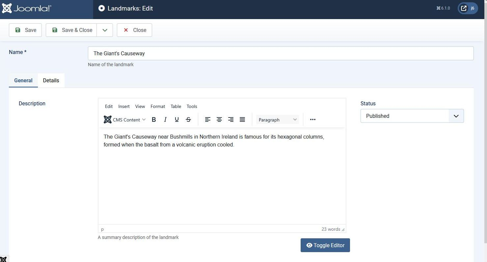
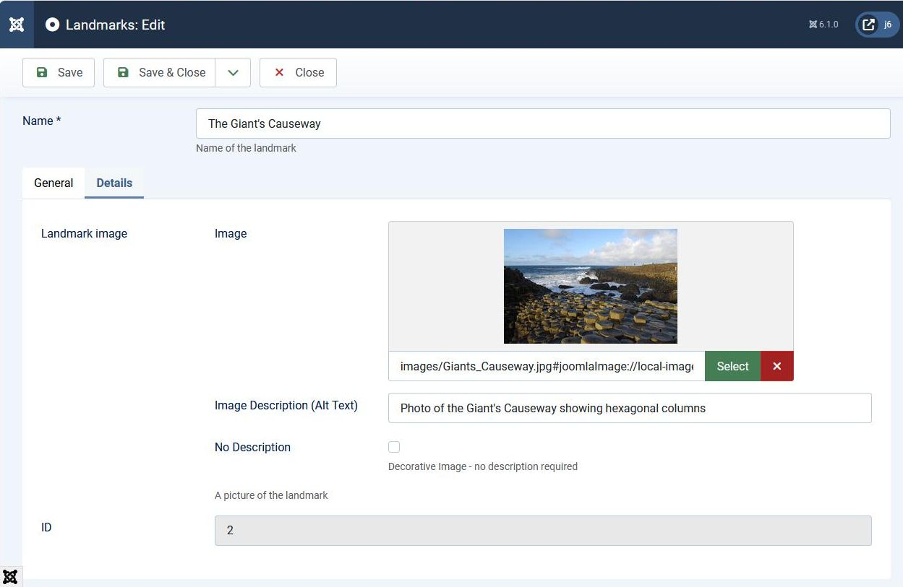

## Introduction

In this step we add an image of the landmark:

- on the admin back-end we provide the ability to add an image to a landmark,

- on the front-end we display the image within the landmark webpage.

The code is available at [com_example step 14](https://github.com/joomla/manual-examples/tree/main/component-tutorial/step14_image).

## Learning Points

Adding images and the accessiblemedia field

JSON-encoded database fields

Tabbed edit form - uitab

Fieldsets

## Back-end Changes

We change the administrator back-end landmark edit form to be split into 2 tabs,
with the name of the landmark in the field above the tabs.
This aligns with how Joomla components organise the fields 



In the General tab we have the editor field on the left and the published state field on the right.
In future tutorial steps we will add more fields on the right hand side.



In the Details tab we include fields which are specific to our com_example component.
This is where we put the image field, and we move the id field there also. 

As you can see, the image field has two parts:

- the path to the image file, and

- the alt text associated with the image.

The alt text of an HTML `` element is used by screen readers to output the description of what the image shows,
and this is important for people who have difficulty seeing the image.

## Database Changes

We need to add into the landmarks database table a column to hold the image details.
This field will hold the path to the image and the alt text, storing them as a JSON-encoded string. 

As usual, we need to create a SQL update file (to enable the database change from the previous step),
and change the install file (for those installing this version of com_example as the first install).

Here's the updated SQL install file:

```sql title="com_example/administrator/components/com_example/sql/install.mysql.sql"
CREATE TABLE IF NOT EXISTS `#__example_landmarks` (
    `id`        INT(11)     NOT NULL AUTO_INCREMENT,
    `title`     VARCHAR(40) NOT NULL,
    `description` TEXT      NOT NULL,
    `published` TINYINT(4)  NOT NULL DEFAULT 1,
  /* highlight-next-line */
    `picture`   TEXT        NOT NULL,
    PRIMARY KEY (`id`)
);

INSERT INTO `#__example_landmarks` (`title`, `description`, `published`, `picture`) VALUES
/* highlight-start */
('The Eiffel Tower', '', 1, ''),
('The Giant\'s Causeway', '', 1, '');
/* highlight-end */
```

And we create a new SQL update file for this version:

```sql title="com_example/administrator/components/com_example/sql/updates/mysql/0.14.0.sql"
ALTER TABLE `#__example_landmarks` 
ADD COLUMN `picture` TEXT NOT NULL;
```

## Admin Edit Form Changes

Here's the updated XML definition file of the administrator edit form.

```xml title="administrator/components/com_example/forms/landmark.xml"
<?xml version="1.0" encoding="utf-8"?>
<form> 
    <field
            name="title"
            type="text"
            label="COM_EXAMPLE_LANDMARK_TITLE_LABEL"
            description="COM_EXAMPLE_LANDMARK_TITLE_DESC"
            required="true"
            default=""
            />
    <field  name="description" 
            type="editor"
            label="COM_EXAMPLE_LANDMARK_DESCRIPTION_LABEL" 
            description="COM_EXAMPLE_LANDMARK_DESCRIPTION_DESC"
            filter="\Joomla\CMS\Component\ComponentHelper::filterText" 
            buttons="true" 
            />
    <field
            name="published"
            type="list"
            label="JSTATUS"
            default="1"
            validate="options"
            >
            <option value="1">JPUBLISHED</option>
            <option value="0">JUNPUBLISHED</option>
            <option value="-2">JTRASHED</option>
    </field>
  <!-- highlight-start -->
    <fieldset name="details">
        <field
                name="picture"
                label="COM_EXAMPLE_LANDMARK_PICTURE_LABEL"
                description="COM_EXAMPLE_LANDMARK_PICTURE_DESC"
                type="accessiblemedia"
                />
        <field
                name="id"
                type="text"
                label="JGLOBAL_FIELD_ID_LABEL"
                class="readonly"
                default="0"
                readonly="true"
                />    
    </fieldset>
  <!-- highlight-end -->
</form>
```

The main change is that we've added in the "picture" field to capture the image.

Joomla provides 2 standard form fields for capturing images (or other media):

- the [media field](../../../general-concepts/forms-fields/standard-fields/media.md) which just captures the path of the media file

- the [accessiblemedia field](../../../general-concepts/forms-fields/standard-fields/accessiblemedia.md) which captures both the path of the media file and the associated alt text.

From an accessibility viewpoint all images should have associated alt text,
so the advantage of the accessiblemedia field is that you can capture and store both the media filename and alt text in one field.
Otherwise you would have to have 2 fields in the form and database, one for the path and another text field for the alt text.

We've also created a `<fieldset>` and moved the "id" field to be within the fieldset,
and the explanation for this will be given in the section describing the tmpl file changes.

## Admin Edit tmpl file Changes

Here's the updated tmpl file:

```php title="administrator/components/com_example/tmpl/landmark/edit.php"
<?php
defined('_JEXEC') or die;

use Joomla\CMS\Router\Route;
use Joomla\CMS\HTML\HTMLHelper;
use Joomla\CMS\Layout\LayoutHelper;
// highlight-next-line
use Joomla\CMS\Language\Text;

?>

<form action="<?php echo Route::_('index.php?option=com_example&layout=edit&id=' . (int) $this->item->id); ?>"
    method="post" name="adminForm" id="adminForm">

    <?php echo $this->form->renderField('title');  ?>
  // highlight-start
    <?php echo HTMLHelper::_('uitab.startTabSet', 'myTab', ['active' => 'general tab', 'recall' => true, 'breakpoint' => 768]); ?>

    <?php echo HTMLHelper::_('uitab.addTab', 'myTab', 'general tab', Text::_('COM_EXAMPLE_LANDMARK_GENERAL_TAB')); ?>
  // highlight-end

    <div class="row">
        <div class="col-lg-9">
            <?php echo $this->form->renderField('description');  ?>
  // highlight-next-line
            // renderField of id field removed from here
        </div>
        
        <div class="col-lg-3">
            <?php echo LayoutHelper::render('joomla.edit.global', $this); ?>
        </div>
    </div>
    
  // highlight-start
    <?php echo HTMLHelper::_('uitab.endTab'); ?>
    
    <?php echo HTMLHelper::_('uitab.addTab', 'myTab', 'details tab', Text::_('COM_EXAMPLE_LANDMARK_DETAILS_TAB')); ?>

        <?php echo $this->form->renderFieldset('details');  ?>
    
    <?php echo HTMLHelper::_('uitab.endTab'); ?>
    
    <?php echo HTMLHelper::_('uitab.endTabSet'); ?>
  // highlight-end
    
    <input type="hidden" name="task" value="" />
    <?php echo HTMLHelper::_('form.token'); ?>
</form>
```

### UiTab

The 2 tabs on the edit form are implemented using the HTMLHelper [UiTab](cms-api://classes/Joomla-CMS-HTML-Helpers-UiTab.html) class.

Most of the parameters of the uitab functions are clear, 
but the `params` of the [startTabSet](cms-api://classes/Joomla-CMS-HTML-Helpers-UiTab.html#method_startTabSet) are:

- 'active' => 'general tab' - points to the tab which by default is set to be active when an administrator edits a landmark.

- 'recall' => true - if 'recall' is set to *any value* (including 'recall' => false) then Joomla stores the tab which was last active **for this landmark**.
When this landmark is next edited then the active tab is set to the stored value, rather than the tab specified using the 'active' option.

- 'breakpoint' => 768 - this specifies the width at which the tab arrangement changes between horizontal and vertical.
If the width of the browser window is greater than 768 pixels then the tabs are displayed horizontally.
If the width is less than 768 pixels then the tabs are displayed vertically.

### Fieldsets

In the XML form definition we grouped the "picture" and "id" form fields into a `<fieldset name="details">` element.

This enables us to output the 2 fields with the single statement `$this->form->renderFieldset('details')`.

Unlike `<fields>` elements, `<fieldset>` elements don't affect how the field values are sent to the server in the HTTP POST parameters.
They just provide an easy way of outputting fields;
executing `renderFieldset` is just the same as repeatedly calling `renderField` for each of the fields within the fieldset.

See the [Fieldset documentation](../../../general-concepts/forms/manipulating-forms.md#fieldsets).

## Handling the HTTP POST

The only change to the POST parameters arises from the inclusion of the accessiblemedia field. 
This generates an array of 2 elements, with keys `jform[picture][imagefile]` and `jform[picture][alt_text]`. 

We want to store both these fields in the `picture` column of the landmark database table,
and the Joomla standard is to store these within a JSON-encoded text string. 

This situation occurs so frequently within Joomla that there is a simple method provided to handle this:

```php title="administrator/components/com_example/src/Table/LandmarkTable.php"
<?php
namespace My\Component\Example\Administrator\Table;
 
\defined('_JEXEC') or die;

use Joomla\CMS\Table\Table;
use Joomla\Database\DatabaseInterface;

class LandmarkTable extends Table
{
  // highlight-next-line
    protected $_jsonEncode = ['picture'];
    
    public function __construct(DatabaseInterface $db)
    {
        parent::__construct('#__example_landmarks', 'id', $db);
    }
}
```

Within the LandmarkTable class we define the protected variable `$_jsonEncode`.
This variable defines the array of data items which should be converted from an array format into a JSON-encoded string
before writing the value to the database field.

Note that this works in one direction only - writing to the database. 
It doesn't generate a json_decode when the data is read from the database.

## Front-end Changes

In the tmpl file for displaying a landmark we need to display the image and its alt text.

```php title="components/com_example/tmpl/landmark/default.php"
<?php
\defined('_JEXEC') or die;

?>
<h4><?php echo $this->escape($this->data->title);?></h4>
// highlight-start
<?php 
    $picture = json_decode($this->data->picture);
    $src = $picture->imagefile;
    $altText = $this->escape($picture->alt_text);
    echo "";
?>
// highlight-end
<p><?php echo $this->data->description;?></p>
```

## Language Strings

We include language strings associated with the image field and the edit form tabs:

```php title="administrator/components/com_example/language/en-GB/com_example.ini"
COM_EXAMPLE_LANDMARK_FIELD_SELECT_TITLE="Landmark"
COM_EXAMPLE_LANDMARK_FIELD_SELECT_DESC="Select a landmark"
; Admin landmarks view
COM_EXAMPLE_LANDMARKS_VIEW_TITLE="Landmarks"
COM_EXAMPLE_LANDMARKS_CAPTION="Table of Landmarks"
COM_EXAMPLE_LANDMARK_TITLE_LABEL="Name"
; Admin landmarks view - confirmations
COM_EXAMPLE_N_ITEMS_DELETED_1="Landmark deleted."
COM_EXAMPLE_N_ITEMS_DELETED="%d Landmarks deleted."
COM_EXAMPLE_N_ITEMS_PUBLISHED_1="Landmark published."
COM_EXAMPLE_N_ITEMS_PUBLISHED="%d Landmarks published."
COM_EXAMPLE_N_ITEMS_UNPUBLISHED_1="Landmark unpublished."
COM_EXAMPLE_N_ITEMS_UNPUBLISHED="%d Landmarks unpublished."
COM_EXAMPLE_N_ITEMS_TRASHED_1="Landmark moved to trash."
COM_EXAMPLE_N_ITEMS_TRASHED="%d Landmarks moved to trash."
; Admin landmark edit form
COM_EXAMPLE_LANDMARK_EDIT="Landmarks: Edit"
COM_EXAMPLE_LANDMARK_TITLE_DESC="Name of the landmark"
COM_EXAMPLE_LANDMARK_DESCRIPTION_LABEL="Description"
COM_EXAMPLE_LANDMARK_DESCRIPTION_DESC="A summary description of the landmark"
// highlight-start
COM_EXAMPLE_LANDMARK_PICTURE_LABEL="Landmark image"
COM_EXAMPLE_LANDMARK_PICTURE_DESC="A picture of the landmark"
// highlight-end
COM_EXAMPLE_SAVE_SUCCESS="Landmark successfully saved"
// highlight-start
; Admin landmark edit form - tabs
COM_EXAMPLE_LANDMARK_GENERAL_TAB="General"
COM_EXAMPLE_LANDMARK_DETAILS_TAB="Details"
// highlight-end
```

## Installation

In the manifest file, update the version number:

```xml title="com_example/example.xml"
  <!-- highlight-next-line -->
    <version>0.14.0</version>
...
```

and then install the updated component. 

## Exploring your installation

In the administrator back-end edit a landmark, then squeeze in the width of your browser.
You should see the tabs switch from horizontal to vertical at the width of 768 pixels. 

Switch on your browser's devtools and examine the parameters of the edit form HTTP POST when you submit the form.
Compare the 'picture' parameters with the values in the 'picture' database column.

The 'recall' option within UiTab requires that the current tab be stored in session storage.
However, this isn't implemented in the same way as for pagination, column ordering, etc, 
as described in [step 12](./step12-filter-form.md).
Instead Joomla uses the browser's sessionStorage, 
and you can see it if you examine your browser's session storage within its devtools. 
