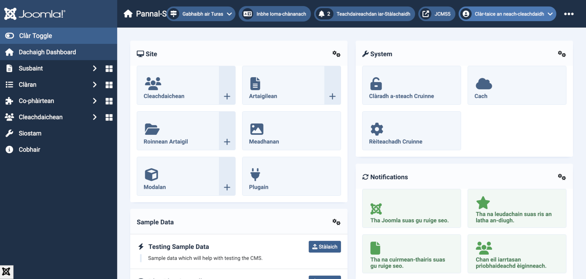
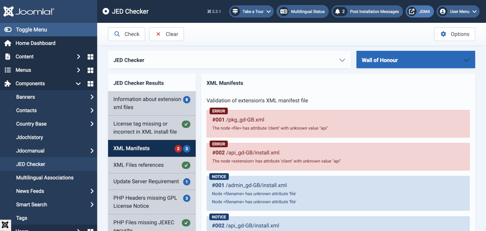

Joomla Language Extension Example
=================================

## Introduction

Official Joomla language extensions are normally installed via the System &rarr; Install &rarr; Languages route. However, there may be occasions when it is necessary to install a language extension via the Install &rarr; Extensions &rarr; Upload & Install route. This example is for Scottish Gaelic with all of the English to Gaelic translation obtained using openai.com at a cost of just under $5. It is an unofficial language extension because it really needs the translations verified by Gaelic speakers, perhaps unlikely as there are only 60,000 of them in total. Creation of the extension was inspired by the coincidence of an enquiry in the Forum and a personal visit to the ruins or Carnasserie Castle where the very first printed document in Scottish Gaelic was produced in 1567.

## Repository File Structure

The following structure includes a build.xml file, used to build the package using phing, and a .gitignore file, neither of which are present in the GitHub [repository](https://github.com/ceford/cefjdemos-pkg-gd-gb). The .ini files are translations of the original English .ini files. The method of translation is covered in a separate article.

```sh
cefjdemos-pkg-gd-gb
    gd-GB
        admin_gd-GB
            454 *.ini files
            install.xml
            langmetadata.xml
            localise.php
        api_gd-GB
            2 *.ini files
            install.xml
            langmetadata.xml
        site_gd-GB
            69 *.ini files
            install.xml
            langmetadata.xml
            localise.php
        admin_gd-GB.zip
        api_gd-GB.zip
        pkg_gd-GB.xml
        script.php
        site_gd-GB.zip
    .gitignore
    build.xml
    LICENSE
    pkg_gd-GB.zip
    README.md
```

The pkg_gd-GB.zip file contains the three client zip files, the script.php file and the pkg_gd-GB.xml file but not the contents of each client folder as they are in the individual zips.

## The pkg_gd-GB.xml File

Note that **gd-GB** is the ISO code for Scottish Gaelic. Most of the fields in the pkg_gd-GB.xml file are self-explanatory. It is possible to create separate Site and Administrator language extensions. However, the Administrator install.xml and langmetadata.xml files are required for language administration and the localise.php file is required for use by some plugins.

```xml
<?xml version="1.0" encoding="UTF-8"?>
<extension type="package" method="upgrade">
	<name>Scottish Gaelic Language Pack</name>
	<packagename>gd-GB</packagename>
	<version>5.3.1.1</version>
	<creationDate>2025-06-18</creationDate>
	<author>Clifford E Ford</author>
	<authorEmail>cliff@ford.myzen.co.uk</authorEmail>
	<authorUrl>https://github.com/ceford/cefjdemos-pkg-gd-gb</authorUrl>
	<copyright>(C) 2025 Clifford E Ford. All rights reserved.</copyright>
	<license>GNU General Public License version 2 or later; see LICENSE.txt</license>
	<url>https://github.com/ceford/cefjdemos-pkg-gd-gb</url>
	<packager>Clifford E Ford</packager>
	<packagerurl>https://github.com/ceford/cefjdemos-pkg-gd-gb</packagerurl>
	<description><![CDATA[Scottish Gaelic translation created by openai.com]]></description>
	<blockChildUninstall>true</blockChildUninstall>
	<scriptfile>script.php</scriptfile>
	<files>
		<file type="language" client="site" id="gd-GB">site_gd-GB.zip</file>
		<file type="language" client="administrator" id="gd-GB">admin_gd-GB.zip</file>
		<file type="language" client="api" id="gd-GB">api_gd-GB.zip</file>
	</files>
	<updateservers>
		<server type="extension" priority="2" name="Scottish Gaelic Update Site">https://github.com/ceford/cefjdemos-pkg-gd-gb/raw/main/pkg_gd-GB.zip</server>
	</updateservers>
</extension>
```
The extension version is usually the same as the Joomla version for which it was created. An optional extra parameter may be used for updates, for example 5.3.1.1. When creating a third party extension take care not to copy any Official Joomla! elements. The JED Checker will flag some as invalid.

## The script.php file

This file is used to perform additional changes during extension install, update or uninstall. It is stored in the administrator/manifests/packages/gd-GB folder.

```php
<?php
/**
 * @package    Joomla.Language
 *
 * @copyright  (C) 2025
 * @license    GNU General Public License version 2 or later; see LICENSE.txt
 */

\defined('_JEXEC') or die;

use Joomla\CMS\Installer\InstallerScript;

/**
 * Installation class to perform additional changes during install/uninstall/update
 *
 * @since  4.0.0v1
 */
class Pkg_gdGBInstallerScript extends InstallerScript
{
	/**
	 * Extension script constructor.
	 *
	 * @since   4.0.0v1
	 */
	public function __construct()
	{
		// Define the minimum versions to be supported.
		$this->minimumJoomla = '5.0';
		$this->minimumPhp    = '8.1.0';

		$this->deleteFiles = [
			// Previous available version was for 2.5 - assume already removed
			// Old files from Joomla 3 language packs - assume already removed
			// Old files from Joomla 4 language packs - assume already removed
			// Old files from Joomla 5 language packs (Only relevant for Joomla 6, should then be included in the deletion array with the 6.0-dev branch once created)
			// '/administrator/language/gd-GB/plg_captcha_recaptcha_invisible.ini',
			// '/administrator/language/gd-GB/plg_captcha_recaptcha_invisible.sys.ini',
		];
	}

	/**
	 * Function to perform changes during postflight
	 *
	 * @param   string            $type    The action being performed
	 * @param   ComponentAdapter  $parent  The class calling this method
	 *
	 * @return  void
	 *
	 * @since   4.0.0v1
	 */
	public function postflight($type, $parent)
	{
		$this->removeFiles();
	}
}
```

## Administrator

The admin folder contains a large number of individual `.ini` files and three others: `install.xml`, `langmetadata.xml` and `localise.php`.

### install.xml

This file is used for installation and removal of the language extension.

```xml
<?xml version="1.0" encoding="UTF-8"?>
<extension client="administrator" type="language" method="upgrade">
	<name>Scottish Gaelic</name>
	<tag>gd-GB</tag>
	<version>5.3.1.1</version>
	<creationDate>2025-06-18</creationDate>
	<author>Clifford E Ford</author>
	<authorEmail>cliff@ford.myzen.co.uk</authorEmail>
	<authorUrl>https://github.com/ceford/cefjdemos-pkg-gd-gb</authorUrl>
	<copyright>(C) 2025 Clifford E Ford. All rights reserved.</copyright>
	<license>GNU General Public License version 2 or later; see LICENSE.txt</license>
	<description><![CDATA[Scottish Gaelic translation created by openai.com]]></description>

	<files>
		<folder>/</folder>
		<filename file="meta">langmetadata.xml</filename>
		<filename file="meta">install.xml</filename>
	</files>
</extension>
```

### langmetadata.xml

This file is used for language management purposes.

```xml
<?xml version="1.0" encoding="UTF-8"?>
<metafile client="administrator">
	<name>Scottish Gaelic</name>
	<tag>gd-GB</tag>
	<version>5.3.1.1</version>
	<creationDate>2025-06-18</creationDate>
	<author>Clifford E Ford</author>
	<authorEmail>cliff@ford.myzen.co.uk</authorEmail>
	<authorUrl>https://github.com/ceford/cefjdemos-pkg-gd-gb</authorUrl>
	<copyright>(C) 2025 Clifford E Ford. All rights reserved.</copyright>
	<license>GNU General Public License version 2 or later; see LICENSE.txt</license>
	<description><![CDATA[Scottish Gaelic translation created by openai.com]]></description>
	<metadata>
		<name>Scottish Gaelic</name>
		<nativeName>Gàidhlig na h-Alba</nativeName>
		<tag>gd-GB</tag>
		<rtl>0</rtl>
		<locale>gd_GB.utf8, gd_GB.UTF-8, gd_GB, gd, gla, gd-GB, scottish gaelic, gaelic, scots gaelic, scotland, uk, united kingdom</locale>
		<firstDay>1</firstDay>
		<weekEnd>0,6</weekEnd>
		<calendar>gregorian</calendar>
	</metadata>
	<params />
</metafile>
```

#### Notes

- The `<name>` tag should be in English.
- The `<nativeName>` tag should be in the extension language.
- The `<locale>` tag is used for sorting purposes. It should include:
    - Standard POSIX-style locale codes (e.g., gd_GB.utf8)
    - Alternate capitalizations or encodings (gd_GB.UTF-8, gd_GB)
    - ISO language and country codes (gd, gla, gd-GB)
    - Human-readable names and aliases (scottish gaelic, scots gaelic, gaelic, etc.)
    - Country/region-related terms (scotland, uk if applicable)
- The `<firstDay>` tag is used to specify the first day of the week in that language. 0 is Sunday, 1 is Monday, etc.
- The `<weekEnd>` tag is used to define the days considered to be weekend and often greyed. 0,6 is Saturday & Sunday, 1 would be Friday.
- The `<calendar>` tag uses *gregorian* by default. Other calendars may be available for some languages.

### localise.php

This file is used to cope with language peculiarities.

```php
<?php
/**
 * @package    Joomla.Language
 *
 * @copyright (C) 2025 Clifford E Ford. All rights reserved.
 * @license    GNU General Public License version 2 or later; see LICENSE.txt
 *
 * @phpcs:disable Squiz.Classes.ValidClassName.NotCamelCaps
 *
 * @phpcs:disable PSR1.Classes.ClassDeclaration.MissingNamespace
 */

// phpcs:disable PSR1.Files.SideEffects
\defined('_JEXEC') or die;
// phpcs:enable PSR1.Files.SideEffects

/**
 * gd-GB localise class.
 *
 * @since  1.6
 */
abstract class Gd_GBLocalise
{
    /**
     * Returns the potential suffixes for a specific number of items
     *
     * @param int $count  The number of items.
     *
     * @return  array  An array of potential suffixes.
     *
     * @since   1.6
     */
    public static function getPluralSuffixes($count)
    {
        if ($count == 0) {
            return ['0'];
        } elseif ($count == 1) {
            return ['ONE', '1'];
        } else {
            return ['OTHER', 'MORE'];
        }
    }

    /**
     * Returns the ignored search words
     *
     * @return  array  An array of ignored search words.
     *
     * @since   1.6
     *
     * @deprecated  5.1 will be removed in 7.0 without replacement
     */
    public static function getIgnoredSearchWords()
    {
        return ['agus', 'ann', 'air', 'an', 'am', 'aig', 'le', 'do', 'gu'];
    }

    /**
     * Returns the lower length limit of search words
     *
     * @return  integer  The lower length limit of search words.
     *
     * @since   1.6
     *
     * @deprecated  5.1 will be removed in 7.0 without replacement
     */
    public static function getLowerLimitSearchWord()
    {
        return 3;
    }

    /**
     * Returns the upper length limit of search words
     *
     * @return  integer  The upper length limit of search words.
     *
     * @since   1.6
     *
     * @deprecated  5.1 will be removed in 7.0 without replacement
     */
    public static function getUpperLimitSearchWord()
    {
        return 20;
    }

    /**
     * Returns the number of chars to display when searching
     *
     * @return  int  The number of chars to display when searching.
     *
     * @since   1.6
     *
     * @deprecated  5.1 will be removed in 7.0 without replacement
     *
     */
    public static function getSearchDisplayedCharactersNumber()
    {
        return 200;
    }
}
```

## API and Site

The files in these folders are similar to those in the admin folder except that the client attribute is set to *api* and *site* respectively and there are fewer *.ini files. The files are not reproduced here. See the en-GB versions for examples.

## Result

The following screenshot shows the Home Dashboard with Scottish Gaelic as the Administrator language:



You may notice that some words are in English! They are the module headings that were entered in English. The modules could be edited and the module titles changed to the default language.

## The Build

To convert the repository structure into an installable package a build process is required. [Phing](https://www.phing.info/) is a PHP based build tool suitable for this purpose. It uses a build.xml file containing the build instructions and requires a method to call it. 

This particular build is very simple. Each of the client folders needs to be compressed into separate zip files and then incorporated into the package zip file.

### build.xml

```xml
<?xml version="1.0" encoding="UTF-8"?>
<project name="gaelic" basedir="." default="main">

	<fileset dir="./gd-GB/admin_gd-GB" id="adminfiles">
		<include name="**" />
	</fileset>

	<fileset dir="./gd-GB/api_gd-GB" id="apifiles">
		<include name="**" />
	</fileset>

	<fileset dir="./gd-GB/site_gd-GB" id="sitefiles">
		<include name="**" />
	</fileset>

	<fileset dir="./gd-GB" id="pkgfiles">
		<include name="*.zip" />
		<include name="pkg_gd-GB.xml" />
		<include name="script.php" />
	</fileset>

	<target name="main" description="main target">

		<zip destfile="./gd-GB/admin_gd-GB.zip">
			<fileset refid="adminfiles" />
		</zip>

		<zip destfile="./gd-GB/api_gd-GB.zip">
			<fileset refid="apifiles" />
		</zip>

		<zip destfile="./gd-GB/site_gd-GB.zip">
			<fileset refid="sitefiles" />
		</zip>

		<zip destfile="./pkg_gd-GB.zip">
			<fileset refid="pkgfiles" />
		</zip>

	</target>
</project>
```

The build process is then called from a VSCode tasks file.

### .vscode/tasks.json

```json
{
	// See https://go.microsoft.com/fwlink/?LinkId=733558
	// for the documentation about the tasks.json format
	"version": "2.0.0",
	"tasks": [
	  {
		"label": "Build pkg_gd-GB",
		"type": "shell",
		"command": "php ~/bin/phing-latest.phar",
		"windows": {
		  "command": "php ~/bin/phing-latest.phar"
		},
		"group": "build",
		"presentation": {
		  "reveal": "always",
		  "panel": "shared"
		}
	  }
	]
}
```

## JED Checker

Although this extension is not destined for the Joomla Extensions Directory, the JED Checker is an invaluable development tool. This is what it reports:



The XML Manifest errors appear to be a JED Checker bug that has been reported. There are no other problems.
