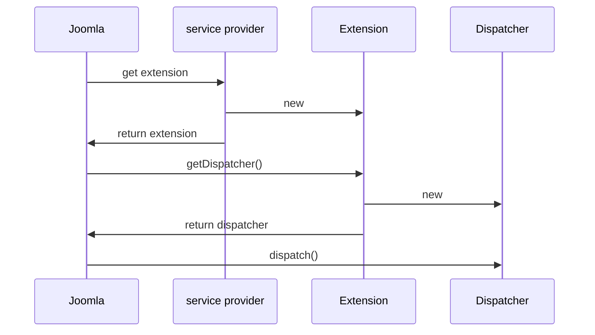

Step 8 Dependency Injection
===========================

In this step we describe the Joomla principles of Extension and Dispatcher classes, and Dependency Injection, and explain the services/provider.php file.

We change mod_hello to get the HelloHelper class via dependency injection. 

This step is quite long and complicated, but it's worth persevering as these principles are fundamental to Joomla and developing Joomla extensions.

The source code is available at [mod_hello step 8](https://github.com/joomla/manual-examples/tree/main/module-tutorial/step8_service_provider). 

## Extension and Dispatcher Classes

Joomla uses a common method of passing control to extensions which for modules and components is very similar. 
In high-level terms this is how it starts up a module:



The service provider code is in services/provider.php

The Extension class can be thought of as a "handle" that the core Joomla code uses to get connected to our module. It's the first module class which is instantiated. 
For modules, the Extension class is mostly just used to get the Dispatcher class.

The Dispatcher class can be thought of as providing a mechanism for Joomla to run our module code, as it provides the `dispatch` function which Joomla calls to run the module.

The Dispatcher `dispatch` function is generally where the module logic begins. 

You may be wondering why the Extension class doesn't just provide the `dispatch` function itself - well, it could, and that might make it easier for extension developers, but it's separated out to enable a similar set of classes for components, modules and plugins. 

You can find more information on Extension and Dispatcher classes [here](../../../general-concepts/extension-and-dispatcher/index.md).

## Dependency Injection

Strategically Joomla has adopted the following pattern for its own extensions:
- the extension's service provider file puts the extension's key classes into a Dependency Injection Container (DIC)
- Joomla then pulls out of the DIC the main Extension class
- via the Extension class the extension gets access to its other key classes

This approach makes it easy to mock these classes for unit testing - you just have to supply a test service provider file which points to the mocked classes.

It also provides a flexibility point for customising Joomla on your own site: Joomla triggers an event after the entries have been loaded into the DIC, but before they have been taken out. 
So you can capture that event in a plugin, replace the extension's DIC entries with your own, and in this way modify the Joomla extension's functionality.

Joomla's Dependency Injection approach is described in more detail [here](../../../general-concepts/dependency-injection/index.md) (where you can find a link to an associated video).

For mod_hello there are 3 classes which we get via the DIC:
1. The Extension class - this will just be the default Joomla extension class for modules: \Joomla\CMS\Extension\Module
2. The Dispatcher class
3. The Helper class

Also the Joomla pattern decrees that we don't put the Dispatcher and Helper classes directly into the DIC, but rather that we use DispatcherFactory and HelperFactory classes instead, and these 2 Factory classes are passed into the Extension class's constructor and stored as local instance variables `$this->dispatcherFactory` and `$this->helperFactory`. 

We can then obtain new instances of the Dispatcher and Helper classes inside the Extension class by using something like:

```php
public function getDispatcher(...) {
    $dispatcher = $this->dispatcherFactory->createDispatcher(...);
}
public function getHelper(...) {
    $helper = $this->helperFactory->getHelper(...);
}
```

However, we usually want to obtain the Helper class inside our Dispatcher code (rather than inside or Extension class), because that is where the real work is done to set up the data for displaying in the module.

Joomla doesn't provide us a link from our Dispatcher back to our Extension, but instead does provide a link to the HelperFactory class if we do the following within our Dispatcher:

```php
use Joomla\CMS\Dispatcher\AbstractModuleDispatcher;
use Joomla\CMS\Helper\HelperFactoryAwareInterface;
use Joomla\CMS\Helper\HelperFactoryAwareTrait;

class Dispatcher implements HelperFactoryAwareInterface
{
    use HelperFactoryAwareTrait;
    ...
    $helper = $this->getHelperFactory()->getHelper('HelloHelper');
    ...
}
```

This link from the Dispatcher to the HelperFactory is set up in the `getDispatcher` function of \Joomla\CMS\Extension\Module in libraries/src/Extension/Module.php, using the code:

```php
if ($dispatcher instanceof HelperFactoryAwareInterface) {
    $dispatcher->setHelperFactory($this->helperFactory);
}
```

and the HelperFactoryAwareTrait provides the Dispatcher with the getHelperFactory and setHelperFactory functions. 

## Service Provider

We're now in the position of being able to understand the service provider file. 
This PHP file basically returns an anonymous class instance which implements Joomla\DI\ServiceProviderInterface and has a public function `register(Container $container)`. Joomla calls this `register` function to create the entries in the DIC. 

Inside the `register` function we can create an entry in the DIC for the DispatcherFactory using

```php
$container->set(
    ModuleDispatcherFactoryInterface::class,
    function (Container $container) {
        return new \Joomla\CMS\Dispatcher\ModuleDispatcherFactory('\\My\\Module\\Hello');
    }
);
```

The ModuleDispatcherFactory gets passed in our namespace so that it can form the fully-qualified name of our dispatcher \My\Module\Hello\Site\Dispatcher\Dispatcher, and hence using the [PSR-4 Namespacing rules](../../../general-concepts/namespaces/finding-classes-with-psr4.md) Joomla will find our source code file in modules/mod_hello/src/Dispatcher/Dispatcher.php. 

Similarly for the HelperFactory:

```php
$container->set(
    HelperFactoryInterface::class,
    function (Container $container) {
        return new \Joomla\CMS\Helper\HelperFactory('\\My\\Module\\Hello\\Site\\Helper');
    }
);
```

Finally, for our Extension class:

```php
use Joomla\CMS\Extension\ModuleInterface;

// inside register():
$container->set(
    ModuleInterface::class,
    function (Container $container) {
        return new \Joomla\CMS\Extension\Module(
            $container->get(ModuleDispatcherFactoryInterface::class),
            $container->get(HelperFactoryInterface::class)
        );
    }
);
```

(By the way, `ModuleInterface::class` is just shorthand for a string containing the class or interface fully qualified name).

When Joomla gets the entry for `ModuleInterface::class` then it will cause the associated function to run. 
This will create the Module instance, and pass into the constructor what is returned from obtaining the ModuleDispatcherFactoryInterface::class and HelperFactoryInterface::class entries from the DIC.

These 3 DIC entries are used so often that Joomla provides a shorthand way of entering them into the DIC. We use this in our service provider file:

```php title="mod_hello/services/provider.php"
<?php

\defined('_JEXEC') or die;

use Joomla\CMS\Extension\Service\Provider\Module as ModuleServiceProvider;
use Joomla\CMS\Extension\Service\Provider\ModuleDispatcherFactory as ModuleDispatcherFactoryServiceProvider;
// highlight-next-line
use Joomla\CMS\Extension\Service\Provider\HelperFactory as HelperFactoryServiceProvider;
use Joomla\DI\Container;
use Joomla\DI\ServiceProviderInterface;

return new class () implements ServiceProviderInterface {

    public function register(Container $container): void
    {
        $container->registerServiceProvider(new ModuleDispatcherFactoryServiceProvider('\\My\\Module\\Hello'));
        // highlight-next-line
        $container->registerServiceProvider(new HelperFactoryServiceProvider('\\My\\Module\\Hello\\Site\\Helper'));
        $container->registerServiceProvider(new ModuleServiceProvider());
    }
};
```

Here `registerServiceProvider` just means calling `register` on the service provider class instance which is passed in. 

:::warning
  You'll find the same name ModuleDispatcherFactory used for the service provider class and the Factory class - you need to check the `use` statement to confirm which one is meant. The same is true of other Factory service provider classes. 
:::

## Helper Class

Up until now we have been obtaining our HelloHelper class using:

```php
use My\Module\Hello\Site\Helper\HelloHelper;

$username = HelloHelper::getLoggedonUsername('Guest');
```

What if we want to perform unit testing on our Dispatcher class, and want to provide mocks for the HelloHelper functions? 

Because Joomla uses the PSR-4 rules to find the HelloHelper class - a mechanism that we can't easily interrupt - it means that we're forced to change our code to something like:

```php
use My\Mocks\HelloHelper;

$username = HelloHelper::getLoggedonUsername('Guest');
```

so we're changing the very source file which we're trying to unit test. We can avoid this situation by using dependency injection.

If we use dependency injection then our Dispatcher code is:

```php
class Dispatcher implements HelperFactoryAwareInterface
{
    use HelperFactoryAwareTrait;

    $username = $this->getHelperFactory()->getHelper('HelloHelper')->getLoggedonUsername('Guest');
    ...
}
```

Here there's no direct reference to the HelloHelper class.
If we want to mock the HelloHelper class then we can change the service provider file from

```php
$container->registerServiceProvider(new HelperFactoryServiceProvider('\\My\\Module\\Hello\\Site\\Helper'));
```

to 

```php
$container->registerServiceProvider(new HelperFactoryServiceProvider('\\My\\Mocks'));
```

Then the HelperFactory will instantiate our mocked HelloHelper instead, and we don't have to change the file whose code we're unit testing.

## Updated Helper Code

As the HelloHelper class is instantiated by the HelperFactory we have to remove the `static` from the `getLoggedonUsername` function:

```php title="mod_hello/src/Helper/HelloHelper.php"
<?php

namespace My\Module\Hello\Site\Helper;

\defined('_JEXEC') or die;

use Joomla\CMS\Factory;

class HelloHelper
{
    // highlight-next-line
    public function getLoggedonUsername(string $default)
    {
        $user = Factory::getApplication()->getIdentity();
        if ($user->id !== 0)  // found a logged-on user
        {
            return $user->username;
        }
        else
        {
            return $default;
        }
    }
}
```

## Updated Dispatcher Code

```php title="mod_hello/src/Dispatcher/Dispatcher.php"
<?php

namespace My\Module\Hello\Site\Dispatcher;

\defined('_JEXEC') or die;

use Joomla\CMS\Dispatcher\DispatcherInterface;
use Joomla\CMS\Helper\ModuleHelper;
use Joomla\CMS\Language\Text;
use Joomla\CMS\Application\CMSApplicationInterface;
use Joomla\Input\Input;
use Joomla\Registry\Registry;
// highlight-start
use Joomla\CMS\Helper\HelperFactoryAwareInterface;
use Joomla\CMS\Helper\HelperFactoryAwareTrait;

class Dispatcher implements DispatcherInterface, HelperFactoryAwareInterface
{
    use HelperFactoryAwareTrait;
// highlight-end
    
    protected $module;
    
    protected $app;

    public function __construct(\stdClass $module, CMSApplicationInterface $app, Input $input)
    {
        $this->module = $module;
        $this->app = $app;
    }
    
    public function dispatch()
    {
        $language = $this->app->getLanguage();
        $language->load('mod_hello', JPATH_BASE . '/modules/mod_hello');
        
        // highlight-next-line
        $username = $this->getHelperFactory()->getHelper('HelloHelper')->getLoggedonUsername('Guest');

        $hello = Text::_('MOD_HELLO_GREETING') . $username;
        
        $params = new Registry($this->module->params);

        require ModuleHelper::getLayoutPath('mod_hello');
    }
}
```

## Manifest File

```xml title="mod_hello/mod_hello.xml"
<?xml version="1.0" encoding="UTF-8"?>
<extension type="module" client="site" method="upgrade">
    <name>MOD_HELLO_NAME</name>
    <version>1.0.8</version>
    <author>me</author>
    <creationDate>today</creationDate>
    <description>MOD_HELLO_DESCRIPTION</description>
    <namespace path="src">My\Module\Hello</namespace>
    <files>
        <folder module="mod_hello">services</folder>
        <folder>src</folder>
        <folder>tmpl</folder>
        <folder>language</folder>
    </files>
    <scriptfile>script.php</scriptfile>
    <media destination="mod_hello" folder="media">
        <filename>joomla.asset.json</filename>
        <folder>js</folder>
    </media>
    <config>
        <fields name="params">
            <fieldset name="basic">
                <field
                    name="header"
                    type="list"
                    label="MOD_HELLO_HEADER_LEVEL"
                    default="h4"
                    >
                    <option value="h3">MOD_HELLO_HEADER_LEVEL_3</option>
                    <option value="h4">MOD_HELLO_HEADER_LEVEL_4</option>
                    <option value="h5">MOD_HELLO_HEADER_LEVEL_5</option>
                    <option value="h6">MOD_HELLO_HEADER_LEVEL_6</option>
                </field>
            </fieldset>
        </fields>
    </config>
</extension>
```
