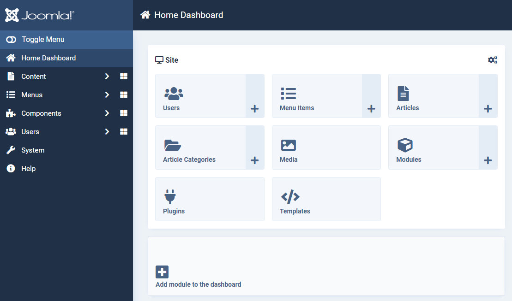
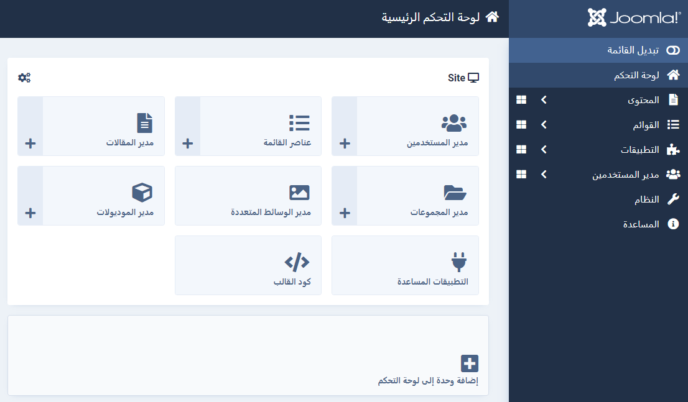

Supporting Right to Left Languages
==================================
Arabic, Hebrew and some others are right to left(RTL) languages which means that the user interface is typically mirrored.

## Joomla Admin LTR

## Joomla Admin RTL

## Template Support
Both the default site template, Cassiopeia and the default admin template, Atum fully support the use of right to left languages. When Joomla is using an RTL language then a different variant of the template css will be used. This file is called template-rtl.min.css.

## What do you need to do
You probably dont need to do anything in your component to support RTL unless you are adding your own css stylesheet. If you use logical css properties wherever possible then it may be that you do not require any specific RTL css.

### Logical CSS Properties
Instead of _**margin-left**_ and then having to create an RTL css file just to change that to _**margin-right**_ you can instead write _**margin-inline-start**_

More information, including a handy visual guide, can be found in this excellent article by Adrian Roselli [CSS Logical Properties](https://adrianroselli.com/2019/11/css-logical-properties.html)

### Absolute CSS Properties
A logical property is not available for everything and/or you want to use css shorthand eg margin: 8px 10px 16px 4px instead of writing full css with logical properties.

In this situation you can use the same tool as Joomla to convert the css for you. RTLCSS is a postcss plugin that does all the hard work ensuring that a matching RTL css file will be created from your existing LTR css.

## Further Information
1. [RTLCSS](https://rtlcss.com/) - Framework for converting Left-To-Right (LTR) Cascading Style Sheets(CSS) to Right-To-Left (RTL)
2. [RTL Styling 101](https://rtlstyling.com/) - An extensive guide on how to style for RTL in CSS

