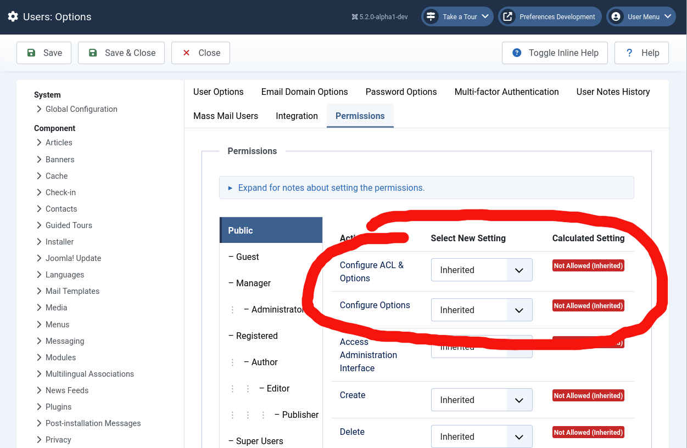
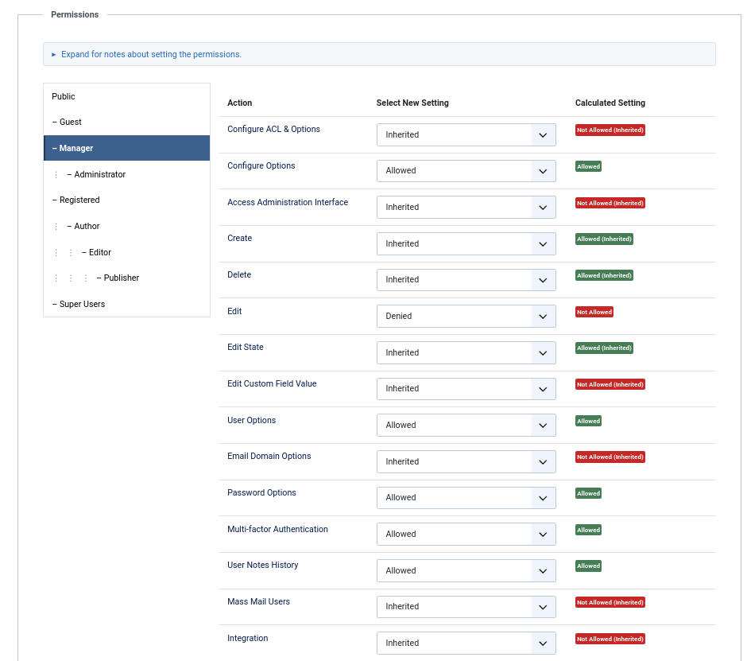
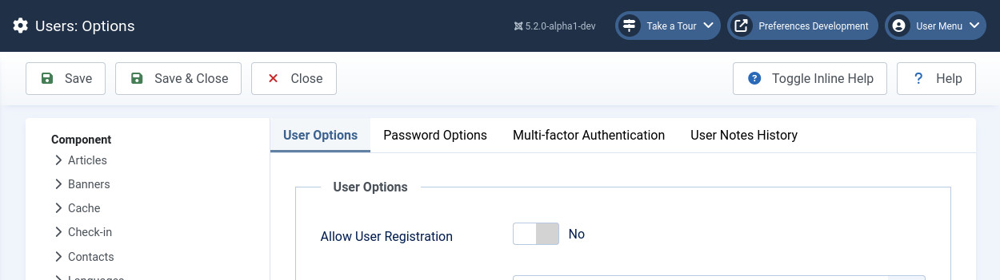

Control Access to Component Preferences
=======================================

If you have more than a few component preferences you have probably already organised them into tabs, each tab holding related preferences. If those tabs represent very different parts of your component you may want to control access to each tabs individually.

All-or-nothing control is generally effected by granting or withholding the permission "core.options.permissions".  This permission is part of the basic ACL set so there is no need to add it into your component's own access.xml file.  It is accessed in the admin panel, for example for the users component, here.



You can further refine access by creating permssions for individual tabs within your component's permission set.

Take the options of the core component users as an example. It currently contains seven tabs apart from the permissions tab itself. A separate access permission that could be used for each these seven tabs could be created by adding the following lines to its /administrator/components/com_users/access.xml file.

```xml
<action name="core.options.user_options" title="COM_USERS_CONFIG_USER_OPTIONS" />
<action name="core.options.domain_options" title="COM_USERS_CONFIG_DOMAIN_OPTIONS" />
<action name="core.options.password_options" title="COM_USERS_CONFIG_PASSWORD_OPTIONS" />
<action name="core.options.multifactorauth" title="COM_USERS_CONFIG_MULTIFACTORAUTH_SETTINGS_LABEL" />
<action name="core.options.user_notes_history" title="COM_USERS_CONFIG_FIELD_NOTES_HISTORY" />
<action name="core.options.massmail" title="COM_USERS_MASS_MAIL" />
<action name="core.options.integration" title="JGLOBAL_INTEGRATION_LABEL" />
```

Then these extra options will appear in the permissions tab and can be controlled just the same as any others. Let's take as an example the ACL settings for managers.  Setting them as



will result in managers only having access to four of the total user component preference tabs, as



the other preference tabs do not appear, preventing managers from being able to set their preferences.
