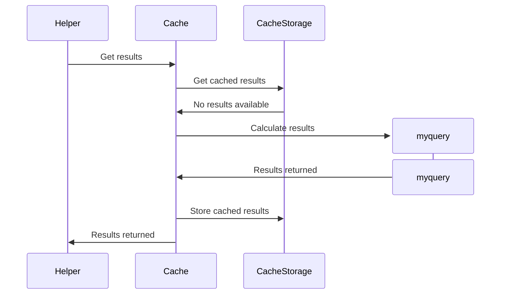
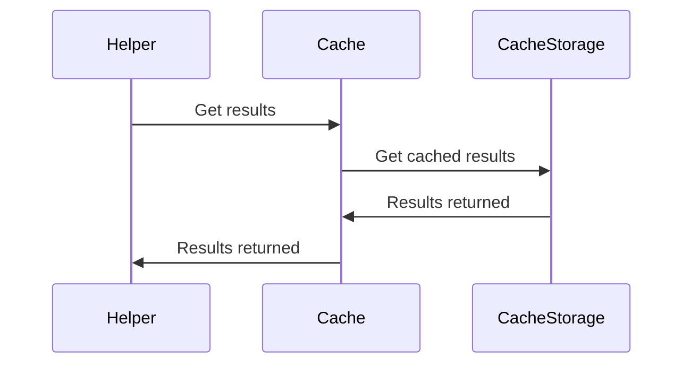
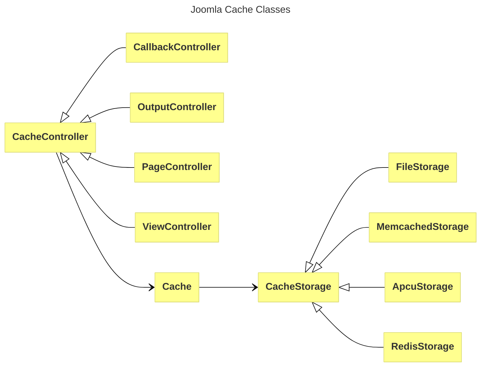

This page describes Joomla Callback Cache,
and includes an example module which you can install to demonstrate it. 

## Overview

You can use Joomla callback cache to cache the results of a resource-hungry operation within your extension.

It's called "callback" because you provide a callback function,
which Joomla caching can use if it doesn't find the results in cache, 
or if the cache has expired.
In that case Joomla caching will call the callback function and will store the results in cache,
ready to be returned in subsequent invocations.

To illustrate callback cache we'll use a callback function `myquery` 
which performs a number of heavy-duty database queries.

We'll embed this in a module, and give the module helper the responsibility of obtaining the results.

So the first time the cache is invoked the sequence will be as follows:



Because the results aren't stored in cache storage, 
the Joomla cache calls the callback function to calculate the results.
Once the results are returned, the cache stores the results in the cache storage,
and returns the results to the module helper function.

The next time that the module is displayed (assuming the cache has not expired),
the sequence will be:



This time the heavy database operations in `myquery` are not performed.

## Obtaining the Cache Controller

To use callback cache we need to get a handle on the Joomla CacheController. 
We do this by first getting the CacheControllerFactory from the Dependency Injection Container:

```php
use Joomla\CMS\Cache\CacheControllerFactoryInterface;
...
$cacheControllerFactory = Factory::getContainer()->get(CacheControllerFactoryInterface::class);
$cacheController = $cacheControllerFactory->createCacheController('callback', array());
```

Because the first parameter is 'callback', 
what will be returned will be an instance of Joomla\CMS\Cache\Controller\CallbackController,
which is one of several types of cache controller, inheriting from the base CacheController class.
The other types of cache controllers are:

- output - if data is just being stored in cache, but there's no callback

- page - used by Joomla for storing page cache
(as described in [Page Cache](./caching-views-modules.md#page-cache]))

- view - used by Joomla for storing the output of views 
(as described in [Component View Cache](./caching-views-modules.md#component-view-cache]))

An overview of the Joomla Caching classes is shown below:



When the CacheController is instantiated it in turn instantiates a Cache class instance,
and this is accessible as a public instance variable `$cache` of the CacheController instance.
It's probably for historic reasons that there are separate CacheController and Cache classes.
With the exception of `get` and `store`,
the [Cache instance methods](cms-api://classes/Joomla-CMS-Cache-Cache.html) 
are available as proxies on the CacheController instance. 
So, for example, you can call:

```php
$cacheController->setCaching(true);
```

and this will proxy to the equivalent `setCaching` function of the Cache instance.

(If you're looking through Joomla code, 
then you may find cases where a CacheController instance is actually called just `$cache`).

The Cache instance then interfaces to a CacheStorage instance, 
which handles the cache storage and retrieval. 
The type of CacheStorage class instantiated is defined by the System / Cache Handler parameter
within Global Configuration. 

## Using the Cache

Once you have the `$cacheController` instance, you can use the cache by calling:

```
$results = $cacheController->get($callback, $args, $id);
```

where:

- `$callback` is the callback function (not just its name - you pass the function itself, as a closure)

- `$args` is an array of the arguments to be passed to the function

- `$id` something (eg a string) which can be used to identify uniquely this use of cache

In the example module, the cache is called as follows:

```php
$myquery = function ($db)
        {   
            // code performing database operations
        };
$results = $cacheController->get($myquery, array($db), "table counts");
```

The Joomla cache functionality will then:

- try to get the results from the cache storage, returning them if they're found

- if not found, then it will call the callback function to obtain the results

- once the callback function has returned the results, it will store the results in the cache, 
and return them to the calling function.

## Demonstrating Callback Cache

To demonstrate the use of cache, download the mod_demo_cache extension from [mod_demo_cache](https://github.com/joomla/manual-examples/tree/main/module-example-cache).

Install the extension, then configure the site module which is created:

- set to Published

- select a Position

- on the Menu Assignment tab, specify the pages where it should appear

- in the Advanced tab, ensure that Caching is set to "No caching" 
(to avoid Joomla caching the whole output of the module). 

In Global Configuration / System tab, set System Cache to "ON - Conservative caching".

Go to a site page where the module is displayed. 
The module displays in nanoseconds the time taken to execute a series of SQL statements.

When you reload the page you should find that the time taken reduces considerably 
as the caching becomes effective.

The module also displays the current time, 
so that you can easily spot if you're caching the whole module output.

### Overriding the global configuration

When you use a CacheController by default it checks the global configuration settings System Cache and Cache Time,
and the callback cache works only if System Cache is set ON. 

(To demonstrate the cache, System Cache must be set to "ON - Conservative caching",
because if you set it to "ON - Progressive caching" then the modules for the page are cached en bloc. 
And with conservative caching you need the individual module's cache setting set to "No caching"
to avoid the whole module output being cached.)

You can override this for your own purposes by specifying the `$options` when you create the CacheController:

```php
$cacheController = $cacheControllerFactory->createCacheController('callback', array('caching' => true, 'lifetime' => 2);
```

where 'lifetime' refers to the cache expiration time in minutes. 
So you can use this to perform caching on your calculations even if the global configuration is set to OFF caching disabled. 

You can obtain the same result by calling:

```php
$cacheController->setCaching(true);
$cacheController->setLifetime(2);
```

where the CacheController class is acting as a proxy for these functions of the Cache class. 

### Cache Storage

The cache storage mechanism is defined by the Global Configuration Cache Handler parameter,
and by default Joomla will use File.

The cache files will be stored in the folder defined by the Path to Cache Folder parameter,
and by default in the administration/cache folder.

The callback cache will be stored in a file in the "default" subfolder,
and by inspection you can easily find the file which stores the database query results.

You can clean the cache by using the Cache [`clean()` function](cms-api://classes/Joomla-CMS-Cache-Cache.html#method_clean).
The demo cache module cleans the cache if you set the URL parameter "?cacheclean=1".
This results in 

```php
$cacheController->clean('default', 'group');
```

and you can confirm that this deletes the 'default' subdirectory in the cache folder.

### Cached Output

Note that Joomla also caches the output arising from echo statements in the callback function.
This output is added to the module output for display on the site,
so that users see the same output, regardless of whether cache is used or not.

You can demonstrate this by uncommenting the 2 echo statements in the `myquery` function.
Note that the current time output isn't changed when the cache is used.
