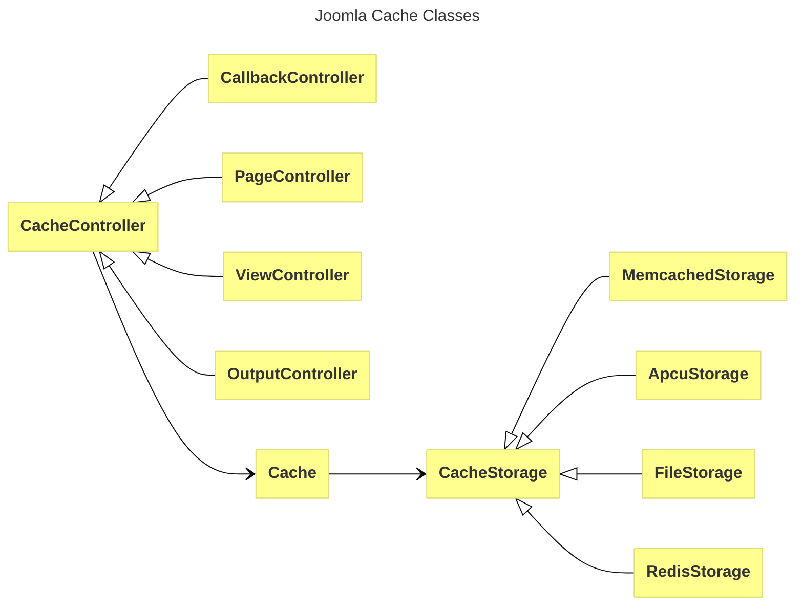

```mermaid
---
title: Joomla Cache Classes
config:
    class:
        hideEmptyMembersBox: true
    theme: base
    themeVariables:
        primaryColor: "#FFFF8F"
---
classDiagram
    direction LR
    
    CacheController <|-- CallbackController
    CacheController <|-- PageController
    CacheController <|-- ViewController
    CacheController <|-- OutputController
    CacheController --> Cache
    Cache --> CacheStorage
    CacheStorage <|-- MemcachedStorage
    CacheStorage <|-- ApcuStorage
    CacheStorage <|-- FileStorage
    CacheStorage <|-- RedisStorage
```