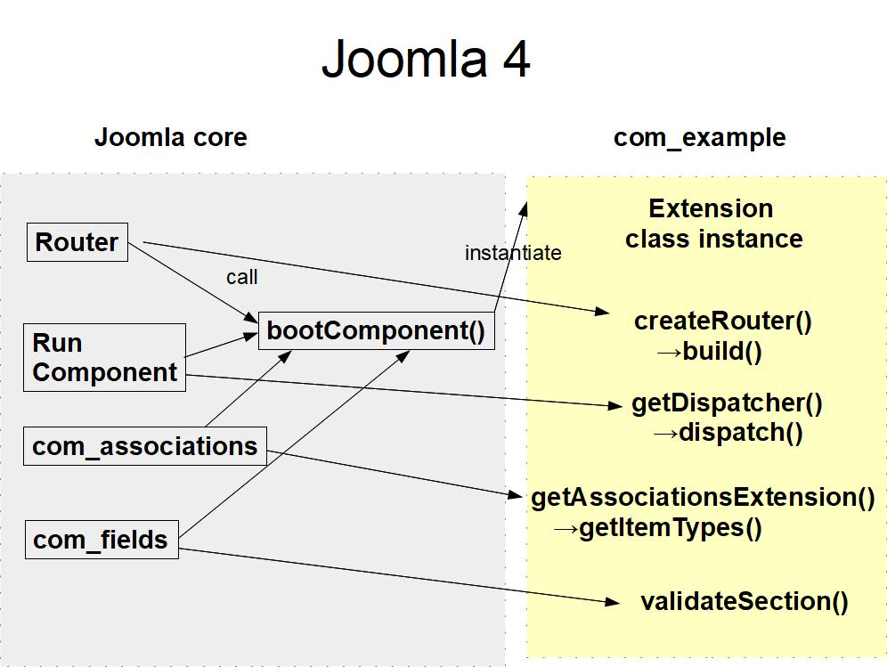

# Extension Class for Components
There are a number of occasions where other Joomla code would want to interact with our component, for example
- the router might want to use our component's custom router to parse and build SEF routes
- if our component supports categories, then `com_categories` will want to display on the categories view a summary by category containing the number of items with that category, split by published status
- if our component supports custom fields then `com_fields` will want to call `getContexts()` to get the types of items which can have custom fields associated with them
- if our component supports multilingual associations then `com_associations` will want to know the types of items which can have associations. 
- and of course Joomla will want to run our component to capture the output for the web page.

The reasons for introducing the Extension class becomes clearer if we review how other Joomla code interacted with our extension in Joomla 3. 


In Joomla 3 all these other bits of code dipped into our component's code base in a rather haphazard fashion – calling functions in various helper files.

In Joomla 4 this is streamlined:



From Joomla 4 components get a handle on our `com_example` component by calling:
```php
$extension = $app->bootComponent("com_example");
```

They can then call their required function on this Extension instance. 

Immediately after the component Extension class is instantiated the Joomla library code will call your Extension's `boot` function, passing your child Dependency Injection Container instance:
```php
$extension->boot($container);
```
This is just an opportunity to let you do, well, really, whatever you like. Sometimes it's used to set up particular classes for using with `HtmlHelper::_()` calls. Or you can use it to save a reference to your child DIC (which can be hard to get otherwise). 

After the first instantiation of your component Joomla caches the instance, and if there is another call to 
```php
$extension = $app->bootComponent("com_example");
```
it just returns your Extension instance, rather than performing the class instantiation and calling of `boot()` again. You can even call `bootComponent` passing your own component, if you need to get a reference to your own Extension object. 