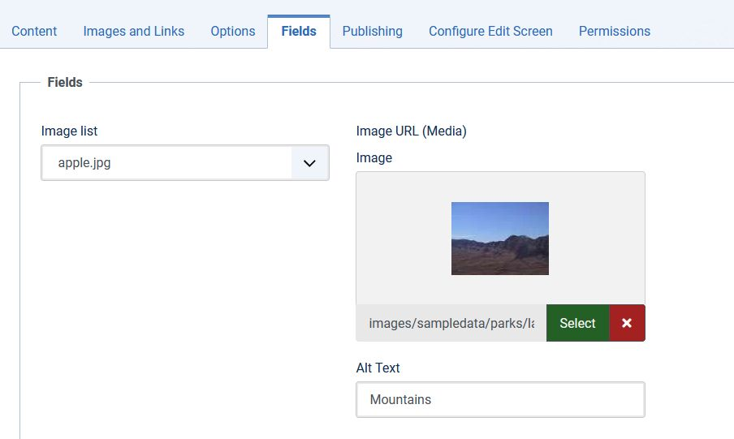

Accessiblemedia Form Field
==========================

The **accessiblemedia** form field type provides modal access to the media manager for the choice of an image (like the media field) and allows the user to specify associated Alt Text. Users with appropriate permissions will be able to upload files.

- **type** (mandatory) must be *accessiblemedia*.
- **name** (mandatory) is the unique name of the field.
- **label** (mandatory) (translatable) is the field html label.
- **description** (optional) (translatable) is the [field description](../standard-form-field-attributes.md#description).
- **directory** (optional) (translatable) is the directory from which the user will be able to choose a file. This attribute should be relative to the top level /images/ folder. The default is that the user will be confined to the top level /images/ folder.
- **preview** (optional) shows or hides the preview of the currently chosen image. ("true": Show always, "tooltip": Show as tooltip, "false": Show never). Default is "tooltip". (since Joomla! 2.5.5)
- **preview_width** (optional) sets the max-width of preview image (default: "200").
- **preview_height** (optional) sets the max-height of preview image (default: "200").

Implemented by: libraries/src/Form/Field/AccessiblemediaField.php

## Example XML parameter definition

```xml
<field
  name="myimage"
  type="accessiblemedia"
  directory="stories"
/>
```

This will open the media manager with the directory /images/stories/ already selected. 
It will allow the user to select a media item and to specify the associated Alt Text. 



Note that if you are using this field on the frontend then permissions restrictions are likely to be in force. If the user is not authorized to view or add media they will see an error page in the modal popup ("403 You are not authorized to view this resource."). 

## Handling the HTTP POST

When the form with an accessiblemedia field is submitted then the HTTP POST parameter for this field will be an array, eg:

```
jform[myimage][imagefile]
jform[myimage][alt_text]
```

If you are storing both in a single database column then you will probably want to JSON-encode the pair of values first.

A worked example can be found in the Component Tutorial [Step 14 Image](../../../building-extensions/components/component-development-tutorial/step14-image.md).  

## See Also

PR where the field is addedː [PR](https://github.com/joomla/joomla-cms/pull/27712)