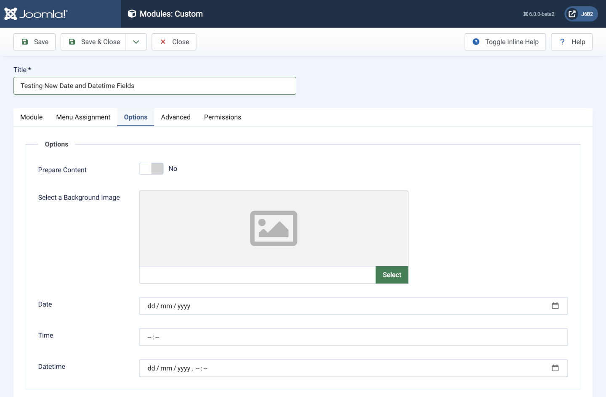

Date Form Field
===============

`<input>` elements of type="date" create input fields that let the user enter a date. The appearance of the date picker input UI varies based on the browser and operating system. The value is normalized to the format yyyy-mm-dd.

The resulting value includes the year, month, and day, but not the time. The time and datetime-local input types support time and date+time input.

## Fields

- **type** must be *date*.
- **name** any name to distinguish this field from all others.
- **label** the translatable label displayed for data entry.
- **description** the translatable description displayed for data entry.

## Example XML parameter definition

```xml
<field 
    type="date"
    name="dob"
    label="COM_EXAMPLE_DATE_OF_BIRTH_LABEL"
    description="COM_EXAMPLE_DATE_OF_BIRTH_DESC"
/>
```

## Screenshot


