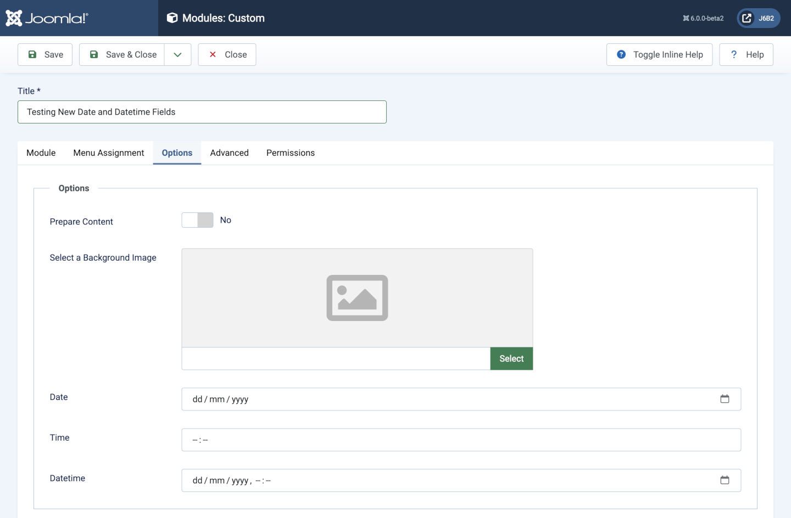

Datetime Form Field
===================

`<input>` elements of type datetime create input controls that let the user easily enter both a date and a time, including the year, month and day as well as the time in hours and minutes. Filters are available to set the date and time to either the Server or User timezone.

## Fields

- **type** must be *datetime*.
- **name** any name to distinguish field this from all others.
- **label** the translatable label displayed for data entry.
- **description** the translatable description displayed for data entry.
- **filter** may be *SERVER_UTC* or *USER_UTC*. The default is *SERVER_UTC*.

## Example XML parameter definition

```xml
<field 
    type="datetime"
    name="dod"
    label="COM_EXAMPLE_DATE_AND_TIME_OF_DEATH_LABEL"
    description="COM_EXAMPLE_DATE_AND_TIME_OF_DEATH_DESC"
    filter="SERVER_UTC"
/>
```

## Screenshot


