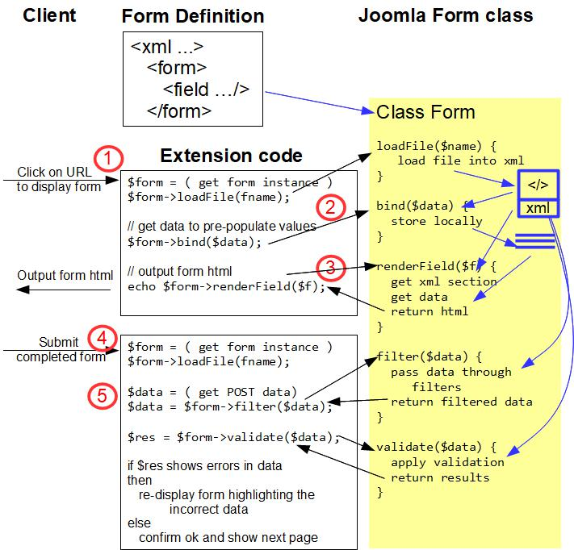

# Introduction
This page describes how you interact in general with the Joomla Form class and provides the code of a simple component which you can install to demonstrate use of this API. With the aid of the diagram below we'll walk through each stage of displaying a form through to handling the submitted data. 

The section in pale yellow is the Joomla library code, specifically code relating to the Form class.

The rectangles with white backgrounds contain your extension code. 



At the outset, you need to define your form in XML using [Joomla Standard form field types](https://docs.joomla.org/Standard_form_field_types). See the component code below for an example. In basic terms, each field element in your XML file maps to an HTML (mostly "input") element in the form, with the XML field attributes mapping to the (input) element attributes. Many of the possible field attributes are listed in [Text form field type](https://docs.joomla.org/Text_form_field_type). 

## Step 1 Loading the form
Step 1 is where the user has navigated to a webpage on which you display a form. 

You first have to instantiate an instance of the Joomla Form class, and you do this by getting a FormFactory out of the [Dependency Injection Container](../dependency-injection/DIC.md) and calling `createForm`. You can do this with the code:
```php
$form = Factory::getContainer()->get(FormFactoryInterface::class)->createForm("sample", array("control" => "myform"));
```
In the above code (which is taken from the sample code below) we've created a Form instance and given it a name "sample" (you can call it whatever you like, it just needs to be unique, so that it doesn't clash with any other Joomla forms on the same webpage) and also passed an array with `"control" => "myform"`. The HTML input elements will then have name attributes set to "myform[message]", "myform[email]", etc,. When the user submits the form then the data items will be passed in HTTP POST parameters that way, and it's then very easy to get these into a PHP array.

Next we get the Form class to load in the XML file containing the form definition:
```php
$form->loadFile("sample_form.xml");  // pass the file path and name of the XML form definition
```

The Form object reads the file into memory (as a PHP SimpleXMLElement) and parses the XML to ensure it's valid. The SimpleXMLElement is represented by the blue rectangle with "xml" in the diagram.

## Step 2 Providing Pre-fill Data

You provide values for any form element you wish. For example, if this form is being used to edit a record in the database, then you would pre-populate it with existing field values from the database. You can provide values by setting up an associative array `$data` where for each element of the array:
- the key is the `name` of the field (in the xml file)
- the value is what you want to prefill that field with

You pass the `$data` array as a parameter to the Form `bind` method, and Joomla Form then stores this data locally within the Form instance - represented by blue bars in the diagram. 

## Step 3 Outputting the Form in HTML

You call `renderField`:
```php
echo $form->renderField($name);
```
where `$name` is the `name` of the field in the XML file, and you get returned the HTML which you can echo to the output. Joomla processes its XML representation of your form to obtain the section relating to the passed-in `name`, generates the HTML for this HTML element and includes the html `value` attribute based on the pre-populated data which you passed in step 2. 

When outputting the form you also need to surround the input elements in a `<form>` element and add a `submit` button. 

## Step 4 User Submitting the Form

The user enters data into your HTML form and clicks on the `submit` button. The browser generates an HTTP POST request to the URL specified in the `<form>` element and passes to the server in an array called `myform` (or whatever `option` you chose previously) the values entered by the user; each element of the array keyed by the `name` attribute of the HTML input element.

Joomla routes this POST through to your component. As this is a new HTTP request the previous Form instance no longer exists, so you have to repeat Step 1 to create a Form instance and load the XML form-definition file into memory. 

## Step 5 Handling the HTTP POST Data

In this step you process the submitted data. This involves 4 parts:

### Getting the POST data
You can use the Joomla [Input](../input.md) functionality to get the data which the user entered. For example 
```php
$app = Factory::getApplication();
$data = $app->input->post->get('myform', array(), "array");
```
will read the POST `myform` parameters into an associative array.

### Filtering the data
It is vital to sanitize any data received to avoid injection attacks by hackers. With many of the [Input](../input.md) methods filtering is applied, but if you read them directly into an array (as above) then no filtering is applied, and you must do it explicitly using eg
```php
$filteredData = $form->filter($data);
```
This applies filtering on each of the input values. The filter applied to a field is governed by the "filter=..." attribute on that field in your form XML file, or if not present then the default filter will remove HTML tags etc from your data values. The possible filters are the classes which are in libraries/src/Form/Filter. Note that these form field filters are different from the [Input](../input.md) filters.

### Validating the data
You validate the data which the user has entered by calling 
```php
$result = $form->validate($data);
```
Joomla compares the user-entered data with the validation you defined in your form XML file, and generates errors for fields which fail the validation. 

### Providing user feedback

If there are validation errors then you should display those errors to the user, and redisplay the form, pre-populating the fields with the (filtered) data which the user entered previously.

If there are no errors then you can confirm this to the user, and show the next web page. 

# Sample Component Code
Below is the code for a small component which you can install to demonstrate basic use of Joomla forms. Place the following 3 files into a folder called "com_sample_form1". Then zip up the folder to create com_sample_form1.zip and install this as a component on your Joomla instance.

For simplicity this component uses the Joomla 3 way of defining a component, and this won't work under Joomla 5. If you want an equivalent which will work under Joomla 5 then you can download and install [this zip file](./_assets/com_sample_form1.zip).

`com_sample_form1.xml` Manifest file for the component 
```php
<?xml version="1.0" encoding="utf-8"?>
<extension type="component" version="3.1.0" method="upgrade">

	<name>com_sample_form1</name>
	<version>1.0.0</version>
	<description>Sample form 1</description>

	<administration>
	</administration>

	<files folder="site">
		<filename>sample_form1.php</filename>
		<filename>sample_form.xml</filename>
	</files>
</extension>
```

`sample_form.xml` File containing the XML for the form definition 
```xml
<?xml version="1.0" encoding="utf-8"?>
<form>
	<field
		name="message"
		type="text"
		label="Enter message"
		size="40"
		class="inputbox"
		required="true" />
	<field name="email"
		type="email"
		label="Enter email"
		required="true"
		size="40"
		class="inputbox" />
	<field name="telephone"
		type="telephone"
		label="Enter telephone number"
		required="true"
		size="40"
		class="inputbox"
		validate="tel" />
</form>
```
`sample_form1.php` Component code. 
```php
<?php
defined('_JEXEC') or die('Restricted access');

use Joomla\CMS\Form\Form;
use Joomla\CMS\Factory;

$form = Form::getInstance("sample", __DIR__ . "/sample_form.xml", array("control" => "myform"));
$prefillData = array("email" => ".@.");

if ($_SERVER['REQUEST_METHOD'] === 'POST')
{
	$app   = JFactory::getApplication();
	$data = $app->input->post->get('myform', array(), "array");
	echo "Message was " . $data["message"] .
		", email was " . $data["email"] .
		", and telephone was " . $data["telephone"] . "<br>";
	$filteredData = $form->filter($data);
	$result = $form->validate($filteredData);
	if ($result)
	{
		echo "Validation passed ok<br>";
	}
	else
	{
		echo "Validation failed<br>";
		$errors = $form->getErrors();
		foreach ($errors as $error)
		{
			echo $error->getMessage() . "<br>";
		}
		// in the redisplayed form show what the user entered (after data is filtered)
		$prefillData = $filteredData;
	}
}

$form->bind($prefillData);
?>
<form action="<?php echo JRoute::_('index.php?option=com_sample_form1'); ?>"
    method="post" name="sampleForm" id="adminForm" enctype="multipart/form-data">

	<?php echo $form->renderField('message');  ?>

	<?php echo $form->renderField('email');  ?>

	<?php echo $form->renderField('telephone');  ?>

	<button type="submit">Submit</button>
</form>
```
Once installed navigate to your site and add the following parameter to the URL: `?option=com_sample_form1`. You should then see the form displayed with 3 required fields:

- a general text input field for a message
- an email input field, pre-populated with the string ".@."
- a telephone number input field.

and using your browser's development tools you can compare the HTML attributes with the attributes in your XML form definition.

Note that modern browsers will do some validation on the values you enter, specifically they will validate the email address and will force you to enter something into fields with the "required" attribute set, but don't (currently) do validation on telephone number fields.

Once you enter valid data into the fields and press `Submit`, then the data will be sent to the server using the same URL (again, use your browsers development tools to see the parameters) and the POST leg of the sample code will be run. This runs the filtering and validation routines. If there are validation errors (the telephone field has some validation) then the code outputs the error messages, and prefills the form with the data which the user entered before redisplaying it. By including html tags within the data values you enter, you can see how the filtering removes them. 