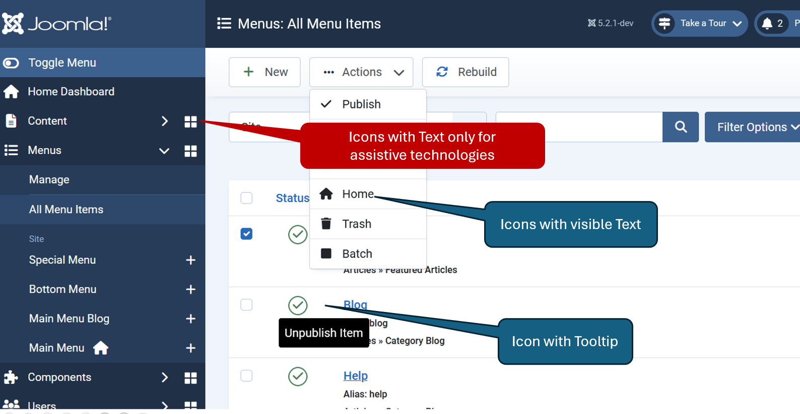

Standard Joomla! Icons 
=====

## Overview
Joomla uses the free [FontAwesome](https://fontawesome.com/search) icons,
which are implemented as [CSS pseudo-elements](https://docs.fontawesome.com/web/add-icons/pseudo-elements)

Joomla implemented the free standard icons, brand icons and supports a subset "icon-..." to be compatible with J!3x and following versions

The source list of available icons can be found in joomla file `media/templates/administrator/atum/css/vendor/fontawesome-free.css`. For a visible representation of all icons with additional information see our [guide.joomla.org](https://guide.joomla.org/user-manual/templates/standard-icons)

## Fontawesome icons
Fontawesome icons can be used for HTML in following forms:

```html
<i style="font-size: 2rem;" class="fa fa-!name!"></i>
<span class="fa fa-!name! "></span>
```

The actual icon name fa-!name! class is accompanied by a prefix class like "fa ..". More below or see [FontAwesome 'classic' styles](https://docs.fontawesome.com/web/dig-deeper/styles)  
The \<span\> element can also do the job but the preferred way is to use classes inside the \<i\> element.

Add attribute ```aria-hidden="true"``` for hiding the icon from screen readers and improves accessibility. Use attribute ```style="font-size: 2rem;"``` or ```style="font-size: 48px;"``` for the size of the icon font.

### Standard icons

The Prefix part is ```fa``` which is short for ```fas``` which is short for ```fa-solid``` which can be used instead.

The icon name part begins with ```fa-``` and the name. Example: 
```php
<i class="fa fa-envelope"></i>
<i class="fa-solid fa-save" aria-hidden="true"></i> <?php echo Text::_('JSAVE') ?> 
```

### Brand icons

The prefix part is ```fab``` which is short for ```fa-brands``` which can be used instead

Example: 
```php
<i class="fab fa-joomla"></i>
<i class="fa-brands fa-facebook" aria-hidden="true"></i> <?php echo 'Facebook' ?> 
```

## Icomoon replacement form / 'icon' parameter in code function calls

For this set of icons, icon names from J3! (icomoon) were replaced (partly) by fontawesome icons. The icon itself is one of the fontawesome icons but the name may differ. Also this is a smaller subset with fewer icons. It is kept for compatibility with J!3 icomoon replacements. In joomla code there are functions which accept the icon name as parameter.

### Direct Html use

The class gets prefix "icon-" (e.g., "icon-calendar", "icon-file", etc.)

Form: ```<i class="icon-name"></i>```. The "name" part has to be replaced by the icon name. 
Add attribute aria-hidden="true" for hiding the icon from screen readers and improves accessibility. 

Example: 
```html
<i class="icon-joomla" style="font-size: 48px;" ></i>
<i class="icon-joomla" aria-hidden="true" style="font-size: 48px;" ></i>
```

### Parameter in J! functions

For example in HtmlView.php of a component the ToolBarHelper:: functions accept a icon name from this icon set.

Example: 
```html
ToolBarHelper::title(Text::_('COM_EXAMPLE_TITLE'), 'envelope');
```

:::tip
Instead of using an 'icon' name of the icon class (see above) a fontawesome icon may be used instead in following form. It is helpful when the required symbol is not available — or looks better.
```html
ToolBarHelper::title(Text::_('COM_EXAMPLE_TITLE'), 'none fa fa-camera-retro');
```
With 'none' given internally a 'icon-none' will be written into the HTML class and ' fa fa-camera-retro' will follow. 
Attention: This could affect subsequent button icons whose CSS formatting is then redefined.
:::

## Icons and accessibility

Support accessibility depending on the situation. Imagine the user is blind or sees symbols only in a blur. Yet, they still want to know what it is about.

We have two situations:
1) The icon stands alone without further text
2) The icon has explanatory text beside it

Blind or visually impaired persons must get the whole information, every icon needs a textual representation. This can be a plain text, a title, a tooltip or also a text which is hidden from sighted users.

If there is the icon-envelope, followed by the text "email me" then you can hide the icon with aria-hidden= true, the screenreader reads the text - good. 
It there is only an icon-envelope but no text - then a blind user sees nothing and the screenreader probably reads nothing.

Then you must add an alt-text to the icon like alt-text="contact me per e-mail"
or aria-hidden = "true" to the icon and add an invisible text "contact me per e-mail".

### Handling isolated symbols without further support

```php
<i class="fa fa-envelope" alt="<?php echo Text::_('CONTACT_ME_PER_EMAIL') ?>"></i> 
<i class="fa fa-envelope" aria-hidden="true" ></i><span hidden><?php echo Text::_('CONTACT_ME_PER_EMAIL') ?></span> 
```

### Handling icons with associated text

If there is the icon-envelope, followed by the text "email me" then you can hide the icon with aria-hidden= true, the screenreader reads the text - good.

```php
<i class="fa fa-envelope" aria-hidden="true"></i><span><?php echo Text::_('CONTACT_ME_PER_EMAIL') ?></span> 
```

### Using 'alt-text' versus 'invisible text' 

There are different opinions about which is better - alt text or invisible text. Both variants are a11y compliant.  
In **Joomla CMS** we use the variant with **invisible** text.

### **Real Joomla! examples**



**Icon with text only**
```php
<span class="menu-dashboard">
    <a href="/Joomla5x/administrator/index.php?option=com_cpanel&amp;view=cpanel&amp;dashboard=components" title="Components Dashboard">
        <span>
            
        </span>
        <span class="visually-hidden">Components Dashboard</span>
        </a>
    </span>
```
Attention: Used title above will create a tooltip 

**Icon with visible text**

```php
<joomla-toolbar-button id="status-group-children-default" task="items.setDefault" list-selection="">
    <button class="button-default  dropdown-item" type="button">
        <span class="icon-default" aria-hidden="true"></span>
    Home
    </button>
</joomla-toolbar-button>
```

**Icon with tooltip**
```php
<td class="text-center">
    <a href="#" class="js-grid-item-action tbody-icon active" data-item-id="cb1" data-item-task="items.unpublish" data-item-form-id="" aria-labelledby="cbunpublish1-desc">
        <span class="icon-publish" aria-hidden="true"></span>
    </a>
    <div role="tooltip" id="cbunpublish1-desc">Unpublish Item</div>                                                                    
</td>
```

## Using other icon sets

In case you want to display other icons not included in the Joomla pack, you have several options, one of which is to use additional FontAwesome icons.
This can be achieved in different ways depending on your needs:
1. Using FontAwesome Kit - this is the easiest approach, but you should have an account on their site.
2. Using self-hosted webfonts and additional CSS files from FontAwesome.
3. Using self-hosted SVG and JS files - for a few icons, this way you will have some speed optimization.
