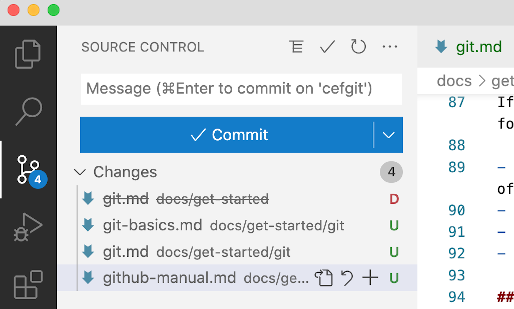
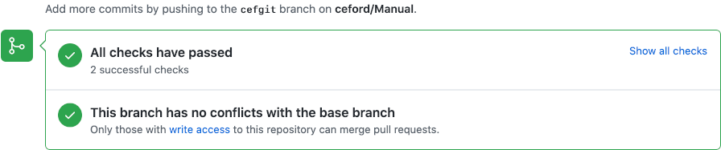

## Getting Started

GitHub is a web site that offers repository hosting. Private repos are charged a commercial fee but public repos, such as Joomla, are hosted free of charge. As the name implies, GitHub is based on using Git for repo management. If you want to contribute to Joomla development you need a GitHub account. It only takes a few moments to create one so Give it a try: [GitHub](https://github.com/). You just need your email address to start. You could try it out by contributing content for this documentation.

## Fork joomla/Manual on GitHub

Log in to your GitHub account and type joomla/Manual in the `Search or Jump to...` box at the top left. You need to be in the original Manual repo.

Click the `Fork` button at the top right of the screen. This will bring up a form asking you to confirm details of the fork you want to make. It is usually sufficient to select the green `Create fork` button.

That will make a complete copy of the Manual repo as it exists at this time in your own account. If someone updates the original later you can use the `Sync fork` button to bring your repo up to date.

## Clone your Github fork locally

For local testing of any web site content you will need to install Apache, MySQL, PHP and phpMyAdmin on your laptop or desktop computer. This collection of separate software items is often referred to as a stack. You may see the words LAMP, MAMP, WAMP or XAMP - the first character indicating Linux, Mac, Windows, or All three. Stack installation is covered elsewhere. 

Your local Apache web server uses a specific folder for individual web sites. For example, on a Mac it may be /Users/username/Sites. You may have many sites for testing and developing different projects, each in a separate subfolder. The clone process will create a folder within your current folder so first open a terminal window and switch to your sites folder:

```
cd ~/Sites
```

Then type in the clone command:

```
git clone https://github.com/yourusername/Manual.git

Cloning into 'Manual'...
remote: Enumerating objects: 833, done.
remote: Counting objects: 100% (65/65), done.
remote: Compressing objects: 100% (39/39), done.
remote: Total 833 (delta 27), reused 55 (delta 24), pack-reused 768
Receiving objects: 100% (833/833), 1.18 MiB | 3.04 MiB/s, done.
Resolving deltas: 100% (436/436), done.
```

Switch to the Manual folder and list what is in it:

```
cd Manual
ls -al
total 1824
drwxr-xr-x   18 ceford  staff     576 26 Aug 12:36 .
drwxr-xr-x  107 ceford  staff    3424 26 Aug 12:33 ..
-rw-r--r--    1 ceford  staff    1463 26 Aug 12:36 .drone.yml
drwxr-xr-x   12 ceford  staff     384 26 Aug 12:36 .git
-rw-r--r--    1 ceford  staff     390 26 Aug 12:36 .gitignore
-rw-r--r--    1 ceford  staff    1445 26 Aug 12:36 README.md
-rw-r--r--    1 ceford  staff      89 26 Aug 12:36 babel.config.js
drwxr-xr-x   12 ceford  staff     384 26 Aug 12:36 docs
-rw-r--r--    1 ceford  staff    5062 26 Aug 12:36 docusaurus.config.js
-rw-r--r--    1 ceford  staff  883852 26 Aug 12:36 package-lock.json
-rw-r--r--    1 ceford  staff    1104 26 Aug 12:36 package.json
-rw-r--r--    1 ceford  staff     357 26 Aug 12:36 renovate.json
-rw-r--r--    1 ceford  staff     725 26 Aug 12:36 sidebars.js
drwxr-xr-x    4 ceford  staff     128 26 Aug 12:36 src
drwxr-xr-x    3 ceford  staff      96 26 Aug 12:36 static
-rw-r--r--    1 ceford  staff     458 26 Aug 12:36 test.sh
-rw-r--r--    1 ceford  staff       4 26 Aug 12:36 versions.json
-rw-r--r--    1 ceford  staff      59 26 Aug 12:36 versionsArchived.json
```

That is your copy of the Joomla Programmers Manual. It is a Docusaurus application that needs Node.js installed to run. That is covered elsewhere. To get going you should read the README.md file, where you will find the following commands:

```
npm install

npm run start
```

And bingo, your browser will spring to life with your local copy of the Joomla! Programmers Documentation.

If you go back to your terminal, open a new window and type `git branch --list` you will see there is only one branch named 'main'. This is something to keep in mind. A local repo created with git will have `master` as the name of the primary branch whereas a repo created on GitHub may have a different primary branch name. 

## Bringing up to date

There are several different ways to keep your repo up to date with the original repo. This is just one:

* In your own GitHub repo, select the `Sync fork` button and then the `Update branch` button. The latter will only be active if the branch is not up to date.
* In your local terminal window type **git pull** and wait for a message (Already up to date).

## Making changes

If you would like to contribute to the Joomla Programmers Manual you need to progress through the following stages:

- **Create and Checkout a branch** in your local repo. This is very important! It will contain a record of the changes you propose to make to the original.
- **Make Changes** by adding or changing folders or files, and adding images.
- **Commit** your changes to your local repo.
- **Push** your changes from your local repo to your remote GitHub repo.
- **Make a Pull request** in your remote repo to ask for your branch to be **merged** into the main branch.

### Create and Checkout a branch

In the terminal window, make sure you are in the root of your site, then:

* git branch ceffixgit
* git checkout ceffixgit

where ceffixgit is some short distinctive piece of text that allows you and others to distinguish between various branches. For example, it could start with your initials and finish with a succinct description of its main purpose: `ceffixgit`.

You may wish to list the branches in your repo:

```
git branch --list
* ceffixgit
  main
```
That is a reminder that the main branch is named `main` rather than `master`.

## Time for an IDE?

During preparation of this article I created a folder, moved an article into that folder and created two new articles. Remembering all of this and updating the repo from the command line is an error prone chore. So I started Visual Studio Code and used File / Open Folder to open my local ~/Sites/Manual folder. The Source Control icon at the left shows me where I have made changes and the state of those changes.



The moved document shows up marked with a red `D` for Deleted. The added documents show up with a green `U` for Unstaged. In each case I can click the adjacent `+` sign to stage the file to make it ready to commit. As each `+` is clicked it moves from a `Changes ` list into a `Staged Changes` list.

## Local Testing

It is essential that you test your proposed changes locally before making a pull request. You will have been checking your local docusaurus site to see that it appears to work properly. However, you also need to check the build stage. This is when static html pages are generated and it can reveal all sorts of additional problems such as broken links or invalid source content. So go back to your terminal window and enter:

```
$ npm run build
```
If it works without error you are ready to make a pull request.

### Commit and Push

Easy with an IDE. In VSCode:
- Select the Source Control icon at the left.
- Add a Commit message: a very brief statement of what changed in this commit.
- Either select the `+` button in the Changes list to stage the changes.
- Or select the `Commit` button to commit the changes to the local repository. 
- Select the Source Control `...` button followed by Pull, Push / Push To... / and then select your own remote repo to push the changes from your local repo to your remote repo.

### Make a Pull Request

Login to your account on GitHub and select your own Manual repo. In the `Code` section select the branch you wish to commit from the `Switch branches` drop-down list (marked with the branch icon). Click the `Contribute` button and then the `Open Pull Request` button.

After making a pull request some automatic checks are carried out. All being well after a few minutes you will see this result:



You can then test the pull request on the live site with the following url:

```
http://pr-[prnumber].manual.joomlacode.org
```

Where the `[prnumber]` can be obtained from the Pull Requests list (just a number - no brackets).

### After commit

If all seems in order, the team who maintain the documentation repo will **commit** your changes to become incorporated into the `main` branch of the original repo. At that point you can delete your branch. From the command line first switch to your local main branch:

```
git checkout main
```

If you have the folder you are working on open in an IDE you will notice that all of the changes you made will seem to have disappeared. That is because git has replaced the source code stored in the previous branch with the source code stored in the main branch.

You can delete the branch that has been committed now or you can leave it until later. Don't make any more changes to it!

```
git branch --delete ceffixgit
```

## Keeping up to date

Tomorrow, next week, next month, you may want to contribute some more documentation. But in the meantime the original `main` branch of the documentation may have changed with contributions from others. Those contributions may even have changed your last contribution. So before starting anything new you need to bring your local copy of the original repo up to date. 

First go to your GitHub account and open your fork of this Manual: username/Manual. Then click the `Sync fork` button. That should bring your fork up to date.

Then in your terminal window, change to the folder containing your local clone of your remote fork and issue the git pull command:

 ```
 cd ~/Sites/Manual
 git pull
 ```

 That is exactly the same as **Bringing up to date** above.

 You are now ready for your next contribution, for which you need a new branch.
