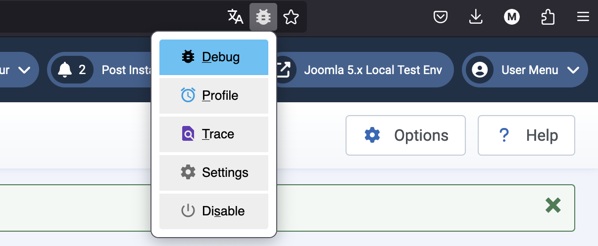

Debugging
=========

## Using MAMP and Xdebug

This section shows you on how to set up your environment in MAMP and PhpStorm to debug your Joomla! extensions.
It is assumed that PhpStorm is in the current version and that you have a local Joomla! installation in which your
extension is already installed.

### Enable Xdebug in MAMP (Pro)

In MAMP open the Settings and switch to the Languages page. Select the PHP Tab and make sure that Xdebug is ticked in
the Extensions section.


### Add IDE Key to your php.ini

Edit php.ini Template inside MAMP, search for the xdebug section and add:

```ini php.ini
xdebug.idekey=PHPSTORM
```


Hint: Use `Ctrl` + `F` and search for "xdebug"

:::note
  After you have changed some settings make sure to save & restart your MAMP Server.
:::

### Check PHP Configuration in your Joomla! Installation

Check in the PHP Settings in your Joomla! Backend in `System` > `System Information` > `PHP
Information` and make sure that the Section for Xdebug is visible:


### Install Xdebug Browser Extension

Install a Xdebug Extension of your choice in your Browser. Search for Xdebug in your Browser's Extensions Dictionary
and enable the Plugin - Check your Browser's Guide on how to install Plugins. Please note: An installation may require
a Browser restart.

### Setting up Environments in PhpStorm

Mostly you will write your Code in its own Project Folder but when using Joomla! The project will be zipped / installed
or deployed from inside your IDE into to your Joomla Dev Environment. Which means you cannot use debugger directly
inside the Project where you write your extension code (because it is not the file which will be run by Joomla!
normally).

So beside your extension development project in PhpStorm open or create a new Project for Debugging inside your local
Joomla! Installation. This Project should point to the Joomla! Main directory of your local Joomla! Installation. So in
PhpStorm click on `File` > `New Project form Existing Files` and select your Joomla! Installation. PhpStorm may ask you
if you would like to Trust this Folder, confirm that request.

### Configure PhpStorm Debugger

In this new Project select `Run` from the Main Menu and Select `Edit Configurations`.


This will open a new window where you can manage configruations or add a new configuration.


Click on `Add new...` next select to add a new `PHP Remote Debug` Configuration.


Name the Configuration as you like but for example "MAMP" (default is Unnamed).
Tick the option `Filter debug connection by IDE Key` Click on the Button `...` with the three dots beside the Server
Selection.


This will open a new PopUp window to set up the server settings. Enter here your MAMP's Server Information.
The name can be "MAMP Server" or whatever you like. By Default MAMP Server's are running on Port 8890 use the Port of
your local Server here. In this example the Joomla! installation is available on the URL `https://joomla5.localhost:8890` so the
Host is `joomla5.localhost`. Set the Host and Port based on your configuration.


Click on `Apply` and `OK` to close the window. Your new Server Configuration should now already be selected, set now your IDE
key based on entry in the php.ini file See: [Add IDE Key to your PHP INI](#add-ide-key-to-your-phpini).


:::note
The IDE Key is not Case Sensitive, but it's recommended to write it here exactly the same way as defined in php.ini
:::

:::note
Make sure the "Activate tool window" option is ticked then click on Apply & OK
:::

### Set Breakpoint in Code

In our example the latest version of the extension we want to develop is already installed in our local Joomla!
Environment so in our Project we search for the file we want to debug and add a breakpoint to the row we want to debug.

[Learn here how to set Breakpoints](https://www.jetbrains.com/help/phpstorm/using-breakpoints.html#set-breakpoints)


Now we can either Click on `Run` from the PhpStorm Main Menu and then on `Start listening for PHP Debug Connections` or
simply click the `Bug Icon` in the Main Window of the Project to let PhpStorm listen.

### Enable Debug in your Browser

Now we simply need to open our page in your Browser where your Extension gets loaded. Make sure the Debugger Plugin is
active and running in your Browser.



When visiting the page you will notice that the site won't get loaded. But PhpStorm jumps in front showing you the Debug
console where you will find the available Variables and its content in the Debugging Console.


## Related external articles
- [Debugging with PhpStorm](https://www.jetbrains.com/help/phpstorm/debugging-with-phpstorm-ultimate-guide.html)
- [Xdebug Documentation](https://xdebug.org/docs/)