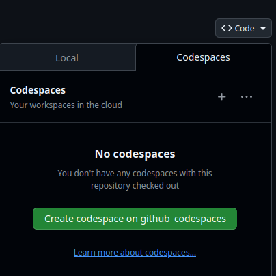
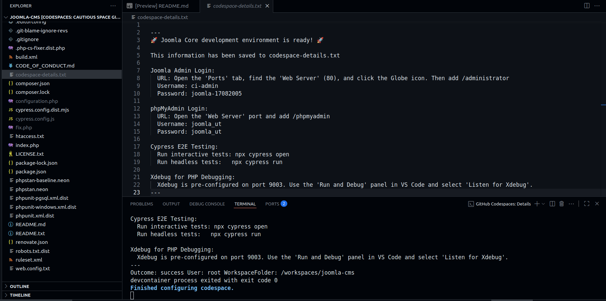
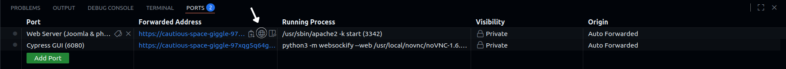
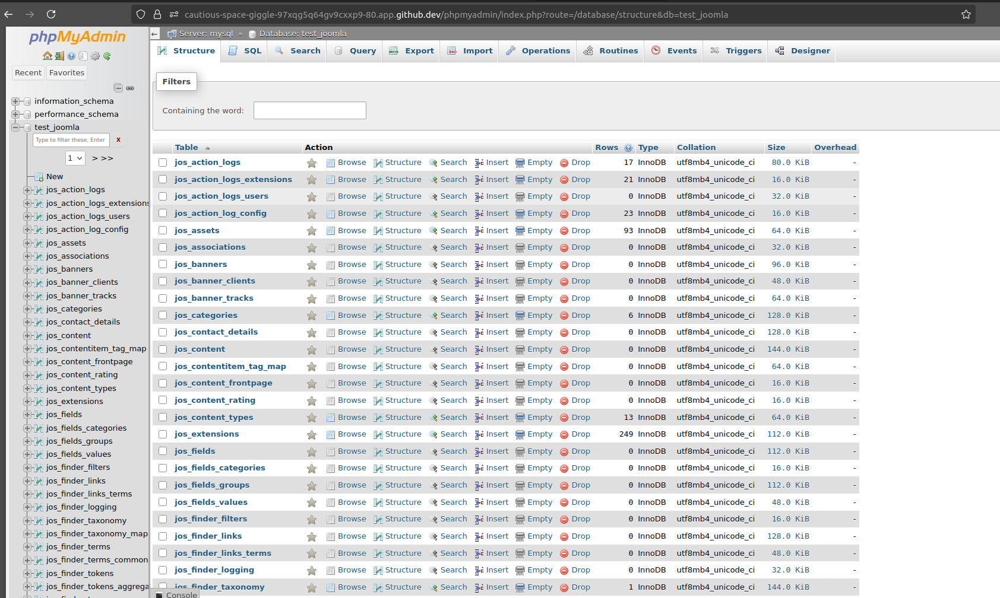
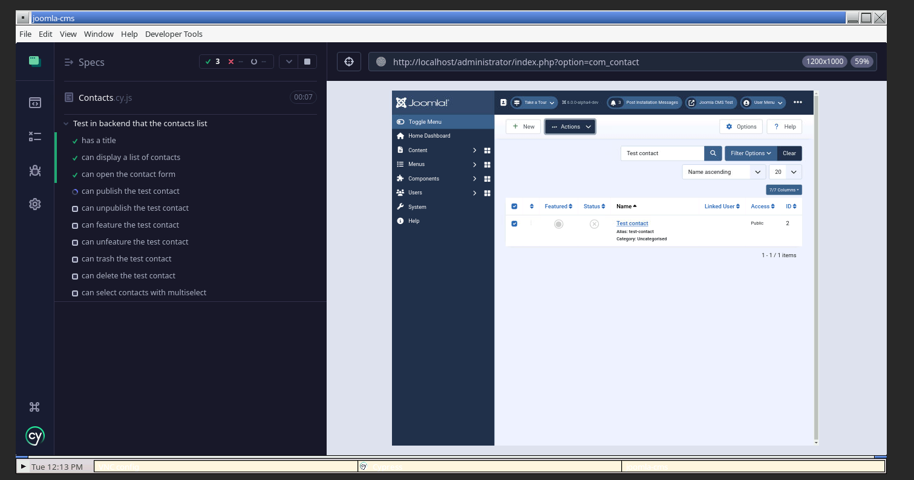
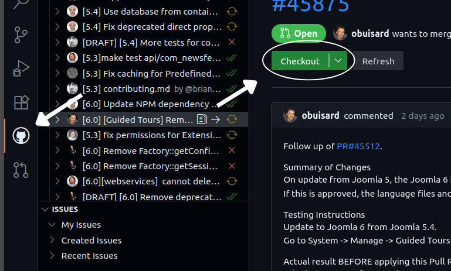

GitHub Codespaces
=================================

GitHub Codespaces provides a complete, configurable development environment in the cloud for testing Joomla! pull requests, or even using as a dev environment.

## Getting Started

To get started with testing a pull request using GitHub Codespaces, follow these steps:

1.  Navigate to the pull request you want to test on GitHub.
2.  Click the **Code** button in the top right.
3.  Select the **Create codespace** option.

4.  A new browser tab will open, and GitHub will begin creating the Codespace. This process will take a few minutes as it sets up the entire Joomla 
development environment, including installing dependencies and running the Joomla installation script.

## The Codespace Environment

Once the setup is complete, you will be in a Visual Studio Code environment within your browser. A file named `codespace-details.txt` will be available, 
containing all the necessary credentials to access the Joomla installation.

### Accessing Joomla and phpMyAdmin

The `codespace-details.txt` file provides you with:

*   **Joomla Admin Credentials:** Username and password for the administrator account.
*   **phpMyAdmin Credentials:** Username and password for phpMyAdmin.

To access these, navigate to the **Ports** tab in VS Code. You will find forwarded ports (e.g., "Web Server", "Cypress"). Click the globe icon next to the HTTP(S) forwarded URL for the web server to open the Joomla site in a new tab.

You can access Joomla webserver using HTTPS on port 443 (**The Recommended and Default**), but you can also access it using HTTP on port 80

### Managing the Database with phpMyAdmin

The environment includes phpMyAdmin, which allows you to directly manage the Joomla database. This is useful for verifying data changes,
importing test data, or debugging issues at the database level.

1.  Find the **phpMyAdmin URL** and **credentials** in the `codespace-details.txt` file.
2.  Open the URL in your browser to access the phpMyAdmin login page.
3.  Log in using the provided credentials.

### Running Interactive Cypress Tests

The environment is ready for end-to-end testing with Cypress.

1. In the VS Code terminal, run `npx cypress open`.
2. Navigate to the Ports tab and click the globe icon next to the Cypress GUI port to open the test interface in a new tab.

### Testing a Pull Request

The primary benefit of using Codespaces is the ease of testing PRs. The environment is set up with the code from the branch the Codespace was created
from. To test a different PR:

1.  Use the **GitHub** extension in the VS Code sidebar.
2.  Find the pull request you want to test.
3.  Click the **Checkout** button.

The changes from the pull request will be applied to the files, and you can immediately see the effect in your running Joomla instance.

