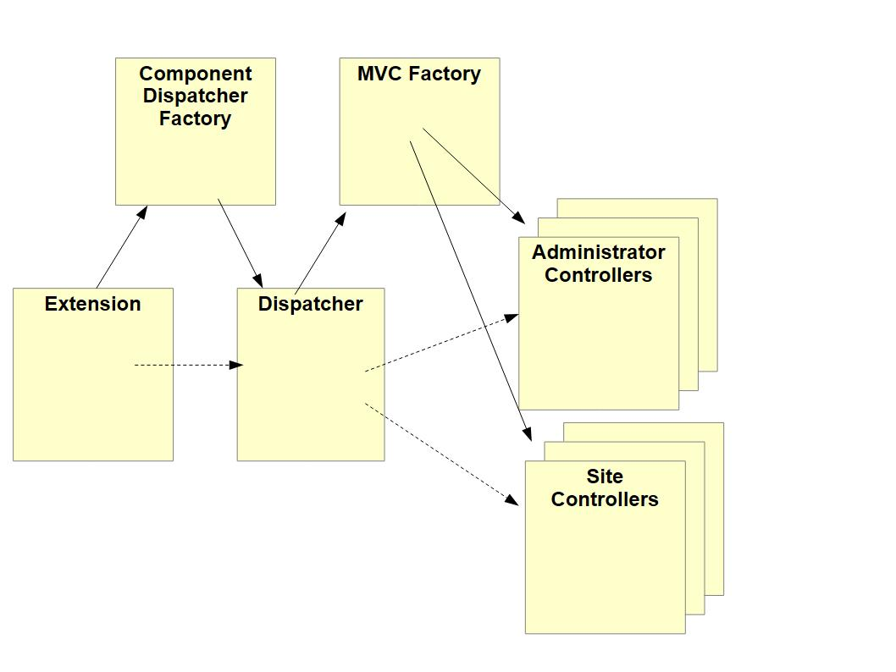

## Introduction

The aim of this step is for you to build and install a basic Joomla component called com_example.
When more fully developed this component will support a database of famous world landmarks,
with back-end functionality to allow administrators to manage the data,
and front-end functionality to display the landmarks to users.

In this first step com_example will simply output our first landmark:

```html
<h4>The Eiffel Tower</h4>
```

Unfortunately this first step is very long, as there is a lot of explaining to do.
But don't let that put you off - subsequent steps will be a lot shorter!

The source code is also available at [com_example step 1](https://github.com/joomla/manual-examples/tree/main/component-tutorial/step01_basic_component).

## Learning Points

Recommended file structure for component development.

Manifest files for components.

Dependency Injection for components.

Extension, Dispatcher and MVC introduction.

Installing an extension from a folder.

Template and language overrides. 

## Source File Structure

The recommended file structure for development of components
is to mirror where the files are stored when the component is installed.

This initial step has 7 source files, organised as follows:

```
com_example
 ├─── administrator
 │     └─── components
 │           └─── com_example
 │                 ├── language
 │                 │     └─── en-GB
 │                 │           ├─── com_example.ini
 │                 │           └─── com_example.sys.ini
 │                 └─── services
 │                       └─── provider.php
 ├─── components
 │     └─── com_example
 │           ├─── src
 │           │     ├─── Controller
 │           │     │     └─── DisplayController.php
 │           │     └─── View
 │           │           └─── Landmark
 │           │                 └─── HtmlView.php
 │           └─── tmpl
 │                 └─── landmark
 │                       └─── default.php
 └─── example.xml
```

## Manifest file

The manifest file is used by Joomla to install the component. 
It tells Joomla the type and name of the extension, where the source files are, etc.

```php title="com_example/example.xml"
<?xml version="1.0" encoding="UTF-8"?>
<extension type="component" method="upgrade">

    <name>COM_EXAMPLE_TITLE</name>
    <creationDate>today</creationDate>
    <author>me</author>
    <license>GPL v3</license>
    <version>0.1.0</version>
    <description>COM_EXAMPLE_DESCRIPTION</description>

    <element>com_example</element>

    <namespace path="src">My\Component\Example</namespace>

    <files folder="components/com_example">
        <folder>src</folder>
        <folder>tmpl</folder>
    </files>

    <administration>
        <files folder="administrator/components/com_example">
            <folder>services</folder>
        </files>
        <languages folder="administrator/components/com_example/language">
            <language tag="en-GB">en-GB/com_example.ini</language>
            <language tag="en-GB">en-GB/com_example.sys.ini</language>
        </languages>
    </administration>

</extension>
```

:::tip
  If you're copying and pasting from here into a local source code file,
  then you can use the little copy icon which appears at the top right of the code block.
:::

Here's an explanation of the key aspects of this file. 
For detailed information, see the [Manifest Files documentation](../../install-update/installation/manifest.md). 

```xml
<extension type="component" method="upgrade">
```

This tells Joomla that the extension type is "component"
and method="upgrade" supports installing another version of an extension above a previous version.

The `<name>` to `<description>` elements are generally informational;
you can put whatever you want in them.

```xml
<element>com_example</element>
```

The "element" is like a key which Joomla uses to identify each extension,
so it needs to be "com_" plus the component name.
If the `<element>` tag isn't provided then Joomla will form the "element" from the `<name>`.

```xml
<namespace path="src">My\Component\Example</namespace>
```

From this line Joomla will create 2 namespace prefixes:

- \My\Component\Example\Site will point to components/com_example/src, 
and we will add our site PHP classes under there.

- \My\Component\Example\Administrator will point to administrator/components/com_example/src, 
and we will add our administrator PHP classes under there.

For background, see the [Namespaces documentation](../../../general-concepts/namespaces/index.md).

```xml
<files folder="components/com_example">
    <folder>src</folder>
    <folder>tmpl</folder>
</files>
```

The `<files>` element tells the Joomla installer where to find the files 
associated with the front-end of the component. 
Joomla will copy them from the location specified by the "folder" attribute
into the components/com_example directory within the Joomla instance.


```xml
<administration>
    <files folder="administrator/components/com_example">
        <folder>services</folder>
    </files>
    <languages folder="administrator/components/com_example/language">
        <language tag="en-GB">en-GB/com_example.ini</language>
        <language tag="en-GB">en-GB/com_example.sys.ini</language>
    </languages>
</administration>
```

The `<administration>` `<files>` element tells the Joomla installer where to find the files 
associated with the back-end administrator functionality of the component. 
Joomla will copy them from the location specified by the "folder" attribute
into the administrator/components/com_example directory within the Joomla instance.

If you have other files and folders within your com_example directory
then they will be ignored. 
Sometimes an easy mistake to make is to forget to include files or folders within a `<files>` element!

The `<administration>` `<languages>` element tells the Joomla installer where to find the files 
associated with the back-end administrator functionality of the component. 
As described in [Manifest Files / Languages](../../install-update/installation/manifest.md#languages),
there are 2 ways to handle languages, 
and in this tutorial we use the method which copies them to the administrator/languages folder. 

## services/provider.php file

```php title="administrator/components/com_example/services/provider.php"
<?php
\defined('_JEXEC') or die;

use Joomla\CMS\Dispatcher\ComponentDispatcherFactoryInterface;
use Joomla\CMS\Extension\ComponentInterface;
use Joomla\CMS\Extension\Component;
use Joomla\CMS\Extension\Service\Provider\ComponentDispatcherFactory as ComponentDispatcherFactoryServiceProvider;
use Joomla\CMS\Extension\Service\Provider\MVCFactory as MVCFactoryServiceProvider;
use Joomla\CMS\MVC\Factory\MVCFactoryInterface;
use Joomla\DI\Container;
use Joomla\DI\ServiceProviderInterface;

return new class implements ServiceProviderInterface {

    public function register(Container $container): void 
    {
        $container->registerServiceProvider(new MVCFactoryServiceProvider('\\My\\Component\\Example'));
        $container->registerServiceProvider(new ComponentDispatcherFactoryServiceProvider('\\My\\Component\\Example'));
        $container->set(
            ComponentInterface::class,
            function (Container $container) {
                $component = new Component($container->get(ComponentDispatcherFactoryInterface::class));

                return $component;
            }
        );
    }
};
```

This code looks pretty horrendous for someone learning Joomla!
However, it's pretty standard - when you start coding a new component, 
you generally reuse a previous provider.php file and just change the component name and namespace.

You can choose either to accept it and leave understanding until later,
or follow the simplified explanation below.



When Joomla wants to run com_example then the first object it creates is the Extension object.
This is like a handle on the component -
when Joomla or another extension wants to find out something from com_example,
then they'll create (aka boot) the com_example Extension object and call a particular method on it.

When Joomla boots com_example because it wants to capture the component output,
it will also create the Dispatcher class, and call the `dispatch` method on it.
To get the Dispatcher class instance it will call the `getDispatcher` method of the Extension instance,
and this will in turn get the ComponentDispatcherFactory to create the Dispatcher.

This Dispatcher's `dispatch` method works out which Controller class to use - 
there will generally be a few controllers on both the administrator and site sides - 
and arranges for that Controller class to be instantiated.
It doesn't instantiate the Controller directly, but rather uses an MVCFactory class to create it.

The Controller is the first class of the Model-View-Controller (MVC) triptych 
around which Joomla components are designed.

More information on Extension and Dispatcher classes can be found in
[Extension and Dispatcher Classes](../../../general-concepts/extension-and-dispatcher/index.md).

Returning to our provider.php file, 
the purpose of this code is to create these 3 key classes, Extension, ComponentDispatcherFactory and MVCFactory.
They're created based on the Joomla [Dependency Injection](../../../general-concepts/dependency-injection/index.md) paradigm.
Note that while there may be multiple Model, View and Controller classes in a component,
a standard component will only ever have 1 instance of each of Extension, ComponentDispatcherFactory (and Dispatcher) and MVCFactory.
The code for these classes is stored within the administrator/ area, 
but covers the creation of MVC classes for the site front-end as well. 

```php
$container->registerServiceProvider(new MVCFactoryServiceProvider('\\My\\Component\\Example'));
```

This will result in the instantiation of an MVCFactory instance. 
The namespace prefix of com_example is passed into the constructor,
because the MVCFactory code will be creating com_example Models, Views and Controllers (and Tables) 
with class names which are prefixed with this namespace prefix.

```php
$container->registerServiceProvider(new ComponentDispatcherFactoryServiceProvider('\\My\\Component\\Example'));
```

This will result in the instantiation of a ComponentDispatcherFactory.
It will in turn create the Dispatcher class with its `dispatch` method for creating Controllers.
Since com_example will follow the standard Joomla pattern for creating Controllers,
we're not going to need any special DispatcherFactory or Dispatcher classes,
and throughout the tutorial we'll just use the standard Joomla ones.

```php
$component = new Component($container->get(ComponentDispatcherFactoryInterface::class));
```

This line instantiates the com_example Extension class.
At this stage we're just using a standard Joomla Extension class called Component,
which is a pretty empty class, really just having a way to get to the Dispatcher.
(Later in the tutorial series we'll need to create our own Extension class.)

The code passes into the Component constructor the ComponentDispatcherFactory got from the child DIC.
In this way, the Extension class has a pointer to the ComponentDispatcherFactory,
for when it has to instantiate a Dispatcher object.

## Administrator Language Files

At this stage, com_example uses language constants on the Administrator back-end only,
so we just need to supply administrator language files. You can choose your own text here, if you like.

```php title="administrator/components/com_example/language/en-GB/com_example.sys.ini"
COM_EXAMPLE_TITLE="Joomla Component Tutorial"
COM_EXAMPLE_DESCRIPTION="Builds an example application for managing famous landmarks"
```

```php title="administrator/components/com_example/language/en-GB/com_example.ini"
<blank file>
```

The .sys.ini file is used when the administrator presents information for multiple components,
for example, within the Manage Extensions functionality.

The .ini file is used when the administrator presents information for com_example only. 
This file is just empty for now. 

## Site DisplayController

A DisplayController is created whenever a component has to just display content,
generally in response to a normal HTTP GET request.

```php title="components/com_example/src/Controller/DisplayController.php"
<?php
namespace My\Component\Example\Site\Controller;

\defined('_JEXEC') or die;

use Joomla\CMS\MVC\Controller\BaseController;

class DisplayController extends BaseController {

    public function display($cachable = false, $urlparams = array())
    {
        $view = $this->getView('landmark', 'html');
        $view->display();
    }
}
```

### _JEXEC

```php
\defined('_JEXEC') or die;
```

This is a security feature to prevent malicious or accidental execution of individual PHP files.
The constant _JEXEC is defined whenever Joomla initialises normally.

### Namespace and class name

```php
namespace My\Component\Example\Site\Controller;
...
class DisplayController
```

These lines mean that the Fully Qualified Name (FQN) of our class will be:

\My\Component\Example\Site\Controller\DisplayController

Remember that the site namespace prefix is \My\Component\Example\Site 
and points to the components/com_example/src folder.
This means that this class must be in the Controller subdirectory under that src folder,
and must be in DisplayController.php.

It is important to match the class name with where it should be stored on disk! 
If you get it wrong then Joomla will often raise an exception
with a message stating that it can't find some Controller / View / Model etc.

### BaseController

```php
use Joomla\CMS\MVC\Controller\BaseController;

class DisplayController extends BaseController 
```

The Joomla\CMS namespace prefix points to libraries/src,
so you will find the source code for BaseController in
libraries/src/MVC/Controller/BaseController.php.

Open the file and have a look at the signature of the BaseController constructor.
Remember that the Controller class will be created by the MVCFactory instance,
upon the request of the Dispatcher class instance. 

```php
public function __construct($config = [], ?MVCFactoryInterface $factory = null, ?CMSApplicationInterface $app = null, ?Input $input = null)
```

You can see that the MVCFactory instance is passed in as a parameter,
and our DisplayController code will use this when it seeks to instantiate the associated View class. 

### Controller display function

```php
$view = $this->getView('landmark', 'html');
```

The getView Controller method is the way to create and return a view,
in this case (based on the parameters) a View/Landmark/HtmlView instance. 
The BaseController will access the stored MVCFactory instance passed in the constructor,
and will use it to request the MVCFactory to create the view instance. 

```php
$view->display();
```

The view display method is what is called to generate the component output.

## Site View

As this view will output a famous landmark from somewhere in the world,
we define its name as "Landmark". 

```php title="components/com_example/src/View/Landmark/HtmlView.php"
<?php
namespace My\Component\Example\Site\View\Landmark;
 
\defined('_JEXEC') or die;

use Joomla\CMS\MVC\View\HtmlView as BaseHtmlView;

class HtmlView extends BaseHtmlView 
{
    function display($tpl = null)
    {
        parent::display($tpl);
    }
}
```

Note that the folder/file structure here is different from the Controller.
It's probably due to the fact that views differ in 2 aspects.
For com_content the views differ based on:

- the type of view being presented - eg an article, or all articles in a category,

- how the view is encoded - eg as HTML, or as XML (for a feed to an RSS/Atom Feed Reader).

So the view folder defines the type of view being presented,
and the view class filename defines the view encoding. 

The `display` function above simply calls the parent `display` function. 
This will result in a PHP `require` of the tmpl file, described in the next section.
However, it will also check first to see if there is a template override of the tmpl file,
and if available it will run it instead. 

Within the MVC pattern the View aspect is split within Joomla into the View class and the tmpl file.
Roughly, the split is:

- the View class is responsible for collating the data to appear on the web page

- the tmpl file is responsible for output of the HTML

As well as simplifying the code by splitting functionality in this way,
it also provides a significant point of flexibility within Joomla,
namely the ability to override the tmpl using a template override.

## tmpl file - default.php

This file simply outputs the HTML element.

```php title="components/com_example/src/tmpl/landmark/default.php"
<?php
\defined('_JEXEC') or die;

?>
<h4>The Eiffel Tower</h4>
```

Note that the tmpl file path mirrors the View file path,
but with small letters being used rather than capitals.
In Joomla capitals are reserved for files containing PHP classes. 

## Installing the Component

When developing an extension it's easiest to use the option of Install from Folder,
as this means you don't have to create a zip file.
This is particularly the case if you have forked the [Joomla Manual Examples repo](https://github.com/joomla/manual-examples)
and have it stored locally on your PC.

To install from a folder:

- Select Install Extensions within the Joomla administrator back-end, and select the Install from Folder tab.

- Enter the name of the folder which contains the com_example manifest file (example.xml).

You should get the confirmation that installation of the component was successful.

To display the first landmark navigate to:

```
<your joomla instance>index.php?option=com_example
```

## Exploring your component installation

### Manage Extensions

On the Administrator System Dashboard select Manage Extensions,
and search for the text which you put against COM_EXAMPLE_TITLE in the administrator language .sys.ini file.

You should see the com_example entry, with the description shown as a tooltip.

### Database record

Using phpmyadmin, display the latest records in the `#__extensions` table of your Joomla instance database.

You should see the com_example record there, 
and can view the data stored in the fields of this record.

### Template Override

Within the administrator System Dashboard select the Site Templates, and then Cassiopeia Details and Files.
In the Create Overrides tab you should see the com_example component,
and you can create a template override which outputs something different from the tmpl file.

If you do create a template override then do remember to delete it afterwards,
as future tutorial steps will be modifying the tmpl file,
and you won't see these modifications while you have the template override in place.

### Language Override

Select Language Overrides on the System Dashboard, 
in the select field choose "English (United Kingdom) Administrator" 
and then press the New button.

In the right-hand panel you can search for the com_example language strings,
and override them if you wish.

### Namespace Cache

Assuming you have the Joomla Namespace Updater plugin enabled,
Joomla will build a cache of the classes in the installed extensions.

Look in administrator/cache/autoload_psr4.php and you should see

```
'My\\Component\\Example\\Site\\' => [JPATH_SITE . '/components/com_example/src'],
```

Usually you would have a similar entry for the administrator namespace,
but we haven't defined any administrator classes yet!

## Challenge

In many of the tutorial steps you'll find a challenge -
to code some additional functionality yourself.

There aren't any answers provided, but if you get stuck and want some assistance,
then you can seek help via the [Joomla Community](../../../get-started/index.md#community).

Sometimes the answer is given in the subsequent step of the tutorial.

The challenge for this first step is as follows.
In outputting the first landmark we've hard-coded the text in the tmpl file.
Can you change the code so that you use a language constant instead?

To provide some guidance, this is what you will need to do:

1. Create a language folder and subfolder under components/com_example,
mirroring how it was done under administrator/components/com_example.

2. Create the language file and insert your new language constant into it.
Should the language file be called com_example.ini or com_example.sys.ini?

3. Change the tmpl default.php file so that it outputs the text for the language constant,
instead of the hard-coded text. 
You use the `Joomla\CMS\Language\Text::_()` method to translate the language string,
as described in [Using Text::_](../../../general-concepts/multilingual.md#using-the-text-class).

4. Update the manifest file example.xml to add the `<folder>language</folder>` 
within the site `<files>`.

Reinstall your component - you don't need to update the version number in the manifest file
when you install a new version. 

Your new language string should now appear as a possible language override on your "English (United Kingdom) Site".