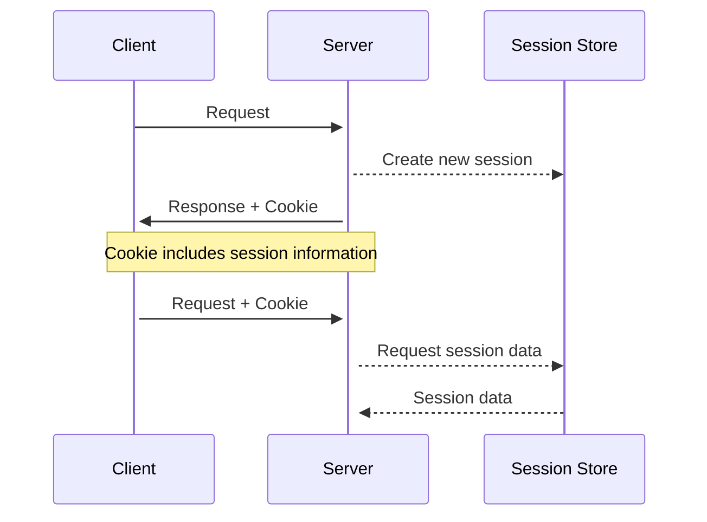

To Logon or not to Logon
========================

:::danger[Developer Notice]

Creating a script which directly includes loads and boots the CMS framework is not recommended and only needed in
rare cases. Depending on the usecase you should create a [console plugin](../plugins/plugin-examples/basic-console-plugin-helloworld.md)
and extend the Joomla! console application. If you need to create a simple entry point for webrequests write an
[ajax plugin](../plugins/plugin-examples/ajax-plugin.md).

:::

## To logon or not to logon

As you can see from the script in the previous section, it's not necessary to logon to Joomla to perform a query on the database and output the result. But should you logon to Joomla or not? You've got 3 options:
 
- Don't logon
- Logon using credentials that you hard-code into the script
- Check if the user is already logged on.

Let's consider these options in reverse order.

## Check if user is logged on
How Joomla knows if a user is logged on is through the use of cookies, as shown in the diagram.



When Joomla responds to an HTTP request it sends down cookies to the browser, and these include a session cookie which is like a pointer to session data stored on the server. If a user logs onto the Joomla site, then that session data includes the username with which they logged on. 

When the user next views a page on the site, or submits a form on the site, then the browser sends to the Joomla server all the cookies which the Joomla site previously sent down. Joomla finds the session cookie, and via it the session data, and checks in it to see if there is a logged-on user, and if so, what the associated username is.

When users are accessing the Joomla site they're actually accessing the script index.php in the top level Joomla directory. However, the browser sends these cookies for all scripts on the same domain. So that if a user navigates to `<your domain>/cli/myscript.php` then the browser will send in the HTTP request all the cookies stored for that domain.

So within your script you can get Joomla to find the session cookie, and via it the session data, and can find out the username of the logged-on user. To do this you generally use:

```php
$user = \Joomla\CMS\Factory::getApplication()->getSession()->get('user');
```

but in this case there is already a variable `$app` pointing to the Application instance, so you can use:

```php
$user = $app->getSession()->get('user');
```

You'll get back a `Joomla\CMS\User\User` object with 
- the id set to 0 if the user isn't logged on, or 
- an id > 0 for a logged on user. 

The other properties of this User object you can find at [User API](cms-api://classes/Joomla-CMS-User-User.html).

If your script uses other Joomla library or extension code then that code may try to access the User object via 

```
$app->getIdentity();
```

So to enable this to work you need to call

```
$app->loadIdentity($user);
```

so that a pointer to the User instance is stored in the Application instance. 

## The "remember me" cookie

The session cookie is valid only for a configurable period of time (set in Global Configuration / System tab, Session lifetime), and if the session cookie has expired then it won't result in the session data yielding any logged-on user. The session lifetime is usually fairly short to reduce the risk of someone else using the same device later and gaining logged-on access to the Joomla site. 

If the user is the sole user of the device, then when they logon they can click the Remember Me checkbox. This results in Joomla issuing a "remember me" cookie, which is a lot longer-lasting than the session cookie. If the user subsequently accesses the Joomla site, then even if the session cookie has expired, the "remember me" cookie will result in the user being treated as logged onto the site.

In Joomla the "remember me" cookie is implemented using a system plugin (in plugins/system/remember) which listens for the onAfterInitialisation event. If the user is a "guest" and not logged on, then the plugin looks for the presence of the "remember me" cookie, and if it finds it then the associated user is found and treated as logged-on (actually performed by the authentication cookie plugin). 

However, the actual name of the "remember me" cookie incorporates the directory name of the php script where it was issued, which is by default the top level directory containing the site index.php file. So to use the "remember me" cookie you must put your script in the same top-level directory as the site index.php file. 

To use the "remember me" cookie all you have to do is trigger the `onAfterInitialise` event. Then you can check if the session now has the user details. Here's the full code

```php
// Instantiate the application.
$app = $container->get(\Joomla\CMS\Application\SiteApplication::class);
// Set the application as global app
\Joomla\CMS\Factory::$application = $app;
$user = $app->getSession()->get('user'); 
if ($user->id > 0){
    echo "<h3>logged on as {$user->name}</h3>";
} else {
    echo "<h3>not logged on</h3>";
}

// Trigger the onAfterInitialise event after ensuring that system plugins are loaded
\Joomla\CMS\Plugin\PluginHelper::importPlugin('system');
$app->triggerEvent('onAfterInitialise');

if ($user->id == 0) {
    // check if the remember me plugin has now logged the user in 
    $user = $app->getSession()->get('user'); 
    if ($user->id > 0) {
       echo "<h3>logged on as {$user->name} via remember me cookie</h3>";
    } else {
        echo "<h3>still not logged on</h3>";
    }
}
```

Just to repeat, you have to have your custom PHP script in the same top-level folder as the site index.php file, and of course you have to have the "Remember Me" and "Authentication - Cookie" plugins enabled.

(Incidentally, if you're testing this with a very short session lifetime and wondering why the session cookie isn't expiring, it's maybe because Joomla incorporates "keep alive" functionality, which involves javascript code sending HTTP "keep alive" HTTP requests to the server, which keeps the session cookie being updated and not expiring.) 

## Logging on using hard-coded credentials

You can do this by

```php
$username = "myuser";
$password = "mypassword";
$credentials = ['username' => $username, 'password' => $password];
$logged_in = $app->login($credentials, []);
```

As you can see from the basic script in the previous section, you don't need to be logged on to perform operations such as database queries. But if you are using Joomla code (eg a `com_content` ArticleModel) then you are likely to find that that code checks permissions before permitting an action, and so you need to be logged-on as an authorised user for the functionality to work. 

Of course, if you're using hard-coded credentials then there's no check that the person running the script is a valid user of the Joomla site, so either the functionality has to be open to anyone, or you have to define some other mechanism to restrict access to the PHP script.

Also a major danger of this approach is that you can leave someone logged onto your Joomla site with your hard-coded credentials. Someone can run your PHP script, and immediately afterwards access the Joomla site, and find themselves logged on as the username you hard-coded in your script. This is because the Joomla startup routines set up PHP register shutdown functions which receive control when your script finishes. These routines then store the session data which includes your hard-coded username, and the HTTP response to the script includes the session cookie being sent down to the browser. If the user then access the Joomla site the browser sends the session cookie to the server, Joomla reads it and accesses the session data, and treats as logged-on any user found there.

For this reason it's recommended that you specifically logout the user in your script:

```php
$app->logout();
```

Even then, if the code you're running causes an exception, and you haven't enclosed it within a try/catch block, then the general Joomla exception handler will gain control, which will cause your script to terminate abruptly before your `logout()` call, and also store the user details in the session data. 

## Summary

In deciding which logon option to choose here are some factors you may want to consider:
 
- is it ok for absolutely anyone to run this script?
- is access to the script adequately restricted by some other means?
- does the Joomla functionality run within the script need to have a logged-on user in order to work correctly?
- if I do hard-code credentials are there fullproof mechanisms in place to ensure that users who run the script don't get logged on accidentally using those credentials?
