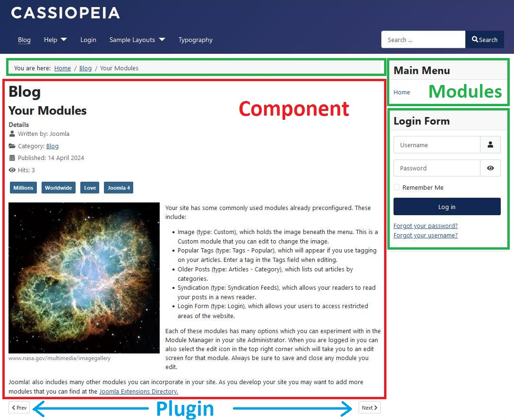
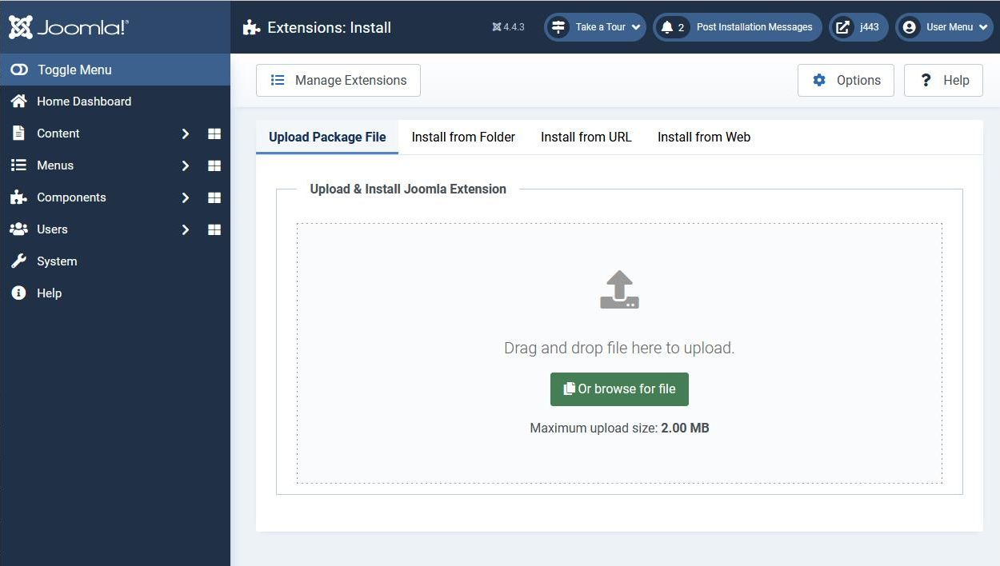

Build Extensions
================
Joomla is a rich featured content management system, but if you're building a website with Joomla and you need extra features which aren't available by default, then you can easily extend it with extensions. There are five common types of extensions for Joomla: Components, Modules, Plugins, Templates, and Languages. There are three others: Packages, Files and Libraries. Each of these extensions handle specific functionality (many built-in features of Joomla are implemented using extensions).

# Components
[Components](./components/index.md) provide the central part of a web page on a Joomla site; each site web page displays the output from one component. They can be thought of as mini applications. Most components have two parts: a site part and an administrator part. For example, `com_content` is the component which handles articles; on the site front-end `com_content` displays articles to website visitors and on the back-end `com_content` provides the functionality for administrators to edit articles. 

- Examples: Content (com_content), Banners (com_banners), Contacts (com_contact), News Feeds (com_newsfeeds)
- Management feature: Admin menu → Components → Contacts (for com_contact)

# Modules
[Modules](./modules/index.md) are more lightweight and flexible extensions used within page rendering. These modules are mostly known as the “boxes” that are arranged around a component, for example: the login module or the breadcrumbs module. Modules are assigned per menu item. So you can decide to show or hide the login module depending on which menu item the user is viewing. Sometimes modules are linked to components such as the “Latest News” module which links to the `com_content` and displays links to the newest content items. However, modules do not need to be linked to components, as a matter of fact they don't even need to be linked to anything and can be just static HTML or text.

- Examples: Banners (mod_banners), Menus (mod_menu), Who's Online (mod_whosonline)
- Management feature: Admin menu → Content → Site Modules

If you're just beginning with Joomla extension development then developing a module is the easiest place to start. 

# Plugins
[Plugins](./plugins/index.md) work behind the scenes to modify or enhance the basic Joomla functionality. In the execution of any part of Joomla - be it the core, a module or a component - an event can be triggered. When an event is triggered, plugins which are registered to handle that event execute, and are passed data related to that event. The plugin can then, for example, modify the data and return it to the core Joomla code. For example, a plugin could be used to intercept user-submitted articles and filter out bad words.

- Examples: Content pagenavigation plugin (which generates the Prev and Next links as shown in the screenshot above)
- Management feature: Admin menu → System → Plugins

# Templates
A [template](./templates/index.md) is basically the design of your Joomla-powered website. With a template you define the look and feel of your website, primarily based on CSS. Templates have certain fields in which the component (just one) and modules (as many as you like) will be shown. Building a complete Joomla template from scratch is difficult because you have to understand the variety of HTML output by the Joomla components, and the CSS classes which are used within them. However, it is relatively easy to customize the Atum (administrator) and Cassiopeia (site) templates which are shipped with Joomla, particularly as you can use the Joomla child template functionality to simply specify deviations from the parent template. 

- Management feature: Admin menu → System → Templates

# Languages
Probably the most basic extensions are languages. Languages can be packaged in two ways: either as a core package or as an extension package. In essence, both the core and the extension language package files consist of key/value pairs, which provide the translation of static text strings, assigned within the Joomla source code. These language packs will affect both the front and administrator side of your Joomla instance. Note: these language packs also include an XML meta file which describes the language.

- Management feature: Admin menu → System → Manage / Languages

# Libraries
Libraries are standalone PHP snippets that Joomla uses. Note nearly all of Joomla's core code is available as a library within the libraries/src folder. All composer libraries (such as PHPMailer) are installed as a library "vendor" within libraries/vendor. Many of the most popular 3rd party extensions in Joomla use libraries to reuse common functionality across their components. 

# File
The File extension type is used to install individual files into a directory of the Joomla instance. There are no examples in Joomla Core of this type and it is the least used type, however it can be used for example to place [custom scripts](./custom-script/index.md) into the Joomla cli directory or to place template overrides into a specific directory. 

# Packages
Packages are simply a group of any of the above types of extensions. A common use of a package would be to ship a template that also bundles a system plugin. Or a component that also installs a library it uses. In Joomla many language packs install as a package so that the frontend and backend languages can be installed independently. 

# Extension Installation
There are 4 methods of installing an extension. You can install from the Joomla Extension Directory (Install from Web), upload the zip file of an extension, install from a folder or install from a URL. 

