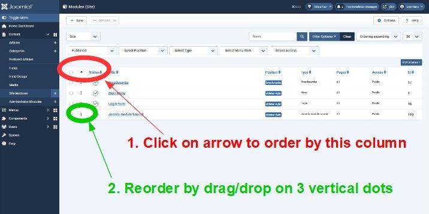

Step 1 Basic Module
===================

The aim of this first step is for you to have a working site module which you can see in your own Joomla instance.

In this first step the module will simply output the HTML

```html
<h4>Hello</h4>
```

## Source Code
In this step you need to create 2 files. Put them both in a folder called `mod_hello`:

```xml title="mod_hello/mod_hello.xml"
<?xml version="1.0" encoding="utf-8"?>
<extension type="module" client="site" method="upgrade">
    <name>Joomla module tutorial</name>
    <version>1.0.1</version>
    <author>me</author>
    <creationDate>today</creationDate>
    <description>Code used in the Joomla module tutorial</description>
    <files>
        <filename module="mod_hello">mod_hello.php</filename>
    </files>
</extension>
```

This file is called a "manifest" file and it tells the Joomla installer key information about the extension which you want to install:

- type="module" - the extension type is a module (rather than a component, plugin, etc)
- client="site" - this module is for the "site", aka the Joomla front-end. It's not for the administrator back-end.
- method="upgrade" - this is more relevant for the next tutorial step and means that the version being installed can be installed in place of an existing version (ie it's providing an upgrade)
- `<name>`, `<author>`, `<creationDate>`, `<description>` are all descriptive elements not validated by Joomla. When the module is installed you'll be able to see them by going to Content / Site Modules and System / Manage / Extensions.
- `<version>` - version of the module - you should update this with subsequent versions.
- `<files>` - tells the installer which files should be considered part of the module code. If you have files in your directory which haven't been explicitly included within the `<files>` section then the Joomla installer will ignore them.
- `<filename module="mod_hello">` - tells Joomla the name of the module (ie "mod_hello") and that this file is the entry point for the module - ie when Joomla wants to run your module, then this is the source file it should run.

The second file is the main PHP file for your module:

```php title="mod_hello/mod_hello.php"
<?php
defined('_JEXEC') or die;

echo "<h4>Hello</h4>";
```

The first PHP line is a security feature. If someone enters a URL which points directly at this PHP source file, then the PHP interpreter will start running the code. 
To avoid a hacker gaining information about the code in a file the first line checks if the constant "_JEXEC" has already been defined, and exits if it's not.
When Joomla runs normally it defines this "_JEXEC" constant, so when Joomla calls your module it will already have been defined. 

## Installing your Module

Next zip up the folder mod_hello containing the two source files to create a file mod_hello.zip.

In your Joomla administrator back-end go to System / Install / Extensions and click on the Upload Package File tab:


Click on "browse for file" and select your mod_hello.zip to get Joomla to install it. You should then see a confirmation message:

"Installation of the module was successful."

together with text in your manifest file's `<description>` element.

Joomla stores your code in the /modules folder. If you open that folder then you should see your mod_hello folder with the 2 source code files.

## Making your Module Visible

To make your module visible you have to do 3 things:
1. Publish your module
2. Define a template position for your module
3. Define which site pages will display your module

To do these, navigate in the administrator back-end to Content / Site Modules. You should see a module with title "Joomla module tutorial" (or whatever you entered as the `<name>` in the manifest file). 
You'll have a cross in the Status column indicating this module has the status of unpublished.

Click on the module title ("Joomla module tutorial") to edit the module information, and then the Module tab. 


In the Position field select "sidebar-right" as your module position.

In the Status field select "Published". 

Click on the Menu Assignment tab and in the Module Assignment field select "On all pages":

 "Set menu assignment")

Click on the Save and Close button. This should return to the list of site modules. 

Now in this list your "Joomla module tutorial" module should show a green tick in the Status column and have an entry "sidebar-right" in the Position column.

If you display a page on your website then you should see your module in the right-hand sidebar:


You may find that there are several modules with Position set to "sidebar-right". You can control the order in which these appear by clicking on the up/down arrow which is a column header, then moving a module using drag/drop:



## Finding Template Positions

In the previous section I suggested that you used "sidebar-right" as your module Position. 
However, you will have noticed that there were lots of possible positions to choose from. 
So how do you know which one to choose?

If you're using the default Joomla site template Cassiopeia then you can view the template positions [here](https://docs.joomla.org/J4.x:Cassiopeia_Template_Customisation#Cassiopeia_Template_Positions).

Also a useful trick is to go to the Administrator System / Global Configuration, select Templates, and set the Preview Module Positions option to Enabled, and then Save your change. 

Then go to your site and add the URL query parameter `?tp=1` to the URL (for example, `http://localhost/joomsite/index.php?tp=1`). The template positions will then be shown. 