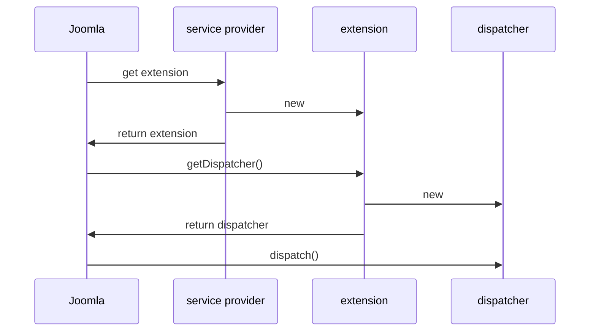

Step 8 Adding a Service Provider
================================

In this step we add a service provider file, and describe the Joomla principles of Extension and Dispatcher classes, and Dependency Injection.

This step is quite long and complicated, but it's worth persevering as these principles are fundamental to Joomla and developing Joomla extensions.

The source code is available at [mod_hello step 8](https://github.com/joomla/manual-examples/tree/main/module-tutorial/step8_service_provider). 

## Extension and Dispatcher Classes

Joomla uses a common method of passing control to extensions which for modules and components is very similar. 
In high-level terms this is how it starts up a module:



The Extension class can be thought of as a "handle" that the core Joomla code uses to get connected to our module. It's the first module class which is instantiated.

The Dispatcher class can be thought of as providing a mechanism for Joomla to run our module code, as it provides the `dispatch` function which Joomla calls to run the module.

You may be wondering why the Extension class doesn't just provide the `dispatch` function itself - well, it could, and that would make it easier for extension developers, but it's separated out to enable a similar set of classes for components, modules and plugins. 

You can find more information on Extension and Dispatcher classes [here](../../../general-concepts/extension-and-dispatcher/index.md).

## Default Extension and Dispatcher Classes

Up till now we haven't specified our own mod_hello Extension and Dispatcher classes, but behind the scenes Joomla has been providing default ones for us.

The default Extension class is \Joomla\CMS\Extension\Module in libraries/src/Extension/Module.php, and for mod_hello it's just used to get the Dispatcher class.

The default Dispatcher class is \Joomla\CMS\Dispatcher\ModuleDispatcher in libraries/src/Dispatcher/ModuleDispatcher.php, and this class inherits from \Joomla\CMS\Dispatcher\AbstractModuleDispatcher in libraries/src/Dispatcher/AbstractModuleDispatcher.php.

There are a few things to note about AbstractModuleDispatcher:

1. It gets passed into its constructor the module `$module`, application `$app` and input `$input` variables. From these it is able to construct the 5 variables described in [step 5](step5-config.md#obtaining-the-parameter-value).

2. It has a function `loadLanguage` which loads the .ini language file for the module.

3. It has a function `getLayoutData` which returns an array of the 5 variables (module, app, input, params and template):

```php
return [
    'module'   => $this->module,
    'app'      => $this->app,
    'input'    => $this->input,
    'params'   => new Registry($this->module->params),
    'template' => $this->app->getTemplate(),
];
```

4. It has a function `dispatch` which performs the following:
    - loads the language via `loadLanguage`
    - calls `getLayoutData` and assigns the array returned to a variable `$displayData`
    - uses PHP `extract` to extract into variables the array elements of `$displayData`
    - executes `require ModuleHelper::getLayoutPath($module->module, $params->get('layout', 'default'));` which runs the tmpl file.

The last 2 operations are performed inside a separate function to create a clean scope.

These operations are common to many modules, and we'll use them in our mod_hello Dispatcher class below.

Returning to our default \Joomla\CMS\Dispatcher\ModuleDispatcher, it uses the `loadLanguage` and `getLayoutData` functions of AbstractModuleDispatcher, but provides its own `dispatch` function which does the following:
- loads the language via `loadLanguage` (from AbstractModuleDispatcher)
- calls `getLayoutData` (from AbstractModuleDispatcher) and assigns the array returned to a variable `$displayData`
- uses PHP `extract` to extract into variables the array elements of `$displayData`
- does an `include` of our mod_hello.php file

Once again, the last 2 operations are performed inside a separate function to create a clean scope.

So this is how Joomla ends up running the code of our mod_hello.php file, with the 5 variables available within its scope.

## Dependency Injection

Strategically Joomla has adopted the following pattern for its own extensions:
- the extension's service provider file puts the extension's key classes into a Dependency Injection Container (DIC)
- Joomla then pulls out of the DIC the main Extension class
- via the Extension class the extension gets access to its other key classes

This approach makes it easy to mock these classes for unit testing - you just have to supply a test service provider file which points to the mocked classes.

It also provides a flexibility point for customising Joomla on your own site: Joomla triggers an event after the entries have been loaded into the DIC, but before they have been taken out. 
So you can capture that event in a plugin, replace the extension's DIC entries with your own, and in this way modify the Joomla extension's functionality.

Joomla's Dependency Injection approach is described in more detail [here](../../../general-concepts/dependency-injection/index.md) (where you can find a link to an associated video).

For mod_hello there are 3 classes which we will get via the DIC:
1. The Extension class - this will just be the default Joomla extension class for modules: \Joomla\CMS\Extension\Module
2. The Dispatcher class
3. The Helper class

Also the Joomla pattern decrees that we don't put the Dispatcher and Helper classes directly into the DIC, but rather that we use DispatcherFactory and HelperFactory classes instead, and these 2 Factory classes are injected into the Extension class's constructor and stored as local instance variables. 
We can then obtain new instances of the Dispatcher and Helper classes inside the Extension class by using something like:

```php
public function getDispatcher(...) {
    $dispatcher = $this->dispatcherFactory->createDispatcher(...);
}
public function getHelper(...) {
    $helper = $this->helperFactory->getHelper(...);
}
```

However, we usually want to obtain the Helper class inside our Dispatcher code (rather than inside or Extension class), because that is where the real work is done to set up the data for displaying in the module.

Joomla doesn't provide us a link from our Dispatcher back to our Extension, but instead does provide a link to the HelperFactory class if we do the following within our Dispatcher:

```php
use Joomla\CMS\Dispatcher\AbstractModuleDispatcher;
use Joomla\CMS\Helper\HelperFactoryAwareInterface;
use Joomla\CMS\Helper\HelperFactoryAwareTrait;

class Dispatcher extends AbstractModuleDispatcher implements HelperFactoryAwareInterface
{
    use HelperFactoryAwareTrait;
    ...
    $helper = $this->getHelperFactory()->getHelper('HelloHelper');
    ...
}
```

This link from the Dispatcher to the HelperFactory is set up in the `getDispatcher` function of \Joomla\CMS\Extension\Module in libraries/src/Extension/Module.php.

## Service Provider

We're now in the position of being able to understand the service provider file. 
This PHP file basically returns an anonymous class instance which implements Joomla\DI\ServiceProviderInterface and has a public function `register(Container $container)`. Joomla calls this `register` function to create the entries in the DIC. 

Inside the `register` function we can create an entry in the DIC for the DispatcherFactory using

```php
$container->set(
    ModuleDispatcherFactoryInterface::class,
    function (Container $container) {
        return new \Joomla\CMS\Dispatcher\ModuleDispatcherFactory('\\My\\Module\\Hello');
    }
);
```

The ModuleDispatcherFactory gets passed in our namespace so that it can form the fully-qualified name of our dispatcher \My\Module\Hello\Site\Dispatcher\Dispatcher, and hence using the [PSR-4 Namespacing rules](../../../general-concepts/namespaces/finding-classes-with-psr4.md) Joomla will find our source code file in modules/mod_hello/src/Dispatcher/Dispatcher.php. 

Similarly for the HelperFactory:

```php
$container->set(
    HelperFactoryInterface::class,
    function (Container $container) {
        return new \Joomla\CMS\Helper\HelperFactory('\\My\\Module\\Hello\\Site\\Helper');
    }
);
```

Finally, for our Extension class:

```php
use Joomla\CMS\Extension\ModuleInterface;

// inside register():
$container->set(
    ModuleInterface::class,
    function (Container $container) {
        return new \Joomla\CMS\Extension\Module(
            $container->get(ModuleDispatcherFactoryInterface::class),
            $container->get(HelperFactoryInterface::class)
        );
    }
);
```

(By the way, `ModuleInterface::class` is just shorthand for a string containing the class fully qualified name).

When Joomla gets the entry for `ModuleInterface::class` then it will cause the associated function to run. 
This will create the Module instance, and pass into the constructor what is returned from obtaining the ModuleDispatcherFactoryInterface::class and HelperFactoryInterface::class entries from the DIC.

These 3 DIC entries are used so often that Joomla provides a shorthand way of entering them into the DIC. We use this in our final service provider file:

```php title="mod_hello/services/provider.php"
<?php

\defined('_JEXEC') or die;

use Joomla\CMS\Extension\Service\Provider\Module as ModuleServiceProvider;
use Joomla\CMS\Extension\Service\Provider\ModuleDispatcherFactory as ModuleDispatcherFactoryServiceProvider;
use Joomla\CMS\Extension\Service\Provider\HelperFactory as HelperFactoryServiceProvider;
use Joomla\DI\Container;
use Joomla\DI\ServiceProviderInterface;

return new class () implements ServiceProviderInterface {

    public function register(Container $container): void
    {
        $container->registerServiceProvider(new ModuleDispatcherFactoryServiceProvider('\\My\\Module\\Hello'));
        $container->registerServiceProvider(new HelperFactoryServiceProvider('\\My\\Module\\Hello\\Site\\Helper'));
        $container->registerServiceProvider(new ModuleServiceProvider());
    }
};
```

Here `registerServiceProvider` just means calling `register` on the service provider class instance which is passed in. 

:::warning
  You'll find the same name ModuleDispatcherFactory used for the service provider class and the Factory class - you need to check the `use` statement to confirm which one is meant. The same is true of other Factory service provider classes. 
:::

## Dispatcher

Our Dispatcher will extend AbstractModuleDispatcher described above, and we'll use the fact that it does most of the work for us. 
We just have to override `getLayoutData` to add in the 'hello' element into the `$data` array, which will become the `$hello` variable when the PHP `extract` is executed.

The AbstractModuleDispatcher `dispatch` function will look after loading the language, calling the `getLayoutData` function, extracting the variables and passing control to the tmpl file.

```php title="mod_hello/src/Dispatcher/Dispatcher.php"
<?php

namespace My\Module\Hello\Site\Dispatcher;

\defined('_JEXEC') or die;

use Joomla\CMS\Dispatcher\AbstractModuleDispatcher;
use Joomla\CMS\Helper\HelperFactoryAwareInterface;
use Joomla\CMS\Helper\HelperFactoryAwareTrait;
use Joomla\CMS\Language\Text;

class Dispatcher extends AbstractModuleDispatcher implements HelperFactoryAwareInterface
{
    use HelperFactoryAwareTrait;

    protected function getLayoutData(): array
    {
        $data = parent::getLayoutData();

        $data['hello'] = Text::_('MOD_HELLO_GREETING') . $this->getHelperFactory()->getHelper('HelloHelper')->getLoggedonUsername('Guest');

        return $data;
    }
}
```

## Helper

As the HelloHelper class is instantiated by the HelperFactory we have to remove the `static` from the `getLoggedonUsername` function:

```php title="mod_hello/src/Helper/HelloHelper.php"
<?php

namespace My\Module\Hello\Site\Helper;

\defined('_JEXEC') or die;

use Joomla\CMS\Factory;

class HelloHelper
{
    // highlight-next-line
    public function getLoggedonUsername(string $default)
    {
        $user = Factory::getApplication()->getIdentity();
        if ($user->id !== 0)  // found a logged-on user
        {
            return $user->username;
        }
        else
        {
            return $default;
        }
    }
}
```

## Manifest File

We have to make the Joomla install process aware of the services/provider.php file and tell it that it's the entry point for our module:

```xml title="mod_hello/mod_hello.xml"
<?xml version="1.0" encoding="utf-8"?>
<extension type="module" client="site" method="upgrade">
    <name>MOD_HELLO_NAME</name>
    <!-- highlight-next-line -->
    <version>1.0.8</version>
    <author>me</author>
    <creationDate>today</creationDate>
    <description>MOD_HELLO_DESCRIPTION</description>
    <namespace path="src">My\Module\Hello</namespace>
    <files>
    <!-- highlight-next-line -->
        <folder module="mod_hello">services</folder>
        <folder>src</folder>
        <folder>tmpl</folder>
    </files>
    <scriptfile>script.php</scriptfile>
    <media destination="mod_hello" folder="media">
        <filename>joomla.asset.json</filename>
        <folder>js</folder>
    </media>
    <languages>
        <language tag="en-GB">language/en-GB/mod_hello.ini</language>
        <language tag="en-GB">language/en-GB/mod_hello.sys.ini</language>
    </languages>
    <config>
        <fields name="params">
            <fieldset name="basic">
                <field
                    name="header"
                    type="list"
                    label="MOD_HELLO_HEADER_LEVEL"
                    >
                    <option value="h3">MOD_HELLO_HEADER_LEVEL_3</option>
                    <option value="h4">MOD_HELLO_HEADER_LEVEL_4</option>
                    <option value="h5">MOD_HELLO_HEADER_LEVEL_5</option>
                    <option value="h6">MOD_HELLO_HEADER_LEVEL_6</option>
                </field>
            </fieldset>
        </fields>
    </config>
</extension>
```

We've also removed the line within `<files>` pointing to mod_hello.php. However, the Joomla installer won't delete this file in the target directory, but you can delete it manually if you wish.

## Simplifying it all

If you've waded through all the complexity above then congratulations on making it this far!

However, modules in general follow a simple pattern:
- get the data you want to display (putting any complex logic into a helper file), and,
- display the data in a section of HTML

If the module you want to develop follows this pattern then you can do the following:
- keep the same services/provider.php file
- keep the same Dispatcher.php file, but customise the getLayoutData to set up the data array to suit your requirements. Remember that the elements of this array get extracted into PHP variables (which are available in the tmpl file)
- put any complex logic into functions within the helper file
- using the data you set up, output the HTML in the tmpl file

If you have more complex requirements then you may need to override more functionality in the Dispatcher.php file, but you can use AbstractModuleDispatcher as a basis.
