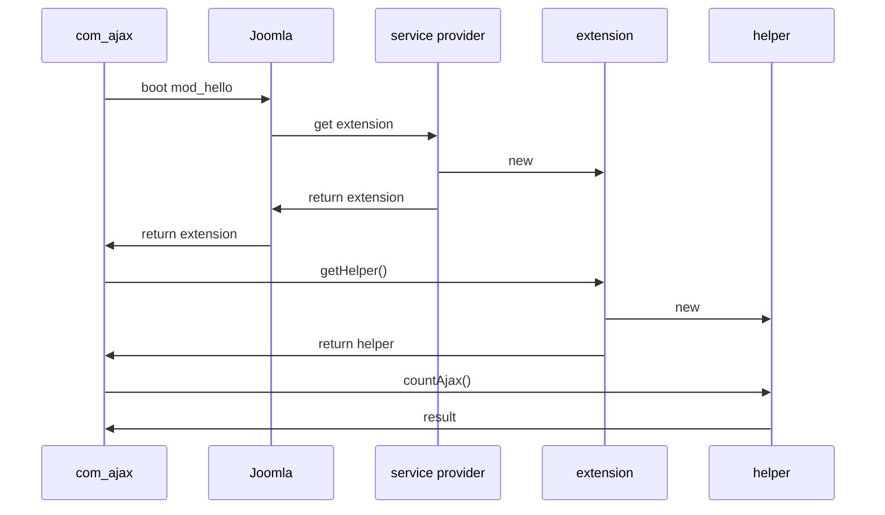

Step 9 Adding Ajax
==================

In this step we add Ajax to mod_hello and also describe
- how you can pass language strings down to javascript code, and,
- how you can display system messages from javascript.

The source code is available at [mod_hello step 9](https://github.com/joomla/manual-examples/tree/main/module-tutorial/step9_ajax). 

## com_ajax

Joomla provides a component `com_ajax` (described [here](https://docs.joomla.org/Using_Joomla_Ajax_Interface)) which allows a module's javascript code to make an Ajax call and get back an Ajax response.

:::caution todo
  Update link above when com_ajax documentation is moved to the manual
:::

In the javascript code we make an Ajax call to `index.php?option=com_ajax&module=hello&method=count&format=json`. 
The URL parameters are interpreted as follows 
- option=com_ajax means that Joomla will route this HTTP request to the com_ajax component. The rest of the URL parameters will be interpreted by com_ajax
- module=hello we want to route to the mod_hello module
- method=count com_ajax will call the countAjax() method of the module's helper class
- format=json we want the response in JSON format

How this works is shown by the sequence diagram



When com_ajax receives the result it uses the Joomla [JsonResponse](https://docs.joomla.org/JSON_Responses_with_JResponseJson) class to return the result to the javascript code. 

:::caution todo
  Update link above when JsonResponse documentation is moved to the manual
:::

## mod_hello changes

To demonstrate the Ajax functionality we'll provide a button on the module which when clicked will trigger an Ajax request to obtain the number of logged-on users.
The Ajax response will be:
- the number of logged-on users if the current user is logged-on
- a "not authorised" error if the current user isn't logged on

Our code changes in mod_hello are:
1. In the tmpl file output a button which the user can click
2. Create the js for making the Ajax call and handling the response
3. Create the `countAjax` function in the helper class

## tmpl file changes

Here's the updated tmpl file:

```php title="mod_hello/tmpl/default.php"
<?php
defined('_JEXEC') or die;

$document = $app->getDocument();
$wa = $document->getWebAssetManager();
$wr = $wa->getRegistry();
$wr->addRegistryFile('media/mod_hello/joomla.asset.json');
$wa->useScript('mod_hello.add-suffix');

// Pass the suffix to add down to js
$document->addScriptOptions('vars', array('suffix' => "!"));

$h = $params->get('header', 'h4');
$greeting = "<{$h} class='mod_hello'>{$hello}</{$h}>"

// highlight-start
Text::script('MOD_HELLO_AJAX_OK');
Text::script('JLIB_JS_AJAX_ERROR_OTHER');
// highlight-end
?>

<?php echo $greeting; ?>
<!-- highlight-start -->
<div>
    <p><?php echo Text::_('MOD_HELLO_NUSERS'); ?><span class="mod_hello_nusers"></span></p>
    <button onclick="count_users();"><?php echo Text::_('MOD_HELLO_UPDATE_NUSERS'); ?></button>
</div>
<!-- highlight-end -->
```

Here we've used the [Text::script](https://api.joomla.org/cms-4/classes/Joomla-CMS-Language-Text.html#method_script) function to pass language strings down to the javascript code.

```php
Text::script('JLIB_JS_AJAX_ERROR_OTHER');
```

will pass the language string 'JLIB_JS_AJAX_ERROR_OTHER' to make it available to the js code. This language string is in the lib_joomla.ini language file, and this is always loaded by Joomla as part of its initialisation.

We can then interpret this language string in javascript using:

```js
Joomla.Text._('MOD_HELLO_AJAX_OK')
```

You can find `Joomla.text` in the core.js library in media/system/js/core.js.

## javascript changes

For convenience we'll just add our Ajax code into add-suffix.js. The additional lines are:

```js title="mod_hello/media/js/add-suffix.js
function count_users() {
    let nusers = event.target.parentElement.querySelector('span');
    Joomla.request({
        url: 'index.php?option=com_ajax&module=hello&method=count&format=json',
        method: 'GET',
        onSuccess(data) {
            const response = JSON.parse(data);
            if (response.success) {
                nusers.innerText = response.data;
                const confirmation = Joomla.Text._('MOD_HELLO_AJAX_OK').replace('%s', response.data);
                Joomla.renderMessages({'info': [confirmation]});
            } else {
                const messages = {"error": [response.message]};
                Joomla.renderMessages(messages);
            }
        },
        onError(xhr) {
            Joomla.renderMessages(Joomla.ajaxErrorsMessages(xhr));
            const response = JSON.parse(xhr.response);
            Joomla.renderMessages({"error": [response.message]}, undefined, true);
        }
    });
}
```

`Joomla.request` is also in core.js and is described [here](../../../general-concepts/javascript/core.md). Of course you can use your own preferred way of initiating Ajax requests.

`Joomla.renderMessages` is in media/system/js/messages.js and is used to display messages in the system message area of the HTML document. 
Check the messages.js code for details of how to use it.

Because our code now depends on these Joomla libraries we need to update the joomla.asset.json to define these as dependencies (although in practice core.js always gets downloaded). 
Also we should update our javascript version number as that will ensure that any add-suffix.js code cached by the browser gets flushed. 

```json title="mod_hello/media/joomla.asset.json"
{
  "$schema": "https://developer.joomla.org/schemas/json-schema/web_assets.json",
  "name": "mod_hello",
  "version": "1.0.0",
  "description": "Joomla Module Tutorial",
  "license": "GPL-2.0-or-later",
  "assets": [
    {
      "name": "mod_hello.add-suffix",
      "type": "script",
      "uri": "mod_hello/add-suffix.js",
      "dependencies": [
        // highlight-next-line
        "jquery", "core", "messages"
      ],
        // highlight-next-line
      "version": "1.1.0"
    } 
  ]
}
```

## Helper file changes

When you logon to the administrator back-end Joomla displays a list of the logged-on users. 
With a little investigation you can find that this is output by an administrator module administrator/modules/mod_logged and that it contains a method `getList` in its helper file which returns a list of the logged-on users.

We use this function in our updated helper class:

```php title="mod_hello/src/Helper/HelloHelper.php"
<?php

namespace My\Module\Hello\Site\Helper;

\defined('_JEXEC') or die;

use Joomla\CMS\Factory;
// highlight-start
use Joomla\Registry\Registry;
use Joomla\Database\DatabaseInterface;
use Joomla\Module\Logged\Administrator\Helper\LoggedHelper;
use Joomla\CMS\Language\Text;
// highlight-end

class HelloHelper
{
    public function getLoggedonUsername(string $default)
    {
        $user = Factory::getApplication()->getIdentity();
        if ($user->id !== 0)  // found a logged-on user
        {
            return $user->username;
        }
        else
        {
            return $default;
        }
    }

// highlight-start
    public function countAjax() {

        $user = Factory::getApplication()->getIdentity();
        if ($user->id == 0)  // not logged on
        {
            throw new \Exception(Text::_('JERROR_ALERTNOAUTHOR'));
        }
        else
        {
            $params = new Registry(array('count' => 0));
            $app = Factory::getApplication();
            $db = Factory::getContainer()->get(DatabaseInterface::class);
            $users = LoggedHelper::getList($params, $app, $db);
            return (string)count($users);
        }
    }
// highlight-end
}
```

The Registry is a utility class which you can find described [here](https://github.com/joomla-framework/registry).

:::caution todo
  Update link above when Registry documentation is moved to the manual
:::

Note how namespacing makes it very easy to reuse code from elsewhere within Joomla! 
However, the risk is that the mod_logged module gets updated in a version of Joomla in a way that makes this call fail. 
This is actually quite likely, as when this module is updated to use dependency injection then the function will change from being a static method to an instance method.

If you incorporate Joomla code like this into your extension then you have to check each Joomla version upgrade carefully!

## New Language Strings

```php title="mod_hello/language/en-GB/mod_hello.ini"
; language strings used inside mod_hello 
MOD_HELLO_NAME="Joomla Module Tutorial"
MOD_HELLO_DESCRIPTION="Source code for the Joomla module tutorial"
MOD_HELLO_GREETING="Hello "
MOD_HELLO_HEADER_LEVEL="Header level of greeting"
MOD_HELLO_HEADER_LEVEL_3="Header level 3"
MOD_HELLO_HEADER_LEVEL_4="Header level 4"
MOD_HELLO_HEADER_LEVEL_5="Header level 5"
MOD_HELLO_HEADER_LEVEL_6="Header level 6"
// highlight-start
MOD_HELLO_NUSERS="Number of logged-on users: "
MOD_HELLO_UPDATE_NUSERS="Update"
MOD_HELLO_AJAX_OK="Ajax response: %s received ok"
// highlight-end
```

## Manifest File changes

```xml title="mod_hello/mod_hello.xml"
<?xml version="1.0" encoding="utf-8"?>
<extension type="module" client="site" method="upgrade">
    <name>MOD_HELLO_NAME</name>
    <!-- highlight-next-line -->
    <version>1.0.9</version>
    <author>me</author>
    <creationDate>today</creationDate>
    <description>MOD_HELLO_DESCRIPTION</description>
    <namespace path="src">My\Module\Hello</namespace>
    <files>
        <folder module="mod_hello">services</folder>
        <folder>src</folder>
        <folder>tmpl</folder>
    </files>
    <scriptfile>script.php</scriptfile>
    <media destination="mod_hello" folder="media">
        <filename>joomla.asset.json</filename>
        <folder>js</folder>
    </media>
    <languages>
        <language tag="en-GB">language/en-GB/mod_hello.ini</language>
        <language tag="en-GB">language/en-GB/mod_hello.sys.ini</language>
    </languages>
    <config>
        <fields name="params">
            <fieldset name="basic">
                <field
                    name="header"
                    type="list"
                    label="MOD_HELLO_HEADER_LEVEL"
                    >
                    <option value="h3">MOD_HELLO_HEADER_LEVEL_3</option>
                    <option value="h4">MOD_HELLO_HEADER_LEVEL_4</option>
                    <option value="h5">MOD_HELLO_HEADER_LEVEL_5</option>
                    <option value="h6">MOD_HELLO_HEADER_LEVEL_6</option>
                </field>
            </fieldset>
        </fields>
    </config>
</extension>
```