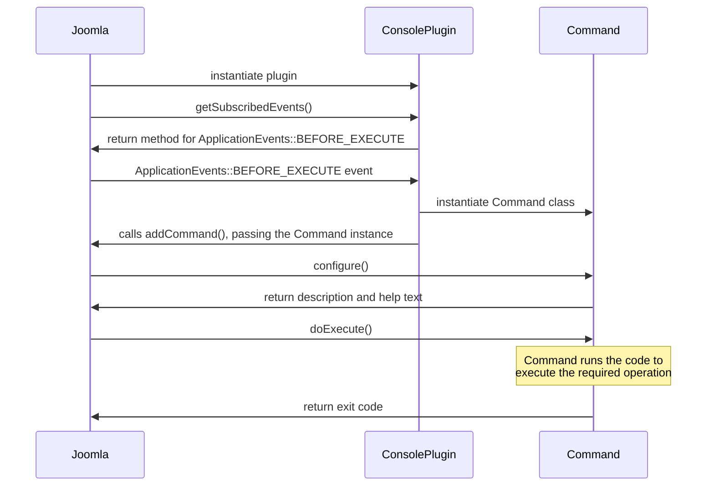

# Introduction
Console applications were introduced in Joomla 4, and are now the Joomla strategic way of writing command line applications. You may also hear these called CLI applications. They are PHP applications which utilise the Joomla framework and are run from the command line where your Joomla instance is hosted, so you can run these applications:
- from a terminal session on the server
- from a cron job on the server
- from a remote terminal session - eg using [PuTTY](https://en.wikipedia.org/wiki/PuTTY).

Joomla ships with a number of these applications already present, so on a terminal session you can navigate to your Joomla instance and execute, for example:

```
php cli/joomla.php user:list
```

and this will list the users on the Joomla instance. (You may need to set your `php` variable to point to the appropriate `php.exe` file.)

You can display the set of console applications available by

```
php cli/joomla.php
```

You can write your own console application, and this will extend the set of applications available. To do this you write a console plugin, and this section describes how to write a "hello world" application, so that you can do:

```
php cli/joomla.php hello:world
```

and the application will output "Hello World".

You may find it useful to watch this video [Adding commands to the CLI Update](https://www.youtube.com/watch?v=gcJJtTcPiTg) but be aware that this video (for Joomla core developers) describes creating commands by changing a library file, whereas you must use a plugin instead. 

# What you have to do
You need to write 2 classes:
- one class (ConsolePlugin below) handles the aspects associated with the Joomla plugin mechanism
- one class (Command below) contains the code for the command

The way that these 2 command interact with Joomla code is shown in this sequence diagram:



In this example the 2 classes are:
- HelloworldConsolePlugin - which handles the plugin aspects, and, 
- RunHelloCommand which writes out "Hello World", and contains information about the command..

## Console plugin code
Following the sequence diagram above, the code for HelloworldConsolePlugin is:

```php
public static function getSubscribedEvents(): array
{
    return [
        \Joomla\Application\ApplicationEvents::BEFORE_EXECUTE => 'registerCommands',
    ];
}

public function registerCommands(): void
{
    $app = Factory::getApplication();
    $app->addCommand(new RunHelloCommand());
}
```

## The Command configure() call

```php
protected function configure(): void
{
    $this->setDescription('This command prints hello world');
    $this->setHelp(
        <<<EOF
The <info>%command.name%</info> command prints hello world. To use enter:
<info>php %command.full_name%</info>
EOF
    );
}
```

The purpose of the `configure()` call on `RunHelloCommand` is to obtain information about the command which Joomla can then display on the terminal. Within this method you should call the following:
- `setDescription` - to define a short description of what the command does. This is shown when a user lists the commands available using

```
php cli/joomla.php
```

- `setHelp` - to define help text for the command. This is shown when a user enters

```
php cli/joomla.php hello:world -h
```

As you can see, you can embed the `%command.name%` and `%command.full_name%` variables into this text.

Also, the name of the command is taken from the variable which you need to set:

```php
protected static $defaultName = 'hello:world';
```

This also is displayed whenever the user enters

```
php cli/joomla.php
```

## The Command doExecute() call
Finally, `doExecute()` is called on `RunHelloCommand` to execute the command, and the code writes out "Hello World"

```php
protected function doExecute(InputInterface $input, OutputInterface $output): int
{
    $symfonyStyle = new SymfonyStyle($input, $output);
    $symfonyStyle->text('Hello World');
    return 0;
}
```

To handling the I/O Joomla has incorporated the [Symfony Style](https://symfony.com/doc/current/console/style.html) package, which provides several methods which you can call easily to provide input and output functionality on a terminal session.

The function returns an exit code, which on successful completion should be the int zero. This code is what the Joomla php application will exit with, so you can capture this if you're running the command within a batch process.

# Plugin Code
This section contains the full source code for the console plugin. You can write the plugin manually by copying the code below, or you can download the zip file from [Download Console Plugin Helloworld](./_assets/plg_helloworld_cli.zip). If you're writing it manually then include the following files in a folder eg `plg_helloworld_cli`.

As described [here](basic-content-plugin.md), there are a number of things you need to ensure are consistent across your source code files when you're developing plugins. That example also includes how to use language files to make your plugin language-independent. For simplicity this helloworld example supports only English. 

## Manifest file

```xml title="plg_helloworld_cli/helloworld.xml"
<?xml version="1.0" encoding="utf-8"?>
<extension type="plugin" group="console" method="upgrade">
	<name>Helloworld Console Application</name>
	<version>1.0.0</version>
	<creationDate>today</creationDate>
	<author>Me</author>
	<description>A basic Hello World console application</description>
	<namespace path="src">My\Plugin\Console\Helloworld</namespace>
	<files>
		<folder plugin="helloworld">services</folder>
		<folder>src</folder>
	</files>
</extension>
```

## Service provider file
The `services/provider.php` file is fairly standard boilerplate code; you just need to code correctly the 3 lines which relate to your plugin.

```php title="plg_helloworld_cli/services/provider.php"
<?php
defined('_JEXEC') or die;

use Joomla\CMS\Extension\PluginInterface;
use Joomla\CMS\Plugin\PluginHelper;
use Joomla\DI\Container;
use Joomla\DI\ServiceProviderInterface;
use Joomla\Event\DispatcherInterface;
use My\Plugin\Console\Helloworld\Extension\HelloworldConsolePlugin;

return new class implements ServiceProviderInterface
{
    /**
     * Registers the service provider with a DI container.
     *
     * @param   Container  $container  The DI container.
     *
     * @return  void
     *
     * @since   4.2.0
     */
    public function register(Container $container)
    {
        $container->set(
            PluginInterface::class,
            function (Container $container) {
                $dispatcher = $container->get(DispatcherInterface::class);
                $plugin     = new HelloworldConsolePlugin(
                    $dispatcher,
                    (array) PluginHelper::getPlugin('console', 'helloworld')
                );

                return $plugin;
            }
        );
    }
};
```

## Console Plugin file
The file below handles the interaction with the Joomla plugin framework:

```php title="plg_helloworld_cli/src/Extension/HelloworldConsolePlugin.php"
<?php
namespace My\Plugin\Console\Helloworld\Extension;

\defined('_JEXEC') or die;

use Joomla\CMS\Plugin\CMSPlugin;
use Joomla\Event\SubscriberInterface;
use Joomla\Application\ApplicationEvents;
use Joomla\CMS\Factory;
use My\Plugin\Console\Helloworld\CliCommand\RunHelloCommand;

class HelloworldConsolePlugin extends CMSPlugin implements SubscriberInterface
{   
    public static function getSubscribedEvents(): array
    {
        return [
            \Joomla\Application\ApplicationEvents::BEFORE_EXECUTE => 'registerCommands',
        ];
    }

    public function registerCommands(): void
    {
        $app = Factory::getApplication();
        $app->addCommand(new RunHelloCommand());
    }
}
```

## Command file
The file below handles the execution of the hello:world command.

```php title="plg_helloworld_cli/src/CliCommand/RunHelloworldCommand.php"
<?php
namespace My\Plugin\Console\Helloworld\CliCommand;

defined('_JEXEC') or die;

use Symfony\Component\Console\Input\InputInterface;
use Symfony\Component\Console\Output\OutputInterface;
use Symfony\Component\Console\Style\SymfonyStyle;
use Joomla\Console\Command\AbstractCommand;

class RunHelloCommand extends AbstractCommand
{
	/**
	 * The default command name
	 *
	 * @var    string
	 * @since  4.0.0
	 */
	protected static $defaultName = 'hello:world';

	/**
	 * Configure the command.
	 *
	 * @return  void
	 *
	 * @since   4.0.0
	 */
	protected function configure(): void
	{
		$this->setDescription('This command prints hello world');
		$this->setHelp(
			<<<EOF
The <info>%command.name%</info> command prints hello world. To use enter:
<info>php %command.full_name%</info>
EOF
		);
	}

	/**
	 * Function to execute the command.
	 *
	 * @param   InputInterface   $input   The input to inject into the command.
	 * @param   OutputInterface  $output  The output to inject into the command.
	 *
	 * @return  integer  The command exit code
	 *
	 * @since   4.0.0
	 */
	protected function doExecute(InputInterface $input, OutputInterface $output): int
	{
		$symfonyStyle = new SymfonyStyle($input, $output);

		$symfonyStyle->text("Hello World");

		return 0;
	}
}
```

## Installation
Generate a zip file from the folder and install the plugin in the usual way. Remember to enable the plugin!

Then in a terminal session navigate to the top level of your Joomla instance and enter:

```
php cli/joomla.php
```

(You may need to set your `php` variable to point to the appropriate `php.exe` file.) This will show in alphabetical order the list of commands, which should now include the `hello:world` command.

To run the `hello:world` command you should enter:

```
php cli/joomla.php hello:world
```

This should print out "Hello World" on the terminal. 

To display the help text:

```
php cli/joomla.php hello:world -h
```