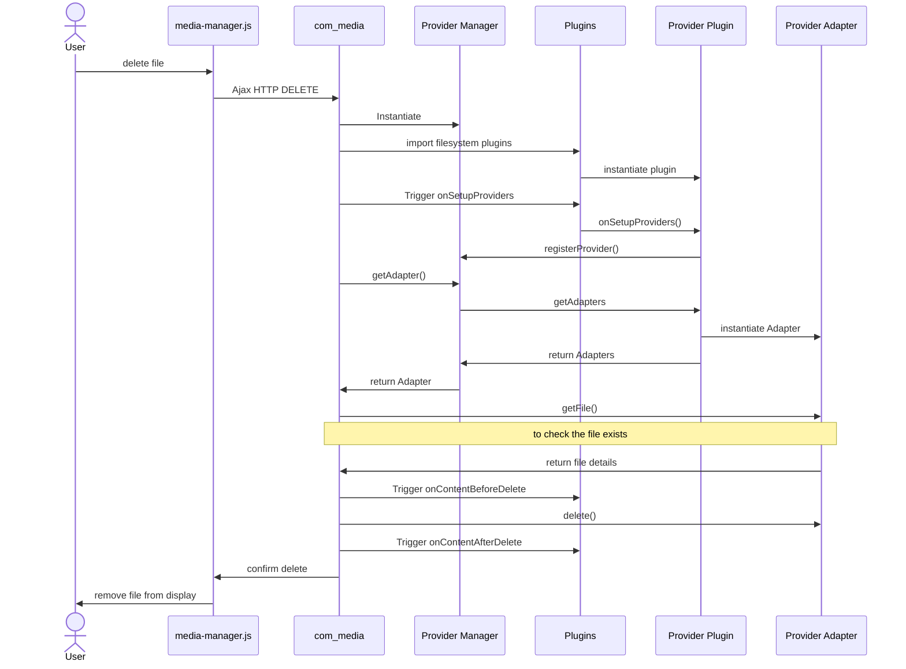

# Introduction
Prior to Joomla version 4, for images and other types of media which you wanted to display on your Joomla site you had to store the files within a subfolder of your Joomla instance, by default /images. 

With the media manager introduced in Joomla 4 the development team abstracted the idea of a "filesystem" to be a "filesystem adapter" - ie a PHP class which offered file-like functionality such as file create, rename, delete, etc. This then opened up the possibility of storing the media files in a location other than the local filesystem, for example, on a server within the "cloud". 

The Joomla design also enables plugins to customise how the media files are stored in the filesystem, for example, by restricting the types of operations that are available to different user groups. 

This section demonstrates how to develop a basic filesystem plugin. It will be similar to the standard Joomla functionality which stores media in the /images folder. Our filesystem plugin will use the /restricted folder instead, and we'll define it so that only Superusers can delete files or subfolders within that /restricted folder. In other respects it will be the same as the standard Joomla filesystem functionality.

In the next section the [FTP Filesystem plugin](filesystem-plugin-ftp.md) will demonstrate how you can store media files on an FTP server. 

# Filesystem Providers and Adapters


The media manager screenshot shows a Joomla instance with 2 filesystem providers:
- a Local provider which provides access via the local filestore - this is what comes shipped with Joomla
- a Restricted provider which provides access to files stored in a restricted directory - this is what is enabled by the basic filesystem plugin described in this section.

In addition, the Local provider has 2 filesystem adapters 
- images - which displays the files stored in the /images folder
- videos - which displays the files stored in the /videos folder.

This has been enabled purely by configuration
- creating a /videos folder under the Joomla instance
- configuring the Joomla "FileSystem - Local" plugin to include a second directory, called videos.

The Restricted provider has just 1 filesystem adapter called "restricted". This reflects the filestore within the /restricted folder, and to make this work you should create this directory under the root directory of your Joomla instance. 

The order of the providers shown is determined by the `ordering` of the filesystem plugins, set via the administrator System / Plugins page.

# How Joomla Media Manager works
To look at how the media manager works we consider what happens when a user clicks on the Content / Media button in the administrator back-end, and describe the steps shown on the diagram. It's simplified a little; the sequence diagram which follows is a more exact representation. 


1. The user clicks on the Content / Media button in the administrator back-end (in the menu sidebar, shown in dark blue)
2. This causes an HTTP GET request to `com_media` on the server.
3. In response to this request `com_media` imports the "filesystem" plugins, and triggers the event `onSetupProviders`.
4. The diagram shows 2 filesystem providers, the Local provider shipped with Joomla, and the Restricted provider of our plugin. Each provider communicates back to `com_media` saying "I'm a filesystem provider, and here are my filesystem adapters". 
5. In the HTTP response `com_media` sends down to the client browser the HTML page which includes the media window container (shown in grey) where all the media files are shown. In the left hand pane of this window the available filesystem providers and their associated adapters are shown. In addition the response tells the browser to download and run the `media-manager.js` code.
6. The `media-manager.js` code sends an Ajax request to the server requesting details of the files for the first provider and adapter in the left hand pane. (Actually, this isn't quite true; the code remembers the session state and the folder which this user was previously viewing, and requests details of the files in that folder if it's set).
7. Because of the stateless nature of HTTP, `com_media` has to repeat step 3, requesting the import of the filesystem plugins and triggering `onSetupProviders`.
8. Similarly, the providers repeat step 4.
9. Based on the adapter and folder set in the Ajax request, `com_media` calls the `getFiles` function of that adapter, passing the folder name. 
10. The adapter `getFiles` function returns details of the files (including subfolders) in that folder.
11. `com_media` relays these files details down to `media-manager.js` in the JSON response of the Ajax request.
12. The `media-manager.js` code updates the media window with the details of these files and subfolders.

Subsequently, as the user performs operations on the files or folders in the media window, the `media-manager.js` code sends Ajax requests to `com_media` to effect these operations. 

An example is shown in the sequence diagram below, for the user requesting that a file be deleted. The sequence diagram is a little more detailed than the overview above, and depicts the interaction with the `com_media` ProviderManager class. 



# Writing a Filesystem Plugin
To write a Filesystem plugin you need to provide 2 classes:
1. The Provider class, which implements `Joomla\Component\Media\Administrator\Provider\ProviderInterface` in administrator/components/com_media/src/Provider/ProviderInterface.php. This is straightforward, and you just copy the approach of the Local Filesystem plugin in plugins/filesystem/local/src/Extension/Local.php. The main plugin (Extension) class doubles as the Provider class.
2. The Adapter class, which implements `Joomla\Component\Media\Administrator\Adapter\AdapterInterface` in administrator/components/com_media/src/Adapter/AdapterInterface.php. This is where the bulk of the work lies, as you have to implement based on your filestore the various types of file operations.

In this basic example we're going to piggy-back upon the Joomla local filestore, so our Adapter class will inherit from the Joomla LocalAdapter class, and we'll just override the delete function (which gets called to delete files or folders):

```php
public function delete(string $path)
{
    // If the user has superuser privilege then allow this, otherwise raise an exception
    $user = Factory::getApplication()->getIdentity();
    if ($user->authorise('core.admin'))
    {
        parent::delete($path);
    } 
    else 
    {
        throw new \Exception(Text::_('JLIB_APPLICATION_ERROR_DELETE_NOT_PERMITTED'));
    }
}
```

# Plugin Source Code
You can copy the source code below into a directory `plg_filesystem_restricted`, or download the complete plugin from [download restricted filesystem plugin](./_assets/plg_filesystem_restricted.zip).

Once installed, remember to enable the plugin! You also need to create the `/restricted` folder within the root folder of your Joomla instance.

## Manifest file

```php title="plg_filesystem_restricted/restricted.xml"
<?xml version="1.0" encoding="UTF-8"?>
<extension type="plugin" group="filesystem" method="upgrade">
    <name>plg_filesystem_restricted</name>
    <author>me</author>
    <creationDate>today</creationDate>
    <version>1.0.0</version>
    <description>My restricted filesystem</description>
    <namespace path="src">My\Plugin\Filesystem\Restricted</namespace>
    <files>
        <folder plugin="restricted">services</folder>
        <folder>src</folder>
    </files>
</extension>
```

## Service Provider File
This is boilerplate code for instantiating the plugin via the Joomla Dependency Injection Container.

```php title="plg_filesystem_restricted/services/provider.php"
<?php
defined('_JEXEC') or die;

use Joomla\CMS\Extension\PluginInterface;
use Joomla\CMS\Factory;
use Joomla\CMS\Plugin\PluginHelper;
use Joomla\DI\Container;
use Joomla\DI\ServiceProviderInterface;
use Joomla\Event\DispatcherInterface;
use My\Plugin\Filesystem\Restricted\Extension\Restricted;

return new class () implements ServiceProviderInterface {

    public function register(Container $container)
    {
        $container->set(
            PluginInterface::class,
            function (Container $container) {
                $dispatcher = $container->get(DispatcherInterface::class);
                $plugin = new Restricted(
                    $dispatcher,
                    (array) PluginHelper::getPlugin('filesystem', 'restricted')
                );
                $plugin->setApplication(Factory::getApplication());

                return $plugin;
            }
        );
    }
};
```

## Plugin / Provider class
This has been adapted from the equivalent class in the Joomla Local filesystem plugin.

```php title="plg_filesystem_restricted/src/Extension/Restricted.php"
<?php
namespace My\Plugin\Filesystem\Restricted\Extension;

use Joomla\CMS\Plugin\CMSPlugin;
use Joomla\Component\Media\Administrator\Event\MediaProviderEvent;
use Joomla\Component\Media\Administrator\Provider\ProviderInterface;
use My\Plugin\Filesystem\Restricted\Adapter\RestrictedAdapter;

\defined('_JEXEC') or die;

final class Restricted extends CMSPlugin implements ProviderInterface
{
    
    public static function getSubscribedEvents(): array {
        return [
            'onSetupProviders' => 'onSetupProviders',
        ];
    }
    
    /**
     * Setup Providers for Restricted Adapter
     *
     * @param   MediaProviderEvent  $event  Event for ProviderManager
     *
     * @return   void
     *
     * @since    4.0.0
     */
    public function onSetupProviders(MediaProviderEvent $event)
    {
        $event->getProviderManager()->registerProvider($this);
    }

    /**
     * Returns the ID of the provider
     *
     * @return  string
     *
     * @since  4.0.0
     */
    public function getID()
    {
        return $this->_name; // from "element" field of plugin's record in extensions table
    }

    /**
     * Returns the display name of the provider
     *
     * @return string
     *
     * @since  4.0.0
     */
    public function getDisplayName()
    {
        return 'Restricted';
    }

    /**
     * Returns an array of adapters
     *
     * @return  \Joomla\Component\Media\Administrator\Adapter\AdapterInterface[]
     *
     * @since  4.0.0
     */
    public function getAdapters()
    {
        $adapters = [];
        $adapter = new RestrictedAdapter(JPATH_ROOT . '/restricted', 'restricted');
        $adapters[$adapter->getAdapterName()] = $adapter;
        return $adapters;
    }
}
```

## Adapter Class
For our Adapter class we extend the Joomla LocalAdapter and override the `delete` function. 

```php title="plg_filesystem_restricted/src/Adapter/RestrictedAdapter.php"
<?php

namespace My\Plugin\Filesystem\Restricted\Adapter;

use Joomla\CMS\Language\Text;
use Joomla\CMS\Factory;

\defined('_JEXEC') or die;

class RestrictedAdapter extends \Joomla\Plugin\Filesystem\Local\Adapter\LocalAdapter
{
    /**
     * Adapter constructor - based on the Joomla LocalAdapter
     *
     * @param   string    $rootPath    The root path
     * @param   string    $filePath    The file path of media folder
     * @param   boolean   $thumbnails      The thumbnails option
     * @param   array     $thumbnailSize   The thumbnail dimensions in pixels
     *
     * @since   4.0.0
     */
    public function __construct(string $rootPath, string $filePath, bool $thumbnails = false, array $thumbnailSize = [200, 200])
    {
        parent::__construct($rootPath, $filePath);
    }

    /**
     * Deletes the folder or file of the given path.
     *
     * @param   string  $path  The path to the file or folder
     *
     * @return  void
     *
     * @since   4.0.0
     * @throws  \Exception
     */
    public function delete(string $path)
    {
        // If the user has superuser privilege then allow this, otherwise raise an exception
        $user = Factory::getApplication()->getIdentity();
        if ($user->authorise('core.admin'))
        {
            parent::delete($path);
        } 
        else 
        {
            throw new \Exception(Text::_('JLIB_APPLICATION_ERROR_DELETE_NOT_PERMITTED'));
        }
    }

    /**
     * Returns the name of this adapter.
     *
     * @return  string
     *
     * @since   4.0.0
     */
    public function getAdapterName(): string
    {
        return "Restricted"; 
    }
}
```