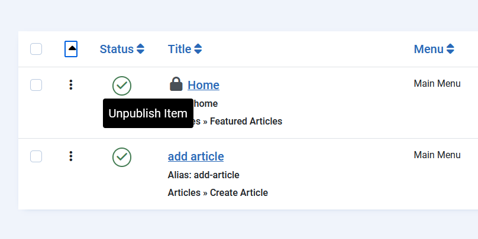

Tooltip
=======
import Tabs from '@theme/Tabs';
import TabItem from '@theme/TabItem';

## Overview

Tooltips are useful elements. They allow presenting information with an icon or a short text and adding additional information if a user activates an element.

Some general rules:

If several tooltips are on a page, every tootip must be related to a interactive element.

Colour contrast of the Tooltip must be >= 4.5 

The tooltip must be dismissible, cannot disappear automatically.

The text or image on a tooltip must follow the rules for accessible information, understandable, with alt-text if needed.


## Code Snippet 

```PHPx title="Example Tooltip from com_menus, view menus "
<span class=".." aria-describedby="tip-unpublish<?php echo $i; ?>">
    <?php echo $item->count_published; ?>
</span>
<div role="tooltip" id="tip-unpublish<?php echo $i; ?>">
   <?php echo Text::_('COM_MENUS_COUNT_UNPUBLISHED_ITEMS'); ?>
</div>
```

```PHPx title="Example Tooltip frontend -  edit icon for an article"
<a href=".." aria-describedby="editarticle-<?php echo $id; ?>">
    <span class="icon-edit" aria-hidden="true"></span>Edit
    <div role="tooltip" id="editarticle-<?php echo $id; ?>">Published Article</div>
</a>       
```

### Common Mistakes
- Missing ID or ARIA Label 
- ID not unique.

### Example in Joomla

A tooltip on an element in a table:
administrator/components/com_menus/tmpl/menu/default.php



A tooltip in the frontend which is visible for editable content (if you have permission for editing)
components/com_content/tmpl/article/form.php


## Who is affected?
Everyone


## Relevant WCAG Success Criteria

1.4.13 Content on Hover or Focus https://www.w3.org/WAI/WCAG21/Understanding/content-on-hover-or-focus.html

2.1.1 Keyboard: All content must be accessible via a keyboard.


## Relevant ATAG Guidelines (optional)

