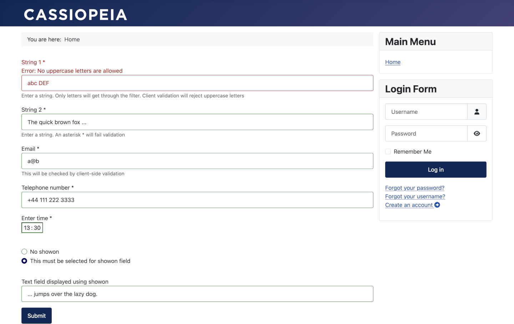

Example Form Component
======================

This example MVC component demonstrates the following aspects of form manipulation:

- using [Joomla Forms](../../../general-concepts/forms/how-forms-work.md) to capture data in a form
- using several of the [standard form fields](../../../general-concepts/forms-fields/standard-fields/index.md)
- writing a [custom field](../../../general-concepts/forms-fields/custom-fields-overview.md)
- writing a [custom server-side validation rule](../../../general-concepts/forms/server-side-validation.md)
- writing a [custom client-side validation rule](../../../general-concepts/forms/client-side-validation.md)
- writing a [custom form filter](../../../general-concepts/forms-fields/standard-form-field-attributes.md#filter)

An installable ZIP file can be obtained via [DownGit](https://downgit.github.io/#/home?url=https://github.com/joomla/manual-examples/tree/main/component-exampleform/com_exampleform). After installation go to `<your domain>/index.php?option=com_exampleform` to run it in your Joomla instance.

The following screenshot shows the example form with some data added:



Brief summaries of the main source files are provided below. There are additional explanatory comments throughout the code.

## Administrator service provider

Path: administrator/components/com_exampleform/services/provider.php

This is boilerplate code for a basic MVC component. For components this file is placed under /administrator in the Joomla filesystem.
If you want to understand it fully then read the [Dependency Injection](../../../general-concepts/dependency-injection/index.md) section. 

From this file Joomla instantiates default [Extension and Dispatcher classes](../../../general-concepts/extension-and-dispatcher/index.md), and an MVC Factory class which creates Model, View and Controller classes for our component. 

## Site Display Controller

Path: components/com_exampleform/src/Controller/DisplayController.php

This is what is run when you go to your site page which displays the form (ie navigate to the URL `.../index.php?option=com_exampleform`).

It gets the associated Model and View classes, and calls display() on the View instance.

## Site Exampleform View

Path: components/com_exampleform/src/View/Exampleform/HtmlView.php

This calls the model to set up the form, then calls display() to run the tmpl file.

## Site Exampleform Model

Path: components/com_exampleform/src/Model/ExampleformModel.php

This sets up the form as described in [Forms](../../../general-concepts/forms/index.md).

## Site Exampleform tmpl file

Path: components/com_exampleform/tmpl/exampleform/default.php

This uses the [Web Asset Manager](../../../general-concepts/web-asset-manager.md) to set up the scripts for client-side validation.

Then it outputs the `<form>` html, and outputs the fields using [renderFieldset](../../../general-concepts/forms/manipulating-forms.md#fieldsets).

The Submit button has an onclick listener which calls `Joomla.submitbutton('exampleform.submit')`. 
This function will initiate an HTTP POST to the server, with the field values as POST parameters, including the *task* parameter set to 'exampleform.submit'.

When the HTTP request reaches the server Joomla will examine the *task* parameter, and as a result will call the ExampleformController::submit() method, as described in [Joomla MVC](../mvc/mvc-overview.md).

## Example XML Form

Path: components/com_exampleform/forms/example_form.xml

Most of this involves simply using the [Joomla Standard Form Fields](../../../general-concepts/forms-fields/standard-fields/index.md).

You can easily add in other standard form fields to experiment with them.

In addition, the file includes:

Definition of a [custom field](../../../general-concepts/forms-fields/custom-fields-overview.md):
```xml
addfieldprefix="My\Component\Exampleform\Site\Field"
name="time" 
type="mytime"
```

Definition of a [custom filter](../../../general-concepts/forms-fields/standard-form-field-attributes.md#filter):
```xml
addfilterprefix="My\Component\Exampleform\Site\Filter"
filter="lettersonly"
```

Definition of a [custom client-side validation rule](../../../general-concepts/forms/client-side-validation.md):
```xml
class="inputbox validate-noUppercase"
data-validation-text="Error: No uppercase letters are allowed"
```

Definition of a [custom server-side validation rule](../../../general-concepts/forms/server-side-validation.md):
```xml
addruleprefix="My\Component\Exampleform\Site\Rule"
validate="noasterisk"
```

Use of the [showon attribute](../../../general-concepts/forms-fields/standard-form-field-attributes.md#showon). 

## Site Exampleform Controller

Path: components/com_exampleform/src/Controller/ExampleformController.php

When the form data is sent to the server in an HTTP POST request, Joomla examines the *task* parameter, and as this will be set to 'exampleform.submit' Joomla will call the `submit` function of the ExampleformController class instance.

This function obtains the array of POST parameters and gets the model to set up the form again from the definition in example_form.xml.

It then initiates applying the filtering and validation rules of the fields.

If the data fails validation then the data entries are stored in the session, and a redirect back to the form is issued. 
When the HTTP GET request to redisplay the form is received then the `loadFormData` function in the ExampleformModel will retrieve the session data and prefill the fields with the previous entries.

If the data passes validation then the ExampleformReturn view is instantiated, and the raw data and filtered data passed to it. 

## Site ExampleformReturn View

Path: components/com_exampleform/src/View/ExampleformReturn/HtmlView.php

This simply has a function to accept the data from the Controller, which it stores locally.

## Site exampleformreturn tmpl file

Path: components/com_exampleform/tmpl/exampleformreturn/default.php

This simply outputs the raw and filtered data which was passed to the view.

Remember that the view and the tmpl file share the same function context, so variables set up in the view are accessible in the tmpl file. 

## Custom Field

Path: components/com_exampleform/src/Field/MytimeField.php

This is the source code for the `mytime` custom field.

## Custom Filter

Path: components/com_exampleform/src/Filter/LettersonlyFilter.php

This is the source code for the `lettersonly` custom filter. 

## Custom Validation Rule

Path: components/com_exampleform/src/Rule/Noasterisk.php

This is the source code for the `noasterisk` custom server-side validation rule.

## Media joomla.asset.json file

Path: media/com_exampleform/joomla.asset.json

This defines the component's javascript (and CSS) assets, together with their dependancies, as required by the [Web Asset Manager](../../../general-concepts/web-asset-manager.md).

For components this file is always automatically processed by Joomla.

## Javascript client-side validation code

Path: media/com_exampleform/js/no-uppercase.js

This is javascript code for the custom client-side validation rule. 