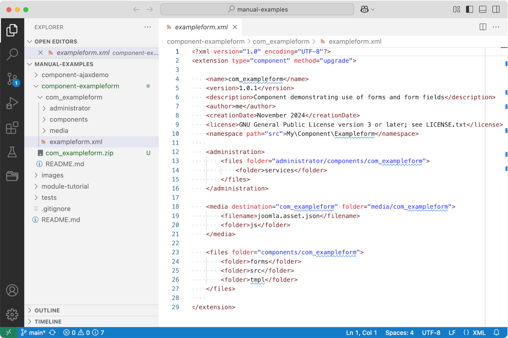

Component Examples
==================

This section contains worked examples of components of various types. To obtain the examples source code to inspect or install you may clone the manual-examples repository or download an installable zip file for an individual example.

## To clone the repository

Navigate to a location on your development computer where you can keep multiple repositories. You might have a folder named `repos` or `git` or something else. In a terminal window use the following command:

```sh
git clone https://github.com/joomla/manual-examples.git
```

This takes no time at all and will give you a clone of the manual-examples repository that is very easy to inspect in an IDE. Here is an example screenshot of a clone open in VSCode:



To create an installable zip file, compress the subfolder containing the example code, such as the com_exampleform folder.

## To download an installable zip

1. Go to the [manual-examples repository](https://github.com/joomla/manual-examples) on GitHub.
2. Select the example you wish to download, for example component-exampleform.
3. Select the subfolder containing the example, com_exampleform.
4. Copy the URL from the browser URL bar.
5. Go to a download utility site such as [DownGit](https://downgit.github.io/#/home).
6. Paste the URL copied in step 4 into the form.
7. Select the Download button.
8. Save the downloaded zip file. This can be installed in a Joomla instance or expanded to inspect with an IDE.
