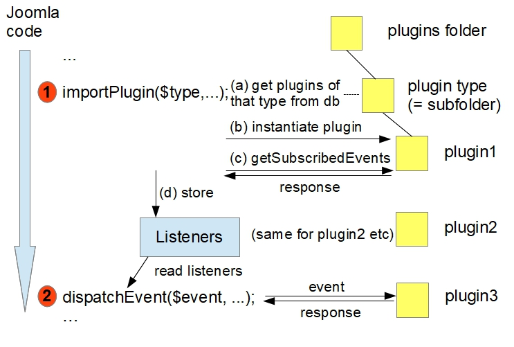
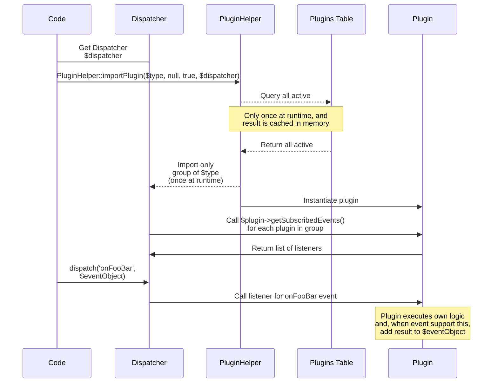

The diagram shows how Joomla plugins work.

The arrow on the left represents the flow of control through Joomla code. Every so often a significant point is reached where it's considered appropriate to get plugins involved. For example:
- after Joomla has performed the initilisation routines
- whenever an article has been retrieved
- whenever a form has been constructed from an XML form definition
- before an item is saved to the database

The idea is that the relevant data is passed to the plugin code, and it can then modify data items to change the resulting user experience. For example, an article's text might be changed, or a form might be extended to capture additional data. 

Sometimes the plugin returns an item of data; this might be used by the code triggering the event to control the subsequent code execution, or might be added to the HTML output, for example. 

The process of involving the plugins comprises 2 steps:
1. Import all plugins of a given type
2. Trigger an event

Importing a plugin type is implemented by the code:
```php
PluginHelper::importPlugin($pluginType, …);
```
Plugins are categorised into types, and these types match the subdirectories within the plugins folder of a Joomla instance.

For example, after Joomla is initialised the system plugins are imported (ie those in the plugins/system directory).

Importing a plugin type involves:
- finding from the database all the plugins associated with a particular type - the type matches the associated subfolder of the `/plugins` folder in the file system. In the diagram these plugins are shown as `plugin1`, `plugin2` and `plugin3`, 
- instantiating each of these plugins,
- determining which events each plugin wants to subscribe to. 
- writing the subscriptions to a data store represented by the `Listeners` box in the diagram.

Splitting the plugins by plugin type in this way makes Joomla more performant - it doesn't need to process plugins which aren't going to be interested in the event which will be triggered next.

The second step is triggering an event via a call to the event dispatcher. Joomla looks through its store of `Listeners` to determine which plugins have subscribed to that event type. It then calls the associated method of the subscribing plugin, and passes the event data to it, often allowing that data to be modified by the plugin code. 

Each plugin which has subscribed to that event is called in turn (based on a priority scheme), and any results returned by the plugins are collated into an array associated with the event. 

As an example, after Joomla is initialised system plugins are imported and the event `onAfterInitialise` is triggered. The "Remember Me" plugin (in plugins/system/remember) receives notification of this, and can log in a user who has previously checked the "Remember Me" checkbox on the login form. 

Once a plugin has been imported and its subscriptions logged in the `Listeners` data store, then it continues to receive notifications for all the events it has subscribed to. For example, consider the following scenario:
- system plugins are imported, and the `onAfterInitialise` event is triggered
- some time later content plugins are imported, and the `onContentPrepare` event is triggered.

The system plugins imported in the first step can subscribe to the `onContentPrepare` event ok, even though it's associated with content plugins, and will receive the `onContentPrepare` event if they have subscribed to it, without having to be imported again.

You should also be aware that unlike components and modules, there aren't different site plugins and administrator plugins. The plugins which you install are run for all the different contexts - site, administrator and API applications - so it's a good idea to in your plugins to check the application context.

For those who wish a more detailed picture of how plugins work, see the sequence diagram below.

