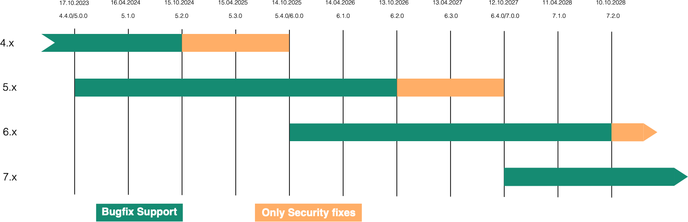

Software Release Cycle
======================

The following description of the software release cycle is for our main product, the CMS. Joomla switched with version 4.0 to a timely based release cycle. This means that every two years a major version of the CMS will be released. The release date is planned for October in a year with an odd year number (e.g. 2025, 2027, 2029 …). Within the two years we release every 6 months a minor release. Patch releases are usually released every 6 weeks.

## Phases of the life cycle

The software release life cycle is composed of distinct phases and milestones that express the software's maturity as it advances from planning to development to release and support. Not every release will go through every possible phase. For example, patch releases will generally omit the alpha and beta milestones.

### Planning phase

The planning phase consists mostly of discussion with little or no actual software likely to be available. An idea for a new feature may take its first tentative steps towards implementation with a RFC discussion on [github](https://github.com/joomla/joomla-cms/discussions/categories/rfc) or the publication of a [Request for Comments (RFC) document.](https://github.com/joomla/rfc) An RFC is a discussion of an idea and its potential implementation with an invitation for the wider community to get involved in further discussion, feedback and refinement of the idea.

During the planning phase some code snippets or proof-of-concept implementations may be produced to demonstrate feasibility or to elicit further feedback and assessment of the idea.

Releases made during this phase are sometimes referred to as “pre-alpha” releases.

### Development and testing phase

During this phase software is being actively written, tested and documented according to the plan. This is coordinated by the CMS Maintainer Team and the Release Managers for the series of the software. Particularly for the larger features the Production Department will make a vote, if a feature will be part of the next version. It is highly recommended to publish ideas as early as possible and get approval for the idea.

During this phase releases will be made that are labelled “alpha”, “beta” and “release candidate”.

### Release phase

Software enters the release phase when the first "general availability" release becomes available. In this phase the code is considered to be of production quality and suitable for use by general users.

Releases during this phase are subject to the version numbering scheme which mandates semantic versioning as explained in the Version numbering part of this document.

### Support phase

After the release of a x.0.0 version we are going into the support phase of the series. In this phase we are fixing bugs, creating patch releases. A patch release is only for fixing bugs, new features can be added to minor releases as long as this doesn’t include a backwards compatibility break.

We plan 4 minor releases. The last minor release is a bridge release and doesn’t contain new features and is meant as a preparation for the next major release. An update to the next major release can only be made from the bridge release, usually a x.y.4 release. After the x.4.0 release date, we are fixing bugs for one year and making security fixes for two years.

A software release is no longer supported when the next minor release is released. For example the x.2.z release goes out of support when the x.3.0 release is published.

## Software milestones

There are four milestones in the Software Release Cycle: alpha, beta, release candidate, and general availability.

### Alpha

The alpha milestone signifies that there is new technology in the software that is ready for testing, but that the software is not feature complete. Alpha software may also be used to demonstrate a possible combination of features to see if they work together successfully. Some features may be removed later.

The target audience for an alpha release is the development community including third-party developers who may be affected by core changes or new features.

Alpha software is not suitable for production environments.

### Beta

The beta milestone is considered feature complete, but is still not considered suitable for production environments. The software is intended to be tested thoroughly for regressions, security and stability problems.

Third-party extension developers should be testing their products against all beta releases and reporting any issues on the Issue Tracker. Waiting for a release candidate is too late.

### Release Candidate (RC)

The purpose of a release candidate is to test the final packaging and release process to ensure that everything is ready for the software to move into the release phase with the first general availability release.

All language tags have to be added before the release candidate is published (Language Freeze).

It is important that third-party extension developers carry out final tests on all release candidates and report any bugs immediately. However, only significant “show stopper” bugs involving core software or the included extensions will be fixed in the release candidates. Issues that only affect third-party software will not be fixed at this stage. No features will be added or removed.

Release candidates are considered complete and suitable for production environments, however they should only be deployed in production by knowledgeable people who understand the risks. A release candidate has the potential to be relabelled as a general availability release unless critical problems emerge.

### General Availability (GA)

The general availability milestone indicates that the release is very stable and appropriate for end users. This version can only be released when all “Release Blocker” Issues have been fixed.

## Version numbering

A software release is the distribution of software code, documentation, and support materials. Each release carries a version identifier which is structured to give readers an idea of how it relates to other releases.

Joomla follows [Semantic Versioning (2.0.0)](http://semver.org/spec/v2.0.0.html) and this document also uses the terminology defined there.

In summary, the version identifiers for Joomla follow a three level numerical convention where the levels are defined by change significance.

major.minor.patch

where

1. An increment in the major version identifier indicates a break in backward compatibility.
2. An increment in the minor version identifier indicates the addition of new features or a significant change to existing features.
3. An increment in the patch version identifier indicates that bugs have been fixed.

Refer to the [SemVer](http://semver.org/spec/v2.0.0.html) documentation for full details. Refer to Backward Compatibility for further information about what constitutes backward compatibility in our products.

## Upgrades

The goal for upgrading from one version of a product to any subsequent version will always be to make it as simple and painless as possible. However, since it is not realistically possible to support direct upgrades from one arbitrary version to any other arbitrary version, we have set out the minimal upgrade path that will be supported.

It is important to have this supported upgrade path because testing of this path should be carried out during the development of any new release and will be a requirement for acceptance of the code. Third-party extension developers should also be aware that this is the supported upgrade path so that they can ensure that their products can also be upgraded/migrated along the same path.

Upgrades should be simple one-click affairs. It is possible that for an update to the next major version users will need to follow a series of manual steps in order to successfully update a site.

In summary, the supported upgrade path is always to first upgrade to the current fully-patched minor release in the major series currently in use, followed by an update to the latest fully-patched minor release in the next sequential major series.

### Patch releases

Patch releases must be capable of being applied by an automatic process with a very high probability of success.

The supported upgrade path to the next sequential minor or major release assumes that all patches within the currently installed minor series have been applied.

### Minor releases

Minor releases should be capable of being applied by a "one-click" upgrade process with a high probability of success. Since new features may have been added it is possible that a minor release will also introduce new bugs that will subsequently be addressed in patch releases. A minor release may reduce stability whereas a patch release should always increase it. Consequently, minor releases should normally be handled by a human who can run follow-up tests to ensure that the upgrade was successful.

### Major releases

Major releases should be capable of being applied by a "one-click" upgrade process with a high probability of success.

The supported upgrade path to the next sequential major release assumes that the currently installed minor release is patched to the latest version of the major release series. Once the currently installed minor release has been fully patched, the site can be upgraded to the next sequential major release.

### Example upgrade path

As an example, suppose that the current fully-patched supported releases are 4.4.2, 5.4.3 and 6.2.3. Assume also that the latest patch for the 4.4 minor release was 4.4.2. We have a site on 4.2.9 which is to be updated to the latest 6.2.3 release. Then the supported upgrade path comprises the following sequence of individual upgrade steps:

1. Apply patches from 4.2.9 to 4.4.2.
2. Update from 4.4.2 to 5.4.3.
3. Update from 5.4.3 to 6.2.3.

Note that updates from end of life releases are not, by definition, supported. However, it is highly likely that the last supported update path will continue to work.
