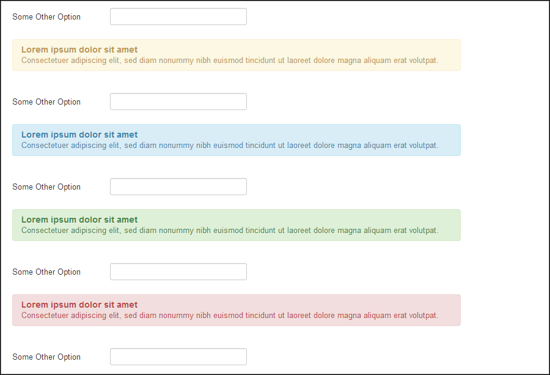

Note Form Field
===============


The **note** form field type makes it possible to create titles, texts, descriptions and even alert boxes. It also allows you to bring order in the settings for extensions, by separating them with useful titles. Or adding descriptions for certain settings (without having to rely on the tooltips). Or adding any other text you want.

- **type** (mandatory) must be *note*.
- **name** (mandatory) is the unique name of the field.
- **label** (optional if using description) (translatable) is the field html label.
- **description** (optional) (translatable) is the [field description](../standard-form-field-attributes.md#description).
- **heading** (optional) the type of heading element to use for the label (optional) (default: h4)
- **class** (optional) a  class name (or class names), like alert (see below for examples) (optional)
- **close** (optional) a value of 'true' (for alerts) or the value for the data-dismiss of the Bootstrap close icon 

Implemented by: libraries/src/Form/Field/NoteField.php

## Example XML parameter definition

```xml
    <field
        name="mynote" 
        type="note" 
        default="" 
        label="A heading goes here" 
        description=""
    />
```

### Title and Description
In the following code examples we will use these example language strings:

```ini
LOREMIPSUM="Lorem ipsum dolor sit amet"
LOREMIPSUM_DESC="Consectetuer adipiscing elit, sed diam"
```
With this note field you can either use the title or the description or both.

```xml
    <field name="opt10" type="text" label="Some Other Option" />
    <field name="note11" type="note" label="LOREMIPSUM" />
    <field name="opt11" type="text" label="Some Other Option" />
    <field name="note12" type="note" description="LOREMIPSUM_DESC" />
    <field name="opt12" type="text" label="Some Other Option" />
    <field name="note13" type="note" label="LOREMIPSUM" description="LOREMIPSUM_DESC" />
    <field name="opt13" type="text" label="Some Other Option" />
```


### Classes (Alerts)
You can add classes to the note. In this way you can easily make (Bootstrap) alerts and also add other styling via class names (like a 'well').
```xml
    <field name="opt20" type="text" label="Some Other Option" />
    <field name="note21" type="note" class="alert" label="LOREMIPSUM" description="LOREMIPSUM_DESC" />
    <field name="opt21" type="text" label="Some Other Option" />
    <field name="note22" type="note" class="alert alert-info" label="LOREMIPSUM" description="LOREMIPSUM_DESC" />
    <field name="opt22" type="text" label="Some Other Option" />
    <field name="note23" type="note" class="alert alert-success" label="LOREMIPSUM" description="LOREMIPSUM_DESC" />
    <field name="opt23" type="text" label="Some Other Option" />
    <field name="note24" type="note" class="alert alert-error" label="LOREMIPSUM" description="LOREMIPSUM_DESC" />
    <field name="opt24" type="text" label="Some Other Option" />
```



### Close Button
A close button can be added to the alerts by adding the close="true" attribute to the tag. If you use a class other than the alert, use the required value for the data-dismiss of the Bootstrap close icon instead of the value true. Here is the code to test the close icon on an alert.
```xml
    <field name="opt30" type="text" label="Some Other Option" />
    <field name="note31" type="note" class="alert" close="true" label="LOREMIPSUM" description="LOREMIPSUM_DESC" />
    <field name="opt31" type="text" label="Some Other Option" />
```


Be aware that a closed alert/note cannot be reopened by the user without page reload. It's not a show/hide functionality. 