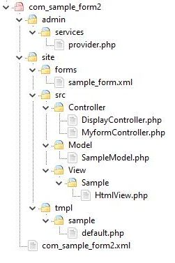

MVC and other considerations
============================

## Introduction
The way that the code of the previous section was written isn't the best approach if you are developing a genuine Joomla component. Instead you should follow the way that the Joomla core code is designed, in particular splitting your component into MVC - model, view, controller pattern. The revised component code `com_sample_form2` at the end of this section follows this approach. 

This section describes MVC and other design patterns, and following these patterns generally make the component code easier to follow, especially in large components. 

### Joomla MVC Split
In general terms Joomla splits components into separate types of functionality:

- the Controller contains the logic to decide how to respond to the HTTP request - in particular, deciding which View and Model to use
- the View defines what data items should be shown on the web page to be presented, and makes calls to the Model to obtain those data items
- the Model provides access to the data
- the tmpl file is an extension of the View (it runs within the context of the View class instance and so has direct access to the `$this` variable of the View object). It outputs the HTML for the component, and it includes in the output the data which has been collated by the View. It's separate from the View code so that the HTML output can easily be overridden using a template override. 

### Post/Request/Get Pattern
In Joomla all of the HTML output (such as the display of a form) is performed in response to an HTTP GET, following the [Post/Redirect/Get Pattern](https://en.wikipedia.org/wiki/Post/Redirect/Get) pattern. The sample code of the previous section doesn't follow this pattern, but instead outputs the validation errors and re-displays the form in the response to the HTTP POST request.

To follow the Joomla pattern, in the code which handles the POST we should include a HTTP GET redirect to the form URL. As that GET will then be a new HTTP request/response we must store in the user session the data to be shown when the form is redisplayed, which includes the following 2 items:

- the validation error messages are stored and output using the `enqueueMessage()` method (which stores data in the user session automatically for us)
```php
$app = Factory::getApplication();
$app->enqueueMessage('some message text');
```

- the user-entered data is stored using `setUserState()` and retrieved using `getUserState()`, and keyed by a context which should be unique to this form. For example:
```php
$app->setUserState('com_sample_form2.sample', $data);
```

The code which provides the data for the form `bind()` operation must first check using `getUserState()` to see if there is any data in the session, as it will be the data which the user previously entered, and should be redisplayed. 

Also, if the user enters data which successfully passes validation then `setUserState()` should then be called passing `null` in order to clear this prefill data in the session; otherwise it will appear whenever the user next displays the form.

Of course, although Joomla works using this pattern, you don't always have to follow it. For example, if you have a large amount of confirmation data which you want to output after a form has been successfully submitted then you can instead output this just as a response to the HTTP POST. 

### Separate Controllers
Joomla routes HTTP requests to separate Controllers based on the value of the *task* URL parameter sent in the request. This parameter is often set by Joomla core javascript based on the submit button, e.g. in the example below:
```php
onclick="Joomla.submitbutton('myform.submit')"
```
When the `submit` button is clicked then the onclick listener calls the javascript function `Joomla.submitbutton` passing in the parameter 'myform.submit', and this results in the *task* parameter being set to "myform.submit". 

In general the *task* parameter is of the form `<controller type>.<method>` and so in this case the HTTP POST containing the form data will be handled by the MyformController and its `submit` method. 

### Joomla MVC Classes
Joomla provides feature-rich Controller, View and Model classes from which your component Controllers, Views and Models can inherit. The Model code in `com_sample_form2` inherits from FormModel which shields somewhat the Joomla Form API explained in the previous section. In this case our model calls the FormModel `loadForm()` method, and this method then executes a callback to our `loadFormData()` to provide the data to `bind()` to the form. So in the code there isn't a separate call to `bind()`.

### Security Token
Joomla uses a security token on forms to prevent [CSRF attacks](https://en.wikipedia.org/wiki/Cross-site_request_forgery). The token is output in the layout file
```php
<?php echo HTMLHelper::_('form.token'); ?>
```
and checked within the controller handling the POST:
```php
$this->checkToken();
```
If the token is found to be invalid then `checkToken()` outputs a warning and redirects the user back to the previous page. 

### Validation
This is covered in the following sections.

## Sample Code
For this section you can download [this component zip file](./_assets/com_sample_form2.zip) and install it. It has basically the same functionality as `com_sample_form1` in the previous section, but it has been redesigned according to the principles above. Although at first sight it may seem more complex, distributing the functionality in this way makes the code much easier to understand when the component becomes sizeable. 

After you have installed the file, navigate to your site home page and add the query parameter `?option=com_sample_form2` to run the component. 

The files in the package are shown below.



Here's a description of the functionality in each file.

### admin/services/provider.php
This is just a standard source file associated with Joomla [Dependency Injection](../dependency-injection/index.md). 

### site/src/Controller/DisplayController.php
The `display()` method of this class is what gets run when you initially navigate to the `com_sample_form2` component.
```php
$model = $this->getModel('sample');
$view = $this->getView('sample', 'html');
$view->setModel($model, true);
$view->display();
```
The `$model` and `$view` get created, and the parameter 'sample' which gets passed indicates the Fully Qualified Name (FQN) which the Model and View must have. In other words, Joomla uses this 'sample' string as part of working out what the FQNs of the Model and View classes are. (These two class instances actually get created by the MVCFactory class object which was included via the services/provider.php file.)

Then `setModel` is called so that the Model is available to the View code, with `true` being passed to indicate that it's the default Model for the View. 

Finally the View `display` method is called.

### site/src/View/Sample/HtmlView.php
In the View `display` function:
```php
$this->form = $this->getModel()->getForm();
parent::display($tpl);
```
it calls the `getForm` method of the (default) Model, then calls `parent::display()` which basically runs the tmpl/default.php file.

### site/src/Model/SampleModel.php
In the Model `getForm` function we have:
```php
$form = $this->loadForm(
    'com_sample_form2.sample',  // just a unique name to identify the form
    'sample_form',				// the filename of the XML form definition
                                // Joomla will look in the site/forms folder for this file
    array(
        'control' => 'jform',	// the name of the array for the POST parameters
        'load_data' => $loadData // if set to true, then there will be a callback to 
                                 // loadFormData to supply the data
    )
);
```
The `loadForm` method is in libraries/src/MVC/Model/FormModel.php, via the FormBehaviorTrait (in libraries/src/MVC/Model/FormBehaviorTrait) which it uses. 

The `loadForm` function will get a Joomla `Form` instance, configured to use `'control' => 'jform'` and then will call `loadFile` on that `Form` instance to read the form definition in site/forms/sample_form.xml.

As the `load_data` in this case is set to `true` there will be a callback to `loadFormData` which has
```php
$data = Factory::getApplication()->getUserState(
    'com_sample_form2.sample',	// a unique name to identify the data in the session
    array("email" => ".@.")	// prefill data if no data found in session
);
```
The `setUserState` and `getUserState` functions store data in the Joomla `Session`, using a key which is here set to 'com_sample_form2.sample'. (You can see what's in the `Session` by setting "Debug System" to Yes in the Global Configuration parameters, then on a webpage click on the Joomla symbol in the bottom left of the page.)

### site/tmpl/sample/default.php
```php
<form action="<?php echo Route::_('index.php?option=com_sample_form2'); ?>"
    method="post" name="adminForm" id="adminForm" enctype="multipart/form-data">

	<?php echo $this->form->renderField('message');  ?>

	<?php echo $this->form->renderField('email');  ?>

	<?php echo $this->form->renderField('telephone');  ?>

	<button type="button" class="btn btn-primary" onclick="Joomla.submitbutton('myform.submit')">Submit</button>

	<input type="hidden" name="task" />
	<?php echo HtmlHelper::_('form.token'); ?>
</form>
```
There are a few points to note here:
- the `action` attribute on the `<form>` indicates that the POST should be back to our `com_sample_form2` component
- each of the fields is rendered as before using `renderField`
- the `submit` button has an onclick listener which will result in the `task` URL parameter being set to 'myform.submit'. Hence Joomla will route this to a `MyformController`, and method `submit()` within it.
- we still need to explicitly include a hidden field with type `task`
- the security token is included with `HtmlHelper::_('form.token')`. This will be sent as one of the POST parameters, and we need to check it when we handle the form submission.

### site/src/Controller/MyformController.php
When the HTTP POST is received Joomla will route it to this Controller, and call the `submit` method.
```php
$this->checkToken();
```
This will check the security token and cause the form submission to be rejected if it's not valid.

```php
$model = $this->getModel('sample');
$form = $model->getForm(null, false);
```
As in the DisplayController we get the Model. However there's not going to be a View here, so the Controller has to call `getForm` instead. We pass `false` as the second parameter, because we're not expecting it to call back to the Model to prefill the data.

```php
// name of array 'jform' must match 'control' => 'jform' line in the model code
$data  = $this->input->post->get('jform', array(), 'array');
```
This retrieves the parameters sent in the HTTP POST request.

```php
// This is validate() from the FormModel class, not the Form class
// FormModel::validate() calls both Form::filter() and Form::validate() methods
$validData = $model->validate($form, $data);
```
This handles the Form filter and validation steps.

```php
if ($validData === false)
{
    $errors = $model->getErrors();

    foreach ($errors as $error)
    {
        if ($error instanceof \Exception)
        {
            $app->enqueueMessage($error->getMessage(), 'warning');
        }
        else
        {
            $app->enqueueMessage($error, 'warning');
        }
    }

    // Save the form data in the session, using a unique identifier
    $app->setUserState('com_sample_form2.sample', $data);
}
else
{
    $app->enqueueMessage("Data successfully validated", 'notice');
    // Clear the form data in the session
    $app->setUserState('com_sample_form2.sample', null);
}
```
If the data is invalid then it outputs the associated error messages and uses `setUserState` to store in the `Session` what the user has entered in the form.

If the data is valid then it outputs a success message, and clears the data in the `Session` so that the next time the form is shown it just has the normal prefill data.

```php
// Redirect back to the form in all cases
$this->setRedirect(Route::_('index.php?option=com_sample_form2', false));
```
This follows the Post/Request/Get Pattern which Joomla uses. 