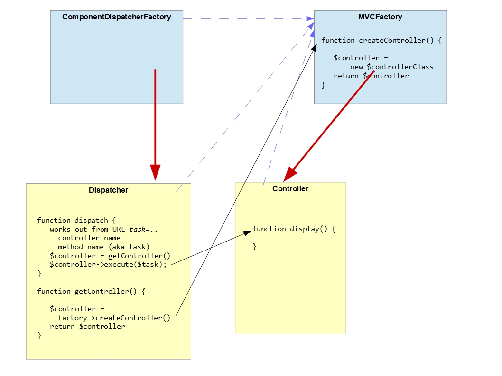
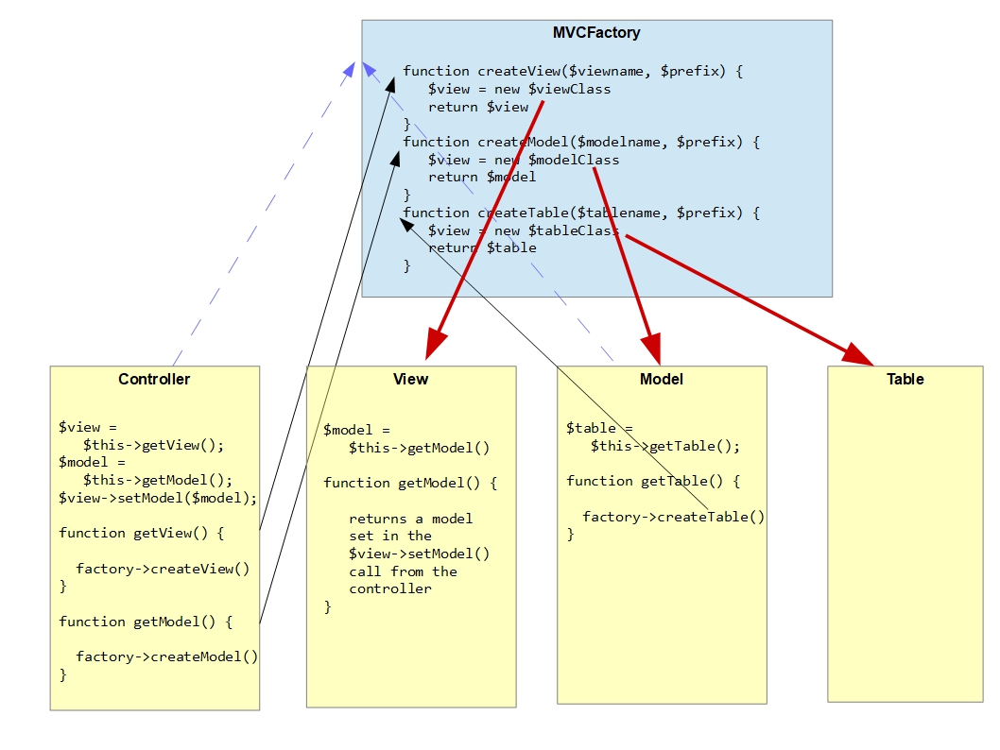

MVC Factory Overview
====================

The MVC Factory class is used within Joomla to create instances of component Controller, View, Model and Table classes. 

Each component has its own MVCFactory class instance, which is instantiated passing in that component's [namespace prefix](../../../general-concepts/namespaces/defining-your-namespace.md). 

It has functions for creating each of the classes: `createController`, `createView`, `createModel`, `createTable`, and in its simplest form you can pass into each function:
- the `name` - eg "display", "article", etc
- the `prefix` - either "site" or "administrator".

(You can specify the `name` and `prefix` with or without the capital first letter - Joomla will capitalise the first letter for you).

The MVCFactory class function will then generate the name of the class to instantiate, and try to [instantiate it](../../../general-concepts/namespaces/finding-classes-with-psr4.md). 

For example, if your component is `com_example` with a namespace prefix \Mycompany\Component\Example then inside your Controller class you could use (where `$this->factory` points to your MVCFactory instance):
```php
$model = $this->factory->createModel('Example', 'Administrator');
```
and the MVCFactory function will attempt to instantiate \Mycompany\Component\Example\Administrator\Model\ExampleModel.

In fact, the library MVC BaseController class makes it even simpler for you, and you just have to call:
```php
$model = $this->getModel('example', 'administrator');
```
Note that if your component is running in the front end (site) you can still use the administrator model, and if it's running in the back end (administrator) you can still use the site model. There is no restriction. 

## Creating the MVCFactory class instance
Your component's MVCFactory is created by defining it as a dependendency in your services/provider.php file, as described in [Dependency Injection](../../../general-concepts/dependency-injection/index.md), but you don't have to understand all the intricacies of Joomla Dependency Injection to use it effectively.

## Creating your Controller class instance

As described in [Extension and Dispatcher Classes](../../../general-concepts/extension-and-dispatcher/index.md), your Controller class is instantiated within the `dispatch` function of the ComponentDispatcher class. It has an instance variable pointing to the MVCFactory class and will call:
```php
$controller = $this->mvcFactory->createController($name, $client, ..);
```
passing the `$name` from the first part of the *task* parameter (or "display" if there's no *task* parameter), and `$client` set to "site" or "administrator", depending upon whether this is run on the front end or the back end. 



In this diagram (and in the next):
- the "Factory" classes are in blue, and ordinary MVC classes in yellow.
- the dashed blue lines indicate that one class has an instance variable which points to the other class instance
- the solid black lines represent method calls
- the thick solid red lines represent where a Factory class instantiates a class

## Creating your View, Model and Table class instances



With the Joomla MVC Factory paradigm
- the Controller is responsible for instantiating the View and the Model, and can call `getView` and `getModel` to do this
- the Model is responsible for instantiating the Table, and can call `getTable` to do this

The View can also get the Model via a `getModel` call, but only if the Controller has set this up by getting the Model instance first and passing this into the View:
```php
$view->setModel($model);
```

## Default names for View, Model and Table classes
While the name for the Controller is taken from the *task* parameter, the default names for the View, Model and Table classes are taken from the *view* parameter. These default classes are what will be instantiated if you just call `getView()`, `getModel()` and `getTable()` without any parameters. 

So, for example, the names of the classes created for a request with URL query "?option=com_example&view=viewname" and no *task* parameter will be:
- `<namespace>\Controller\DisplayController`
- `<namespace>\View\Viewname\HtmlView`
- `<namespace>\Model\ViewnameModel`
- `<namespace>\Table\ViewnameTable`

## Summary
We've covered a fair bit of background in this section, to give you an understanding of why things work, but it's all to make it easy for you in your MVC classes.

In your Controller, you can create the View and the Model, and give the View a reference to the Model:
```php
$model = $this->getModel();           // to get the default Model, based on the view= parameter
$foomodel = $this->getModel('foo');   // to get the Model\FooModel
$view = $this->getView();             // to get the default View, based on the view= parameter
$fooview = $this->getView('foo');     // to get the View\Foo\HtmlView
$view->setModel($model, true);        // to set the view's default model, accessible inside the view by $this->getModel()
$view->setModel($foomodel);           // make the $foomodel accessible to the view by $this->getModel('foo')
```
To get multiple models you just pass each name to `getModel`:
```php
$foomodel = $this->getModel('foo'); 
$barmodel = $this->getModel('bar');   
```
If your component is running on the front end but you want to get its administrator model, just pass the `$prefix` second parameter:
```php
$model = $this->getModel('foo', 'administrator');
```
In your View, you can access the model set up by the Controller:
```php
$model = $this->getModel();           // to get the default model
$foomodel = $this->getModel('foo');   // to get the foo model
```
In your Model, you can create the Table:
```php
$table = $this->getTable();           // if your Table class matches the view= parameter in the HTTP request
$table = $this->getTable('example');  // to get the ExampleTable class
```

## Issues
A key reason for the introduction of the MVCFactory class was to remove the use of the `static::getInstance()` calls to obtain an instance of one of the MVC classes. However, you may find one or two problems with the approach.

For example, when saving a database record in the Table class (eg in `Joomla\CMS\Table\Content::store()`), Joomla obtains another instance of that Table class in order to verify that the alias which is about to be saved is unique. However, when the Table instance is created it isn't passed a pointer to the MVCFactory instance, so it can't create another instance using the MVCFactory's `createTable` function. In Joomla 4 the solution was to use the deprecated `getInstance()` function:
```php
$table = Table::getInstance('Content', 'JTable', ['dbo' => $this->getDbo()]);
```
In Joomla 5 it just creates a new version of itself:
```php
$table = new self($this->getDbo(), $this->getDispatcher());
```
So you can use a similar approach to avoid using the deprecated `getInstance` method (or just execute a SQL query directly on your database table).