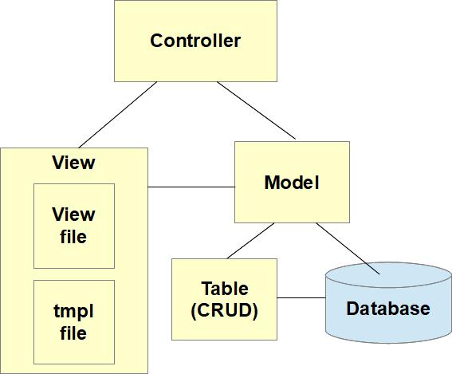

MVC Overview
============

The diagram below depicts the MVC pattern as it's used in Joomla. This applies to both the admin back end and the site front end.

## Basic Elements

In this section we will cover the 4 types of classes shown in the diagram. In your component you're likely to have several Controller, View and Model classes, and (if your component uses its own table or tables in the database) one Table class for each database table your component has. 

### Controller
Your Controller code is run whenever there's an incoming HTTP request which is routed to your component. The controller is responsible for analysing the user's request, checking that the user is allowed to perform that action and determining how to satisfy the request. The latter could involve:

- determining which Model (or Models) will be needed to satisfy the request, and creating an instance of that Model
- making calls to Model methods to make any required database updates
- determining which View should be used to present the web page to the user, and creating an instance of that View or
- if instead the user should receive a redirect to another URL, then determining that redirect URL.

### View
The MVC View functionality is split into 2 files

1. A View class file, which is usually just known as the View, and after this we'll just call it the View
2. A tmpl file 

The View specifies what should appear on the web page which is going to be displayed, and collates all the data necessary for outputting the HTTP response.

After the controller creates the View instance it calls the View's `setModel()` method and passes the Model instance. In this way the View knows which Model to use, and calls the Model's methods to obtain the data required for returning to the user. This data is stored in instance variables of the View.

The tmpl file (sometimes known as template or layout file - Joomla isn't totally consistent here!) is responsible for outputting the actual HTML of the web page to be displayed. The View doesn't output HTML itself but delegates this to the tmpl file. 

The tmpl contains PHP code which runs within the context of the View. The View class usually extends Joomla\CMS\MVC\View\HtmlView and the `display()` method of this class works out which tmpl to use and then does an `include` of the file. 

This means that if the View holds the response data in, for example, `$this->items` then the tmpl file can access that same `$this->items` when it is outputting the HTML. 

Separating the View and tmpl like this enables another level of flexibility, as you can easily set up a layout override to output the View data using your own preferred HTML. 

### Model
The Model encapsulates the data used by the component. In most cases this data will come from a database, either the Joomla database, or some external database, but it is also possible for the Model to obtain data from other sources, such as via a web services API running on another server. The Model is also responsible for updating the database where appropriate. The purpose of the Model is to isolate the Controller and View from the details of how data is obtained or amended.

If the component is displaying a form which is defined in XML using the Joomla Form approach, the Model handles the setting-up and configuration of the `Form` instance, ready for the tmpl to output fields using `$form->renderField()` etc. 

### Table
If your extension has one or more database tables, then you should have a Table class for each database table. Your Table class will inherit from the Joomla library Table class, which provides CRUD (Create / Read / Update / Delete) access to the underlying database table.

The Table class provides access to individual records only, so it would be used by the Model if the requirement was a CRUD operation on an individual record, eg to create or update a record in the database.

If instead it's required to access several records in the database table, then the Model would access the database directly, rather than using the Table class.

## The HTTP Request *task* Parameter
Joomla uses the HTTP Request *task* parameter to determine which controller should be used. The *task* parameter can be sent in an HTTP GET or an HTTP POST - Joomla doesn't mind which - and it's just an ordinary HTTP parameter, nothing special. 

The *task* parameter is of the form `<controllerType>.<method>`. The first part identifies the particular Controller class to use, and the second part identifies that class's instance method to call.

The controller type may be absent in which case the DisplayController class is used. 

If the task parameter is not set at all then the `display()` method in the DisplayController class is run. 

We'll look at some examples later on.

## Your MVC within Joomla
Of course, your component's MVC code runs within the context of Joomla's library code, really like the meat in a sandwich. When Joomla determines that it should run your component, then it obtains your component's Extension and Dispatcher classes, and it's the `dispatch()` function of the Joomla ComponentDispatcher class which actually analyses the *task* parameter to determine which of your Controller classes to instantiate, as described in [Extension and Dispatcher classes](../../../general-concepts/extension-and-dispatcher/index.md). Then `dispatch()` calls your component's `execute()` method, passing the `<method>` part of the *task* parameter. Assuming your component has Joomla\CMS\MVC\Controller\BaseController in its inheritance chain, then this will result (in the normal case) in your Controller's `method` function being called. 

After the `execute()` method completes the `dispatch()` method will call the Controller's `redirect()` method - we'll see the significance of this later. 

At the other end, the HTML output by the tmpl file doesn't go directly into the HTTP response, but rather is captured by Joomla in a buffer using [PHP Output Buffering](https://www.php.net/manual/en/book.outcontrol.php), and later injected into the final HTML page, together with any modules, messages, etc that need to be included in the web page.