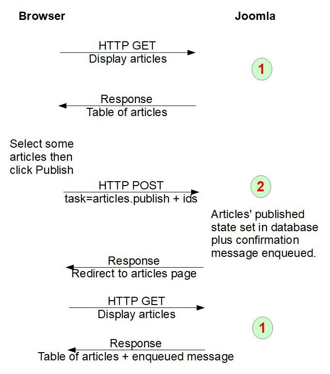
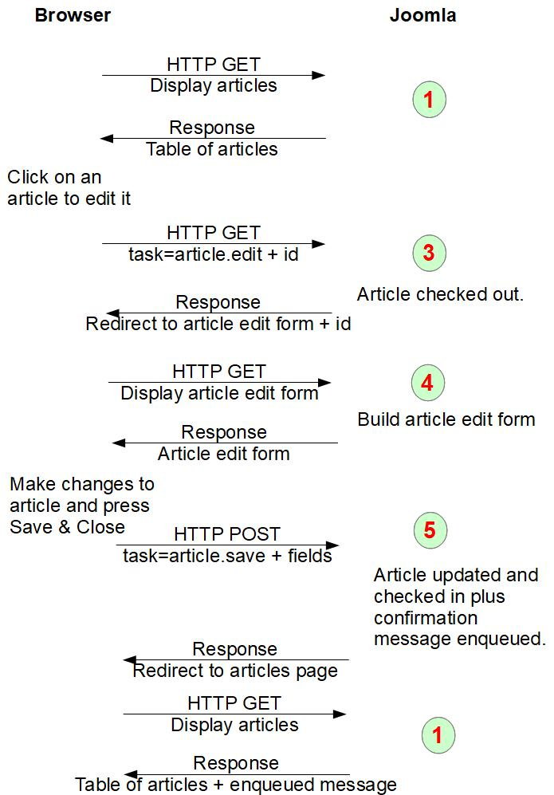

Post-Request-Get Pattern
========================

Joomla follows the [Post/Redirect/Get pattern](https://en.wikipedia.org/wiki/Post/Redirect/Get), which means that when a user submits a form in an HTTP POST, then rather than Joomla responding to the POST with an HTML page, it redirects to another page which the browser will access with an HTTP GET. In this section we'll look at a couple of examples of this, and see how it aligns with the use of the *task* parameter, and later with the Joomla library MVC classes.

Although Joomla uses the Post-Request-Get Pattern extensively, this doesn't mean that you have to use it everywhere in your own component. For example, if your component has a front-end form which is used to submit an order, then it may make perfect sense to provide the order confirmation text as the HTTP response to the HTTP POST of the order submission. 

## Example 1 Publish Articles
The diagram shows the steps associated within publishing articles on the Joomla back-end. You'll probably find it helpful to perform these operations on your own Joomla instance, and use your browser's devtools to examine the HTTP requests and responses. 



### Action 1
The administrator clicks on Content / Articles to display the list of articles. This is simply an HTTP GET request to the `com_content` administrator webpage with the `view` parameter set to `articles`. (If SEF URLs are being used, then it's the Joomla Router which will set up the `view` parameter, based on parsing the incoming URL). The *task* parameter is not set in this HTTP request, and so the `com_content` DisplayController is instantiated and the `display()` method called. Based on the `view` parameter, the default View class is Joomla\Component\Content\Administrator\View\\**Articles**\HtmlView, and the default Model is Joomla\Component\Content\Administrator\Model\\**Articles**Model.

A key thing to note is that this view displays various buttons at the top of the form. When you select one or more articles, then these buttons become visible in the Actions button drop-down at the top of the page. It is these buttons which trigger an HTTP POST to the server, and embedded within the buttons is what the *task* parameter gets set to within that POST request.  

### Action 2
The administrator selects a number of articles and then presses the Publish button. At this point it's worth switching on your browser's devtools, and examining the messages. You'll see that pressing Publish triggers:
- an HTTP POST request to the server with
- the *task* parameter set to "articles.publish"
- an array cid[] of the ids of the articles which are affected
- plus a number of other parameters from the pagination / filter fields / batch options - all of which don't concern us here

This request will then be routed to the `com_content` administrator ArticlesController, and the `publish()` method within it will be called. If you look at the code in administrator/components/com_content/src/Controller/ArticlesController.php you won't find a `publish()` function there, so what will be run will be the `publish()` function in the class it extends, namely Joomla\CMS\MVC\Controller\AdminController in libraries/src/MVC/Controller/AdminController.php. Let's pick out a few lines from that `publish()` method:
```php
$cid   = (array) $this->input->get('cid', [], 'int');
```
It gets the list of ids which the administrator has selected.
```php
$model = $this->getModel();
$model->publish($cid, $value);
```
The `getModel` function is defined in the ArticlesController:
```php
public function getModel($name = 'Article', $prefix = 'Administrator', $config = ['ignore_request' => true])
{
    return parent::getModel($name, $prefix, $config);
}
```
and as the default `$name` is 'Article' this will get the `com_content` administrator **Article**Model (instead of the default **Articles**Model). If you look in this file you'll find the `publish()` method, but it basically just has:
```php
return parent::publish($pks, $value);
```
so the real work of handling the publish operation is in the class which the ArticleModel extends, namely Joomla\CMS\MVC\Model\AdminModel in libraries/src/MVC/Model/AdminModel.php, in its `publish` method. 

Back to the AdminController.php code, a little further on we have:
```php
$ntext = $this->text_prefix . '_N_ITEMS_PUBLISHED';
$this->setMessage(Text::plural($ntext, \count($cid)));
```
Here the code is setting up a message which is going to get displayed to the administrator, basically confirming the number of records which have had their status set to Published.

Finally, at the end of the `publish` function in AdminController.php it has:
```php
$this->setRedirect(
    Route::_(
        'index.php?option=' . $this->option . '&view=' . $this->view_list
        . $this->getRedirectToListAppend(),
        false
    )
);
```
Here is the Post-Request-Get Pattern in action - Joomla hasn't displayed a web page in response to the POST, rather it has set up a redirect - in this case back to the form which displays the list of articles. 

As mentioned in [MVC Overview](mvc-overview.md) and [Dispatcher Component](../../../general-concepts/extension-and-dispatcher/dispatcher-component.md), after the component's `execute` method finishes the Dispatcher calls the component's `redirect` method. This method (actually in Joomla\CMS\MVC\Controller\BaseController) will do 2 things:
1. Use the Joomla Application's `enqueueMessage` function to store the confirmation message ("n articles published") in the session data
2. Tell the Joomla Application to redirect to the URL which was stored in the `setRedirect` call above.

If you've been looking at the Joomla source code while you've been reading this page, then you've maybe noticed 2 things.

Firstly, the `publish()` function in the AdminController is not only handling the `publish` functionality, but also used for setting the state to other values, eg `unpublish`. The Joomla BaseController has a protected instance variable `$taskmap` which maps the `<method>` part of the *task* parameter to the function which will get called, and in the AdminController constructor it has 
```php
$this->registerTask('unpublish', 'publish');
```
which means that in its `execute` function it will call the `publish` function for the case when *task* is set to "Articles.unpublish" as well.

This enables sharing of code for 2 operations which are similar, but of course there will be differences in the detail, and in `publish()` it calls 
```php
$task  = $this->getTask();
``` 
to get the `<method>` part of the *task* parameter, in order to code the differences. Note that in these calls in the Controller code that "task" refers to just the `<method>` part of the *task* parameter; Joomla isn't consistent in its naming here.

Secondly, did you notice how much of the code to handle the publish operation was actually within the `com_content` code? Very little! Practically all the code was within the Joomla library MVC classes. Making judicious choices in how you name your component's fields and how your component's MVC classes extend the Joomla library classes can make it easy for you to include functionality with very little coding effort. We'll look at the Joomla library MVC classes in more detail in the next section.

### Action 1 again
The URL redirect at the end of Action 2 results in the display of the list of articles again. However, this time the user will see a message like "2 articles published" at the top of the form. 

There may be 2 administrators logged on simultaneously, and both displaying the list of articles around the same time. How does Joomla know which administrator should be shown the "2 articles published" message? The answer is that it uses cookies. When the administrator's browsers sends the HTTP GET request to display the list of articles it sends in the request all the cookies which the server previously sent to it. One of these will be used by the Joomla Session functionality as an index to the Session data which is stored for that user. The `enqueueMessage` function described above stores a message within this session data, and when Joomla processes the next HTTP request it will see that there's a message stored there and will output it to the page.

You can see what's stored in your session data by switching on Joomla Debug in the global configuration, and then clicking on the little Joomla symbol at the bottom left of each web page. However you won't see any enqueued messages because when Joomla outputs an enqueued message it removes it from the session, so that it isn't displayed again on the next HTTP request. 

## Example 2 Edit Article


### Action 1
This is the same as above, displaying the list of articles.

### Action 3
The administrator clicks on an article to edit it. If you switch off Search Engine Friendly (SEF) URLs in your Global Configuration / Site parameters, then you'll see that the link behind each article title is something like `http://yourdomain.org/administrator/index.php?option=com_content&task=article.edit&id=1`. So the HTTP GET request sent to the server will have *task* set to "article.edit", and this will result in the `com_content` ArticleController being instantiated, and its `edit()` function being called.

Similar to what we found previously, there's no `edit` function within ArticleController.php, so what is run is the `edit` function in the class it extends, namely Joomla\CMS\MVC\Controller\FormController in libraries/src/MVC/Controller/FormController.php. It basically checks that the user is allowed to perform this operation, and if so, checks the content record out (by setting the `checked_out` and `checked_out_time` columns in the article record in the database), and sets up a redirect to display the article edit form.

### Action 4
The redirect results in an HTTP GET to a URL like http://yourdomain.org/administrator/index.php?option=com_content&view=article&layout=edit&id=1. The *task* parameter is not set so this will be handled by the `com_content` DisplayController, in the `display()` function. It will use the `com_content` Article View class in src/View/Article/HtmlView.php, and the tmpl file used will be tmpl/article/edit.php (from the `layout` parameter). This displays the form for editing a single article.

### Action 5
When the administrator clicks on `Save & Close` then this will result in an HTTP POST to the server, with the article's field values, and *task* set to "article.save". This will be routed to the `com_content` ArticleController, and its `save()` function. Once again the `save` function is absent, so it drops back to using the `save` function in the class which ArticleController extends, namely Joomla\CMS\MVC\Controller\FormController in libraries/src/MVC/Controller/FormController.php. This function does the following (in its 'happy path'):
- checks the user is allowed to perform the operation
- validates the data (ie the submitted article fields) 
- saves the data (via the ArticleModel)
- checks in the record
- enqueues a confirmation message that the save succeeded
- sets up a redirect back to the form showing the list of articles

### Action 1 again
As before, this displays the list of articles, plus the enqueued message.

