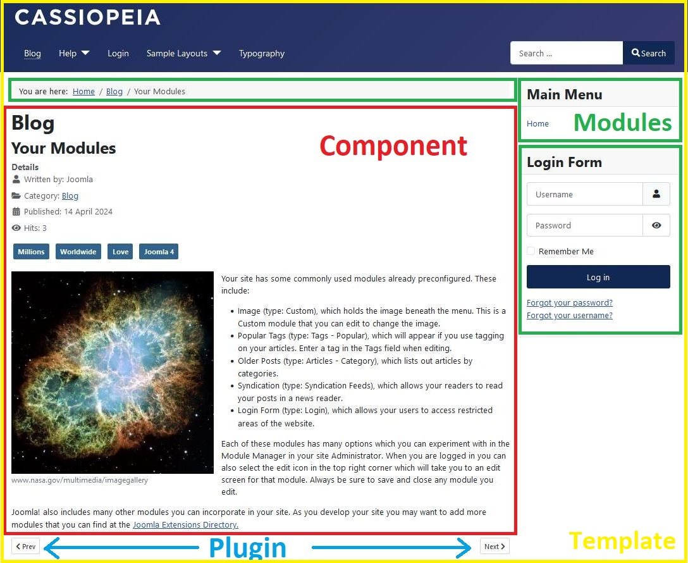
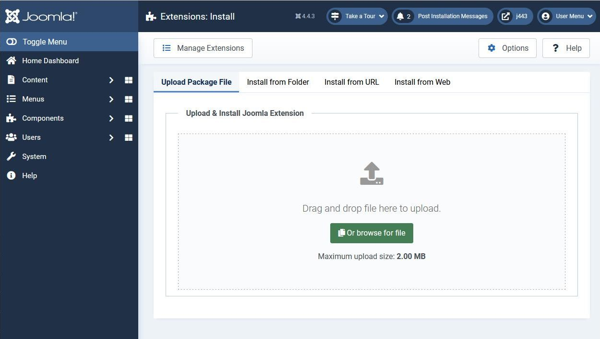

Build Extensions
================

Joomla is a rich featured content management system, but if you're building a website with Joomla and you need extra features which aren't available by default, then you can easily extend it with extensions. There are five common types of extensions for Joomla: Components, Modules, Plugins, Templates, and Languages. There are three others: Packages, Files and Libraries. Each of these extensions handle specific functionality (many built-in features of Joomla are implemented using extensions).

The difference between Joomla components, modules, plugins and templates can be initially confusing. If you're new to Joomla then you may find it useful to watch the video [How Joomla Works - a guide for extension developers](https://youtu.be/JKnq47Yhtvs), which describes how these 4 types of extension fit into the generation of a Joomla web page. Their output is also highlighted in different colours in the diagram below.

## Components

Components provide the central part of a web page on a Joomla site; each site web page displays the output from one component. They can be thought of as mini applications. Most components have two parts: a site part and an administrator part. For example, `com_content` is the component which handles articles; on the site frontend `com_content` displays articles to website visitors and on the backend `com_content` provides the functionality for administrators to edit articles.

In general, components manage the data of the Joomla instance and provide functionality for creating, editing, removing and displaying the data. Often the data management aspects are handled in the administrator backend and the site frontend simply displays the data, but this split of responsibility is not mandated, and some components provide frontend functionality for creating/editing/removing data.

When you navigate to a certain page on a site or perform a certain operation such as login/logout then you're selecting the component which is going to be run. That component is the code which is primarily responsible for handling the HTTP Request, executing the requested operation, and displaying the key data on the web page.

- Core component examples: Articles (com_content), Categories (com_categories), Contacts (com_contact), Images and media files (com_media)
- Third party examples: See the [Joomla Extensions Directory](https://extensions.joomla.org/) for third party extensions for Backup, eCommerce and many other purposes.

To read more go to the [Components Index page](components).

## Modules

Modules are more lightweight and flexible extensions displayed on a web page. Modules are mostly known as the “boxes” that are arranged around a component, for example: the login module or the breadcrumbs module. Modules are assigned per menu item. So you can decide to show or hide the login module depending on which menu item the user is viewing.

A module can often be a companion to the component. For example, if your web page displays an article (`com_content` component) then you might have a module (`mod_tags_similar`) in the sidebar which displays links to related articles, or a module which displays an image slider of related photos.

However, modules do not need to be linked to components, as a matter of fact they don't even need to be linked to anything and can be just static HTML or text.

- Core module examples: Latest Articles (mod_articles_latest), Menus (mod_menu), Who's Online (mod_whosonline), Custom HTML (mod_custom).

If you're just beginning with Joomla extension development then developing a module is the easiest place to start.

To read more go to the [Modules Index page](modules).

## Plugins

Joomla has over 150 Plugins that work behind the scenes to modify or enhance basic Joomla functionality. A plugin responds to a registered event triggered in the core, a component or a module and modifies the data related to that event. For example, the *Content - Email Cloaking* plugin obfuscates any email address in an output page so that it cannot be harvested by a robot.

- Core examples: Content - Page Navigation (which generates the Prev and Next links as shown in the screenshot above).

To read more go to the [Plugins Index page](plugins).

## Templates

A template is basically the design of your Joomla-powered website. With a template you define the look and feel of your website, primarily based on CSS. Templates have certain fields in which the component (just one) and modules (as many as you like) will be shown. Building a complete Joomla template from scratch is difficult because you have to understand the variety of HTML output by the Joomla components, and the CSS classes which are used within them. However, it is relatively easy to customize the Atum (administrator) and Cassiopeia (site) templates which are shipped with Joomla, particularly as you can use the Joomla child template functionality to simply specify deviations from the parent template.

To read more go to the [Templates Index page](templates).

## Languages

Probably the most basic extensions are languages, which can be packaged either as a core package or as an extension package. In essence, both the core and the extension language package files consist of key/value pairs, which provide the translation of static text strings, assigned within the Joomla source code. These language packs will affect both the front and administrator side of your Joomla instance. Note: these language packs also include an XML meta file which describes the language.

## Libraries

Libraries are standalone PHP snippets that Joomla uses. Note nearly all of Joomla's core code is available as a library within the libraries/src folder. All composer libraries (such as PHPMailer) are installed as a library "vendor" within libraries/vendor. Many of the most popular 3rd party extensions in Joomla use libraries to reuse common functionality across their components.

## File

The File extension type is used to install individual files into a directory of the Joomla instance. There are no examples in Joomla Core of this type and it is the least used type, however it can be used for example to place [custom scripts](./custom-script/index.md) into the Joomla cli directory or to place template overrides into a specific directory.

## Packages

Packages are simply a group of any of the above types of extensions. A common use of a package would be to ship a template that also bundles a system plugin. Or a component that also installs a library it uses. In Joomla many language packs install as a package so that the frontend and backend languages can be installed independently.

## Extension Installation

There are four methods of installing an extension: by upload of a zip file, from a folder, from a URL or from the Joomla Extension Directory (Install from Web).

